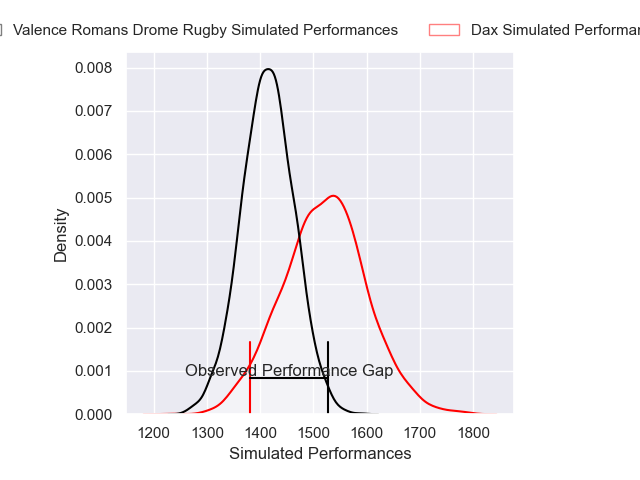
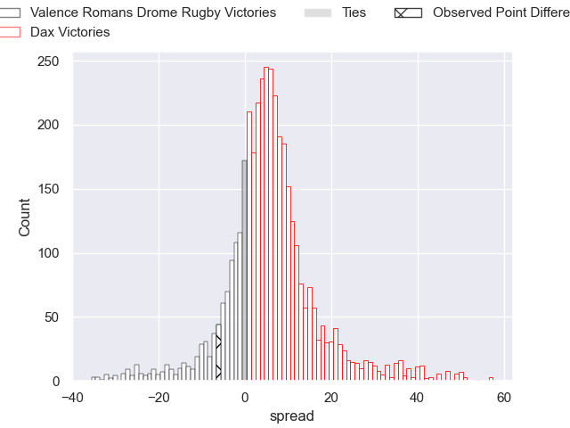
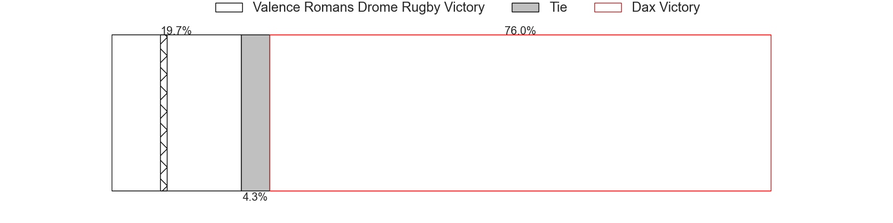
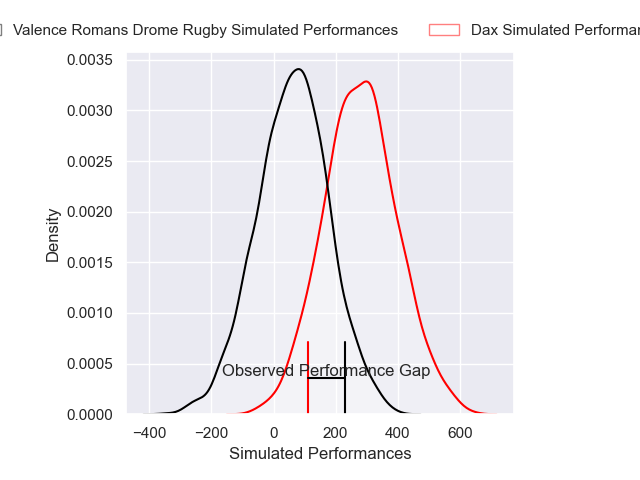
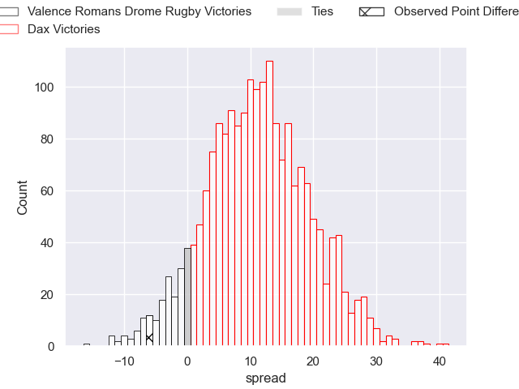
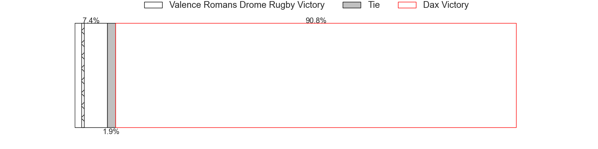

---  
layout: page  
title: Valence Romans Drome Rugby at Dax; 23-17  
date: 2025-02-07 18:00:00 -0500  
categories: "Pro D2 24/25" match review  
---
# Valence Romans Drome Rugby at Dax; 23-17

# Club Level Predictions

The first set of predictions treats a club as the smallest object, as the club develops its members, organizes a gameplan, and deploys its players as needed for each match. This club model has a prediction of 0.647, which translates to predicting Dax to win by 5.3.

Our Over/Under is 53.5 - and combined with the spread above, we have a predicted scoreline of 24 to 29

Each club has a rating and a rating deviation (similar to a Glicko rating), and expected performances can be generated. This allows for simulated matches and spreads like the ones below.
## Projected Performances - Club Model

## Projected Spreads - Club Model

## Projected Results - Club Model

# Player Level Predictions

Treating teams instead as an entity made up of the currently active players, I have ratings for each player in an altogether different system. These can be combined to form team ratings once teamsheets are announced, weighting starters a bit higher than the reserves. After the match is played, players can be weighted by their minutes on the field, allowing for an accurate measure of the team's composition. With these compiled team ratings, we can make predictions, measure inaccuracy, and update the individual player ratings.
## Prediction without Player Minutes: Dax by 7.9

Valence Romans Drome Rugby by 4.2 on a neutral pitch

## Projected Performances - Player Model

## Projected Spreads - Player Model

## Projected Results - Player Model

|   Away Minutes | Away Player         |   Away Percentile |   Number |   Home Percentile | Home Player           |   Home Minutes |
|---------------:|:--------------------|------------------:|---------:|------------------:|:----------------------|---------------:|
|             12 | Andrea Pontanier    |             68.55 |        1 |             34.36 | Thibaud Dréan         |             51 |
|             16 | Cyril Deligny       |              0.68 |        2 |             15.03 | Louis Barrere         |             80 |
|             10 | Gareth Milasinovich |             17.18 |        3 |             33.2  | David Lolohea         |             29 |
|              6 | Ryan McCauley       |             33.65 |        4 |             19.52 | Alexandre Manukula    |             53 |
|             50 | Florian Goumat      |             68.37 |        5 |              7.88 | Jean-Baptiste Singer  |             29 |
|             35 | Axel Bruchet        |             52.18 |        6 |              3.78 | Jean-Baptiste Barrère |             64 |
|             28 | Thembelani Bholi    |             75.07 |        7 |             63.24 | Arnaud Aletti         |             20 |
|             80 | Mathieu Vachon      |             85.68 |        8 |             53.05 | Genesis Mamea Lemalu  |             61 |
|             80 | Thomas Lhusero      |             83.36 |        9 |             80    | Paul Ravier           |             61 |
|             30 | Lucas Meret         |             35.38 |       10 |             23.09 | Romuald Séguy         |             52 |
|             30 | Mosese Mawalu       |             88.5  |       11 |              1.32 | Maxime Oltmann        |             46 |
|             29 | Louis Marrou        |             88.71 |       12 |              0.21 | Jale Vatubua          |             80 |
|             74 | Anatole Pauvert     |             87.36 |       13 |             11.81 | Benjamin Puntous      |              4 |
|             80 | Owen Lane           |              1.04 |       14 |             69.75 | Théo Gatelier         |             80 |
|             23 | Thomas Roziere      |             21.02 |       15 |             26.53 | Théo Duprat           |             80 |
|             51 | Anthony Aléo        |             44.32 |       16 |             66.39 | Dino Casadei          |             80 |
|             80 | Brice Humbert       |            nan    |       17 |             51.01 | Iban Hiriart-Urruty   |             80 |
|             30 | Vincent Vial        |             56.27 |       18 |              2.66 | Nephi Leatigaga       |             65 |
|             30 | Loan Real           |             54.8  |       19 |             68.5  | Sylvère Reteau        |             80 |
|             27 | Mattéo Rodor        |             27.61 |       20 |             68.22 | Hugo Cerisier         |             22 |
|             80 | Mathieu Guillomot   |              4.91 |       21 |             53.71 | Bastien Daguerre      |             58 |
|             80 | George Worth        |             36.73 |       22 |             58.85 | Brice Ferrer          |             22 |
|             79 | Éloi Massot         |              5.77 |       23 |             52.6  | Étienne Loiret        |             52 |

