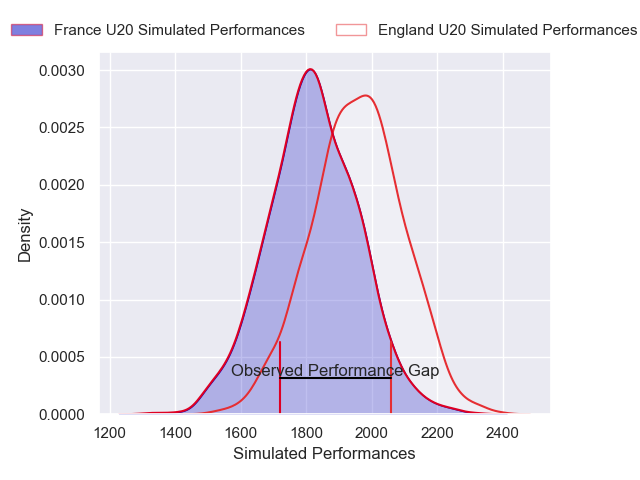
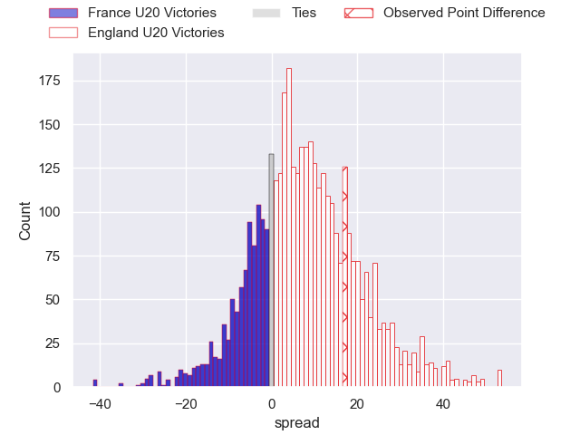
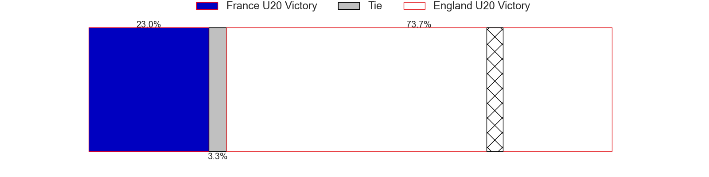
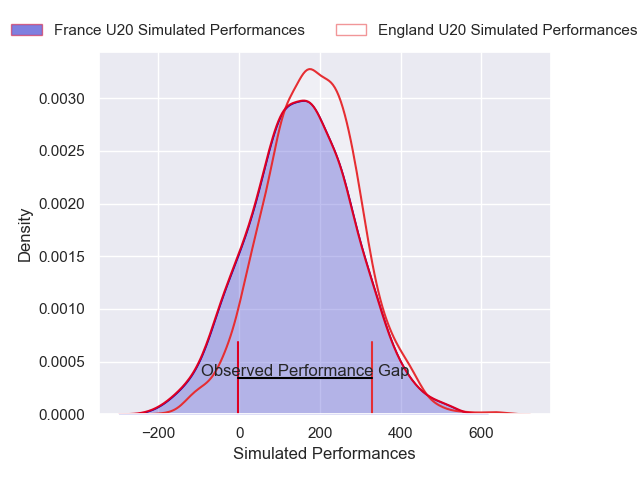
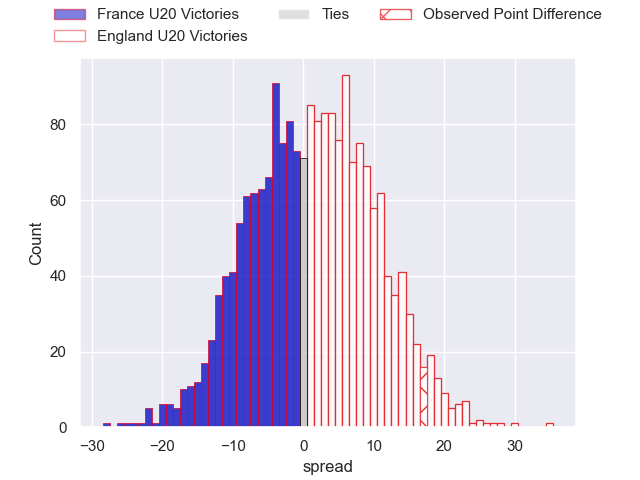
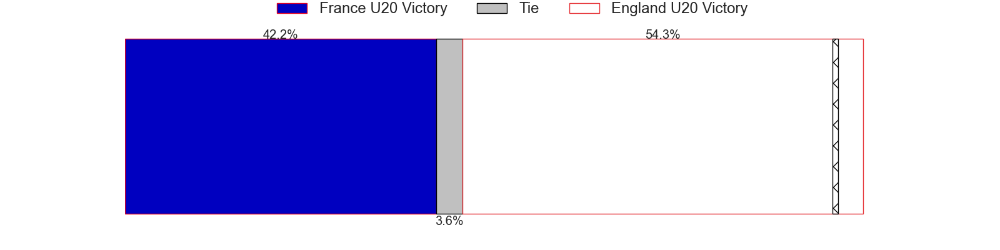

---  
layout: page  
title: France U20 at England U20; 10-27  
date: 2025-02-07 18:00:00 -0500  
categories: "U20 Six Nations Championship 2025" match review  
---
# France U20 at England U20; 10-27

# Club Level Predictions

The first set of predictions treats a club as the smallest object, as the club develops its members, organizes a gameplan, and deploys its players as needed for each match. This club model has a prediction of 0.68, which translates to predicting England U20 to win by 7.2.

Our Over/Under is 56.5 - and combined with the spread above, we have a predicted scoreline of 25 to 32

Each club has a rating and a rating deviation (similar to a Glicko rating), and expected performances can be generated. This allows for simulated matches and spreads like the ones below.
## Projected Performances - Club Model

## Projected Spreads - Club Model

## Projected Results - Club Model

# Player Level Predictions

Treating teams instead as an entity made up of the currently active players, I have ratings for each player in an altogether different system. These can be combined to form team ratings once teamsheets are announced, weighting starters a bit higher than the reserves. After the match is played, players can be weighted by their minutes on the field, allowing for an accurate measure of the team's composition. With these compiled team ratings, we can make predictions, measure inaccuracy, and update the individual player ratings.
## Prediction without Player Minutes: England U20 by 3.1

England U20 by 0.8 on a neutral pitch

## Projected Performances - Player Model

## Projected Spreads - Player Model

## Projected Results - Player Model

|   Away Minutes | Away Player                 |   Away Percentile |   Number |   Home Percentile | Home Player          |   Home Minutes |
|---------------:|:----------------------------|------------------:|---------:|------------------:|:---------------------|---------------:|
|             62 | Isaac Koffi                 |             27.69 |        1 |             62.35 | Ralph Mceachran      |             56 |
|              0 | Lyam Akrab                  |             65.99 |        2 |             77.78 | Kepu Tuipulotu       |             80 |
|             72 | Mohamed Megherbi            |             28.69 |        3 |             94.44 | Billy Sela           |             29 |
|              5 | Bartholomé Sanson           |             45.11 |        4 |             64.49 | Olamide Sodeke       |              5 |
|             80 | Corentin Mezou              |             63.53 |        5 |             66.7  | Tom Burrow           |             25 |
|             24 | Antoine Déliance            |             40.15 |        6 |             68.3  | George Timmins       |             17 |
|             29 | Baptiste Britz              |             38.81 |        7 |             94.24 | Henry Pollock        |             13 |
|             28 | Elyjah Ibsaiene             |             35.02 |        8 |             53.16 | Kane James           |              9 |
|              0 | Thibaut Motassi             |             43.48 |        9 |             69.39 | Lucas Friday         |             40 |
|             22 | Diego Jurd                  |             36.6  |       10 |             46.81 | Ben Coen             |              0 |
|             12 | Xan Mousques                |             96.1  |       11 |             65.97 | Charlie Griffin      |             61 |
|             80 | Robin Taccola               |             74.92 |       12 |             54.01 | Nic Allison          |             12 |
|             56 | Fabien Brau Boirie          |             72.63 |       13 |             56.92 | Angus Hall           |             59 |
|             68 | Oliver Cowie                |             32.51 |       14 |             66.35 | Jack Bracken         |             75 |
|             80 | Ugo Pacome                  |             26.39 |       15 |             67.22 | Jack Kinder          |             64 |
|             40 | Quentin Algay               |            nan    |       16 |            nan    | Louie Gulley         |             41 |
|             63 | Édouard-Junior Jabea Njocke |            nan    |       17 |            nan    | Ollie Scola          |             80 |
|             67 | Owen Sorhaindo              |            nan    |       18 |            nan    | Tye Raymont          |             62 |
|             80 | Charles Kanté-Samba         |            nan    |       19 |            nan    | Oscar Beckerleg      |             65 |
|             71 | Raphaël Darquier            |            nan    |       20 |            nan    | Aiden Ainsworth-Cave |             80 |
|             80 | Sialevailea Tolofua         |            nan    |       21 |            nan    | Dom Hanson           |             80 |
|             80 | Simeli Daunivucu            |             49.53 |       22 |            nan    | Ollie Davies         |             80 |
|             80 | Jean Cotarmanac'h           |             37.87 |       23 |            nan    | Nick Lilley          |             62 |
|            nan | nan                         |            nan    |       24 |            nan    |                      |             80 |

