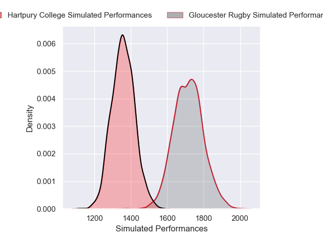
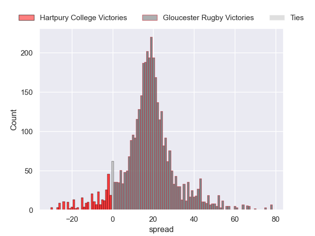
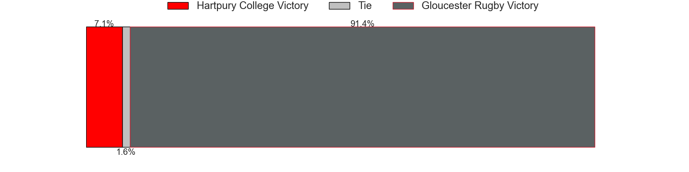
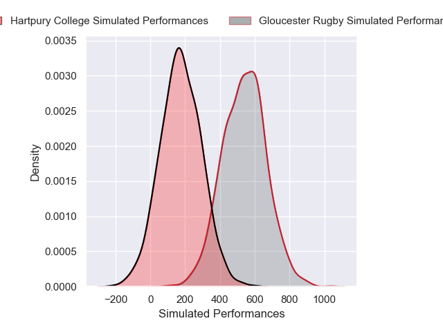
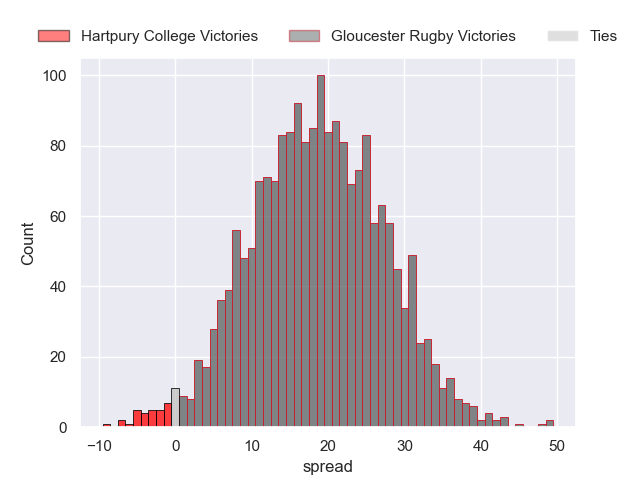
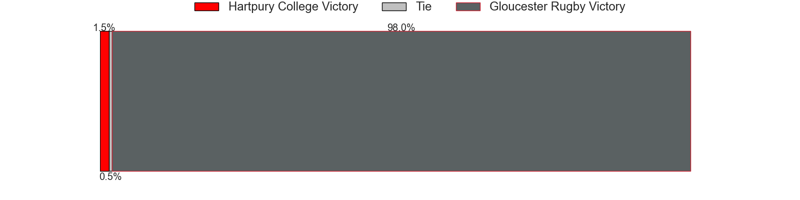

---  
layout: page  
title: Hartpury College at Gloucester Rugby; 7-7  
date: 2025-02-07 18:00:00 -0500  
categories: "Premiership Rugby Cup 24/25" match review  
---
# Hartpury College at Gloucester Rugby; 7-7

# Club Level Predictions

The first set of predictions treats a club as the smallest object, as the club develops its members, organizes a gameplan, and deploys its players as needed for each match. This club model has a prediction of 0.885, which translates to predicting Gloucester Rugby to win by 18.0.

Our Over/Under is 53.5 - and combined with the spread above, we have a predicted scoreline of 18 to 36

Each club has a rating and a rating deviation (similar to a Glicko rating), and expected performances can be generated. This allows for simulated matches and spreads like the ones below.
## Projected Performances - Club Model

## Projected Spreads - Club Model

## Projected Results - Club Model

# Player Level Predictions

Treating teams instead as an entity made up of the currently active players, I have ratings for each player in an altogether different system. These can be combined to form team ratings once teamsheets are announced, weighting starters a bit higher than the reserves. After the match is played, players can be weighted by their minutes on the field, allowing for an accurate measure of the team's composition. With these compiled team ratings, we can make predictions, measure inaccuracy, and update the individual player ratings.
## Prediction without Player Minutes: Gloucester Rugby by 17.5

Gloucester Rugby by 1.6 on a neutral pitch

## Projected Performances - Player Model

## Projected Spreads - Player Model

## Projected Results - Player Model

|   Away Minutes | Away Player           |   Away Percentile |   Number |   Home Percentile | Home Player           |   Home Minutes |
|---------------:|:----------------------|------------------:|---------:|------------------:|:----------------------|---------------:|
|             52 | Harry Edwards         |             29.79 |        1 |             38.44 | Harrison Bellamy      |             80 |
|             59 | William Crane         |             68.24 |        2 |             34.73 | George McGuigan       |             71 |
|             61 | Alex Gibson           |             13.58 |        3 |              2.55 | Alfie Petch           |             75 |
|             18 | Dale Lemon            |             65.15 |        4 |             73.18 | Danny Eite            |             51 |
|             24 | Jack Rees Davies      |             48.4  |        5 |             80.15 | Cameron Jordan        |             80 |
|             21 | Peter Paramore        |             51.93 |        6 |             44.4  | Caio James            |             59 |
|             18 | Harry Short           |             86.29 |        7 |             51.25 | Archie McArthur       |             80 |
|             39 | Cameron Cobbett       |             29.03 |        8 |             95.27 | Albert Tuisue         |             44 |
|             66 | Michael Austin        |             74.39 |        9 |             43.68 | Charlie Chapman       |             16 |
|             80 | Nathan Chamberlain    |             65.81 |       10 |             71.58 | Charlie Atkinson      |             80 |
|             50 | Matt Protheroe        |             94.88 |       11 |              5.89 | Jake Morris           |             80 |
|             18 | Robbie Smith          |              8.96 |       12 |             37.41 | Max Knight            |             17 |
|              4 | Jack Johnson          |             68.49 |       13 |             66.07 | William Butler        |             80 |
|             80 | Bradley Denty         |             84.25 |       14 |             21.16 | Louis Hillman-Cooper  |             30 |
|             80 | Alex Morgan           |             77.5  |       15 |             24.38 | George Barton         |             80 |
|             80 | Ethan Hunt            |             83.25 |       16 |             59.67 | Toti Benz-Salomon     |             80 |
|             80 | Bronson Mellowes      |            nan    |       17 |             89.88 | Jonathan Benz-Salomon |             62 |
|             50 | Ollie Minnis          |             21.89 |       18 |             90.23 | Morgan Nelson         |             80 |
|             50 | Eddie Erskine         |            nan    |       19 |            nan    | Olly Allport          |             73 |
|             29 | Cameron Murray        |            nan    |       20 |             71.13 | Morgan Adderly-Jones  |             80 |
|              9 | Stan Folks-Underhill  |             40.68 |       21 |            nan    | Jack Cotgreave        |              9 |
|             80 | Josiah Edwards-Giraud |             55.22 |       22 |            nan    | nan                   |            nan |
|             80 | Oliver Holliday       |             83.09 |       23 |            nan    | nan                   |            nan |

