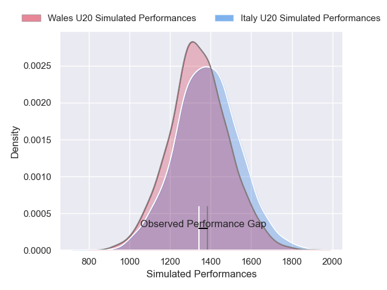
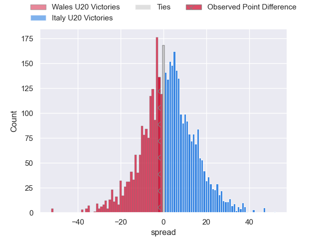
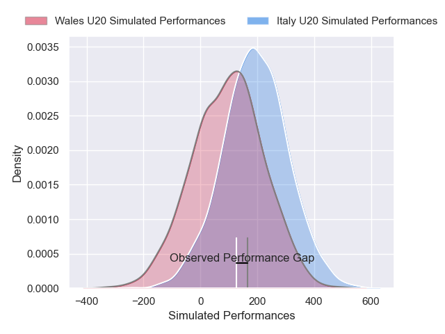
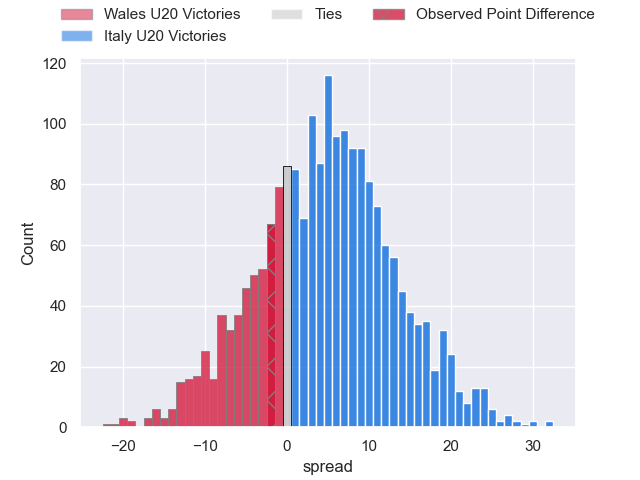

---  
layout: page  
title: Wales U20 at Italy U20; 20-18  
date: 2025-02-07 18:00:00 -0500  
categories: "U20 Six Nations Championship 2025" match review  
---
# Wales U20 at Italy U20; 20-18

# Club Level Predictions

The first set of predictions treats a club as the smallest object, as the club develops its members, organizes a gameplan, and deploys its players as needed for each match. This club model has a prediction of 0.559, which translates to predicting Italy U20 to win by 2.2.

Our Over/Under is 53.5 - and combined with the spread above, we have a predicted scoreline of 26 to 28

Each club has a rating and a rating deviation (similar to a Glicko rating), and expected performances can be generated. This allows for simulated matches and spreads like the ones below.
## Projected Performances - Club Model

## Projected Spreads - Club Model

## Projected Results - Club Model

# Player Level Predictions

Treating teams instead as an entity made up of the currently active players, I have ratings for each player in an altogether different system. These can be combined to form team ratings once teamsheets are announced, weighting starters a bit higher than the reserves. After the match is played, players can be weighted by their minutes on the field, allowing for an accurate measure of the team's composition. With these compiled team ratings, we can make predictions, measure inaccuracy, and update the individual player ratings.
## Prediction without Player Minutes: Italy U20 by 5.3

Italy U20 by 3.1 on a neutral pitch

## Projected Performances - Player Model

## Projected Spreads - Player Model

## Projected Results - Player Model

|   Away Minutes | Away Player     |   Away Percentile |   Number |   Home Percentile | Home Player           |   Home Minutes |
|---------------:|:----------------|------------------:|---------:|------------------:|:----------------------|---------------:|
|             80 | Louie Trevett   |             51.52 |        1 |             54.32 | Sergio Pelliccioli    |             71 |
|             80 | Harry Thomas    |             11.87 |        2 |             38.39 | Alessio Caïolo        |             80 |
|             32 | Sam Scott       |             30.95 |        3 |             52.76 | Bruno Vallesi         |              8 |
|             13 | Kenzie Jenkins  |             43.95 |        4 |             59.54 | Tommaso Redondi       |             62 |
|             32 | Dan Gemine      |             46.85 |        5 |             59.15 | Enoch Opoku-Gyamfi    |             68 |
|              0 | Deian Gwynne    |             40.93 |        6 |             55.21 | Antony Miranda        |             80 |
|             20 | Harry Beddall   |             39.67 |        7 |             60.14 | Nelson Casartelli     |             55 |
|              5 | Evan Minto      |             34.41 |        8 |             30.32 | Giacomo Milano        |              0 |
|             30 | Logan Franklin  |             43.33 |        9 |             51.05 | Niccolò Beni          |             17 |
|             80 | Harri Wilde     |             47.01 |       10 |             57.48 | Roberto Fasti         |             13 |
|             48 | Tom Bowen       |             20.1  |       11 |             53.72 | Malik Faissal         |              9 |
|             48 | Steffan Emanuel |             49.32 |       12 |             57.53 | Edoardo Todaro        |             40 |
|             67 | Osian Roberts   |             52.69 |       13 |             54.37 | Federico Zanandrea    |             80 |
|             80 | Aidan Boshoff   |             39.03 |       14 |             63.19 | Jules Ducros          |              0 |
|             80 | Scott Delnevo   |             47.29 |       15 |             56.46 | Gianmarco Pietramala  |             68 |
|             79 | Saul Hurley     |            nan    |       16 |            nan    | Giacomo Casiraghi     |             51 |
|             33 | Ioan Emanuel    |             28.56 |       17 |            nan    | Cristian Brasini      |             56 |
|             80 | Jac Pritchard   |            nan    |       18 |            nan    | Nicola Bolognini      |             55 |
|             46 | Tom Cottle      |            nan    |       19 |            nan    | Mattia Midena         |             70 |
|             80 | Ryan Jones      |            nan    |       20 |            nan    | Carlo Antonio Bianchi |             51 |
|             50 | Sion Davies     |            nan    |       21 |            nan    | Giulio Sari           |             80 |
|             30 | Harri Ford      |            nan    |       22 |            nan    | Pietro Celi           |             80 |
|              0 | Elijah Evans    |             27.82 |       23 |            nan    | Riccardo Ioannucci    |             21 |

