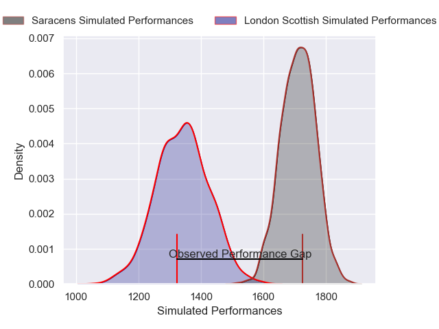
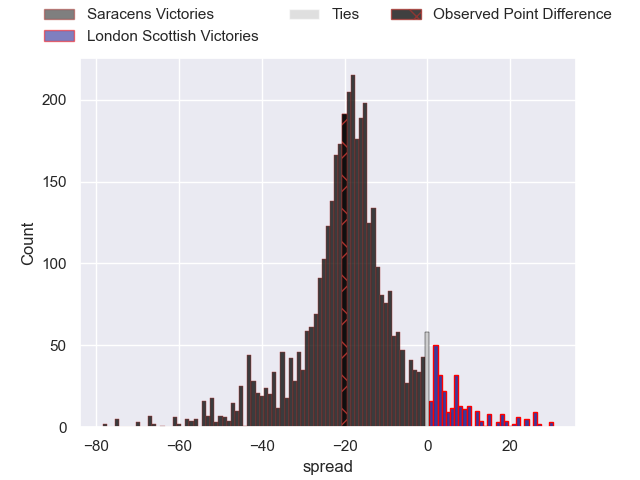
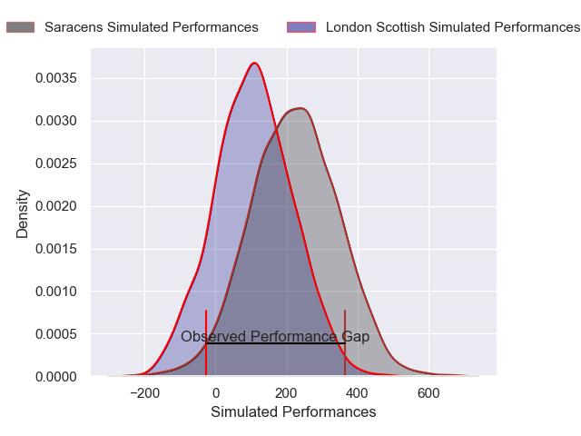
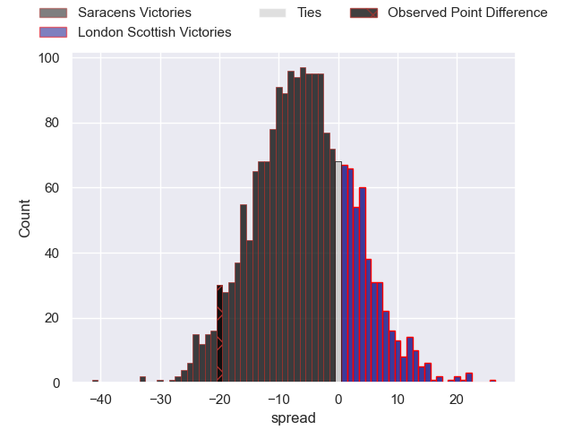
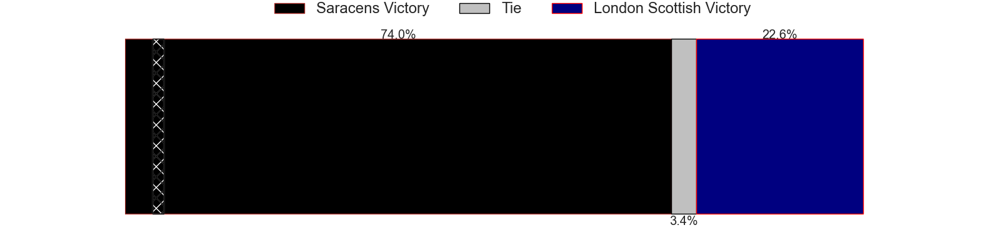

---  
layout: page  
title: Saracens at London Scottish; 20-0  
date: 2025-02-07 18:00:00 -0500  
categories: "Premiership Rugby Cup 24/25" match review  
---
# Saracens at London Scottish; 20-0

# Club Level Predictions

The first set of predictions treats a club as the smallest object, as the club develops its members, organizes a gameplan, and deploys its players as needed for each match. This club model has a prediction of 0.109, which translates to predicting Saracens to win by 18.5.

Our Over/Under is 62.5 - and combined with the spread above, we have a predicted scoreline of 41 to 22

Each club has a rating and a rating deviation (similar to a Glicko rating), and expected performances can be generated. This allows for simulated matches and spreads like the ones below.
## Projected Performances - Club Model

## Projected Spreads - Club Model

## Projected Results - Club Model

# Player Level Predictions

Treating teams instead as an entity made up of the currently active players, I have ratings for each player in an altogether different system. These can be combined to form team ratings once teamsheets are announced, weighting starters a bit higher than the reserves. After the match is played, players can be weighted by their minutes on the field, allowing for an accurate measure of the team's composition. With these compiled team ratings, we can make predictions, measure inaccuracy, and update the individual player ratings.
## Prediction without Player Minutes: Saracens by 7.9

Saracens by 12.3 on a neutral pitch

## Projected Performances - Player Model

## Projected Spreads - Player Model

## Projected Results - Player Model

|   Away Minutes | Away Player       |   Away Percentile |   Number |   Home Percentile | Home Player           |   Home Minutes |
|---------------:|:------------------|------------------:|---------:|------------------:|:----------------------|---------------:|
|             54 | Eroni Mawi        |             96.1  |        1 |              4.65 | George Cave           |             56 |
|             14 | James Hadfield    |             63.18 |        2 |             50.68 | Calum Scott           |             80 |
|             80 | Alec Clarey       |             91.12 |        3 |             12.37 | Ntinga Mpiko          |             59 |
|             80 | Kaden Pearce-Paul |             62.12 |        4 |              7.79 | Jonny Green           |             59 |
|             63 | Hugh Tizard       |             87.21 |        5 |             15.96 | Alex Wardell          |             64 |
|             60 | Max Eke           |             22.99 |        6 |             24.83 | Jake Spurway          |             61 |
|             54 | Nathan Michelow   |             80.99 |        7 |             12.12 | Lewis Barrett         |             66 |
|             17 | Carwyn Tuipulotu  |             66.95 |        8 |              9.26 | Austin Wallis         |             39 |
|             20 | Charlie Bracken   |             46.19 |        9 |              9.73 | Daniel Nutton         |             16 |
|             24 | Louie Johnson     |             25    |       10 |             20.55 | Alexander Lloyd-Seed  |             12 |
|             33 | Brandon Jackson   |             39.3  |       11 |              1.89 | Noah Ferdinand        |              6 |
|              2 | Olly Hartley      |             25.39 |       12 |              4.08 | Robert David McCallum |             18 |
|             11 | Josh Hallett      |             34.06 |       13 |             80.15 | Bryn Bradley          |             21 |
|             80 | Tobias Elliott    |             59.57 |       14 |             21.11 | Roma Zheng            |             29 |
|             80 | Alex Goode        |             92.45 |       15 |             70.2  | William Talbot-Davies |             52 |
|             80 | Oscar Wilson      |            nan    |       16 |             78.17 | Will Prior            |             80 |
|             80 | Gareth Simpson    |            nan    |       17 |              7.95 | Jack Ingall           |             80 |
|             80 | Sam Crean         |             77.93 |       18 |              3.73 | Ashley Challenger     |             80 |
|             80 | Kennedy Sylvester |             18.85 |       19 |             26.37 | Jonny Law             |             24 |
|             10 | Harvey Beaton     |             48.3  |       20 |             13.56 | Tom Wilstead          |             13 |
|             19 | Reggie Hammick    |             37.92 |       21 |            nan    | Jack Doorey-Palmer    |             21 |
|             75 | Luke Davidson     |            nan    |       22 |            nan    | Tom Johnson           |             31 |
|             13 | James Isaacs      |             51.18 |       23 |             45.33 | Matthew Gribbon       |             66 |

