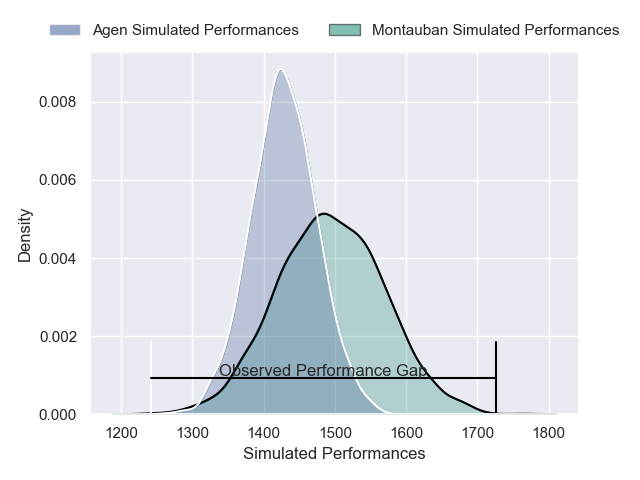
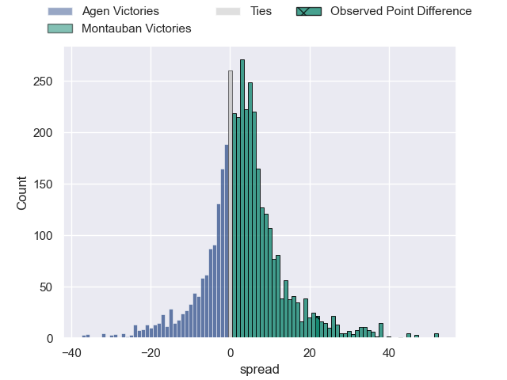
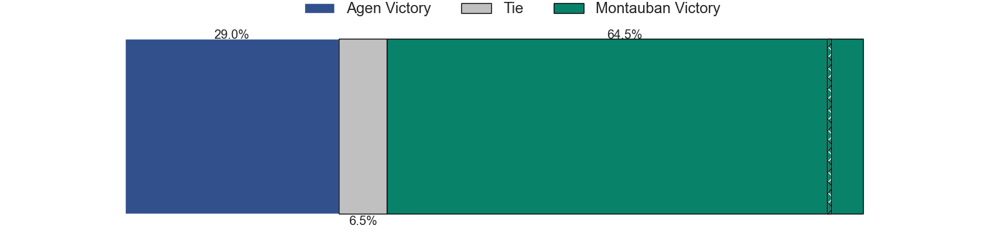
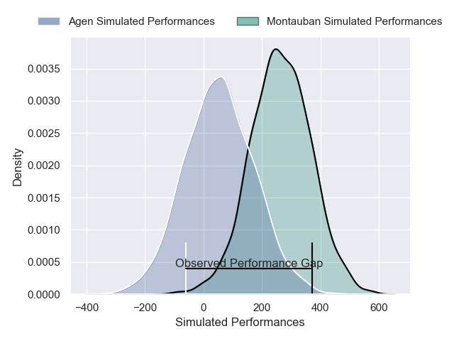
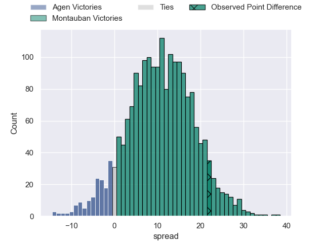
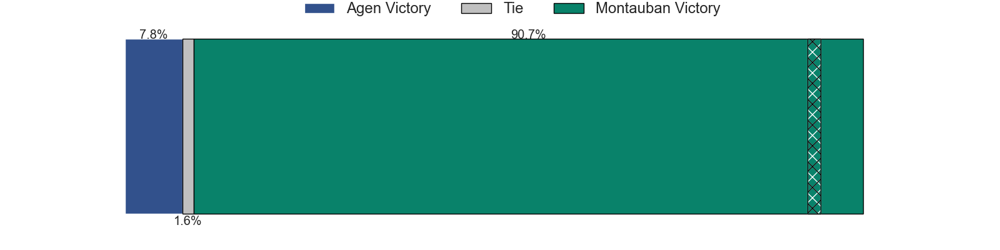

---  
layout: page  
title: Agen at Montauban; 14-36  
date: 2025-02-07 18:00:00 -0500  
categories: "Pro D2 24/25" match review  
---
# Agen at Montauban; 14-36

# Club Level Predictions

The first set of predictions treats a club as the smallest object, as the club develops its members, organizes a gameplan, and deploys its players as needed for each match. This club model has a prediction of 0.59, which translates to predicting Montauban to win by 3.2.

Our Over/Under is 49.5 - and combined with the spread above, we have a predicted scoreline of 23 to 26

Each club has a rating and a rating deviation (similar to a Glicko rating), and expected performances can be generated. This allows for simulated matches and spreads like the ones below.
## Projected Performances - Club Model

## Projected Spreads - Club Model

## Projected Results - Club Model

# Player Level Predictions

Treating teams instead as an entity made up of the currently active players, I have ratings for each player in an altogether different system. These can be combined to form team ratings once teamsheets are announced, weighting starters a bit higher than the reserves. After the match is played, players can be weighted by their minutes on the field, allowing for an accurate measure of the team's composition. With these compiled team ratings, we can make predictions, measure inaccuracy, and update the individual player ratings.
## Prediction without Player Minutes: Montauban by 12.5

Montauban by 1.6 on a neutral pitch

## Projected Performances - Player Model

## Projected Spreads - Player Model

## Projected Results - Player Model

|   Away Minutes | Away Player                   |   Away Percentile |   Number |   Home Percentile | Home Player           |   Home Minutes |
|---------------:|:------------------------------|------------------:|---------:|------------------:|:----------------------|---------------:|
|             80 | Florent Guion                 |              3.49 |        1 |              3.98 | Lucas Seyrolle        |             80 |
|             40 | Pierre Jouvin                 |             18.58 |        2 |              6.08 | Kevin Firmin          |             35 |
|             40 | Alex Burin                    |             22.24 |        3 |             44.48 | Facundo Pomponio      |             30 |
|             40 | Javier Eissmann               |              2.6  |        4 |             75.58 | Clément Bitz          |             30 |
|             40 | John Madigan                  |             10.67 |        5 |             53.37 | Noa Kanika            |             30 |
|             29 | Matthieu Bonnet               |             16.49 |        6 |              1.65 | Frédéric Quercy       |             29 |
|             51 | Tomasi Fineanganofo           |             43.55 |        7 |             64.69 | Kyllian Ringuet       |             29 |
|             30 | Valentin Gayraud              |             44.84 |        8 |             75.37 | Sikhumbuzo Notshe     |             13 |
|             17 | Theo Idjellidaine             |             11.86 |        9 |             30.62 | Hugo Zabalza          |             50 |
|             21 | Franck Pourteau               |             91.31 |       10 |             76.69 | Jérôme Bosviel        |             52 |
|             80 | Lucas Martins                 |             83.32 |       11 |             62.39 | Yvan Reilhac          |             68 |
|             68 | Clement Garrigues             |             44.41 |       12 |              4.39 | Maxime Mathy          |             80 |
|             64 | Peyo Muscarditz               |             73.15 |       13 |             47.54 | Maxime Espeut         |             52 |
|             60 | Inoke Nalaga Kurukuruvakatini |              5    |       14 |             95    | Stephane Ahmed        |             42 |
|             80 | Loris Tolot                   |              1.02 |       15 |              2.04 | Segundo Tuculet       |             52 |
|             43 | Santiago Socino               |             81.59 |       16 |            nan    | Vakhtang Jintcharadze |             45 |
|             80 | William Demotte               |             80    |       17 |             84.42 | Frank Bradshaw        |             80 |
|             23 | Billy Searle                  |              1.48 |       18 |             69.59 | Simon Renda           |             80 |
|             23 | Julien Lebian                 |             14.74 |       19 |             17.05 | Tyrone Viiga          |             51 |
|             45 | Mamuka Mstoiani               |             33.03 |       20 |             32.61 | Leo Aouf              |             67 |
|             45 | Jack Maunder                  |             83.19 |       21 |             74.36 | Tietie Tuimauga       |             16 |
|             80 | Beau Farrance                 |             54.69 |       22 |             71.33 | Joe Powell            |             12 |
|             80 | Ethan Randle                  |            nan    |       23 |             30.93 | Thomas Fortunel       |             29 |

