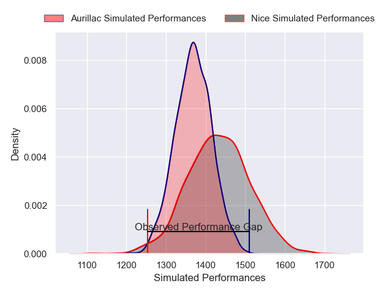
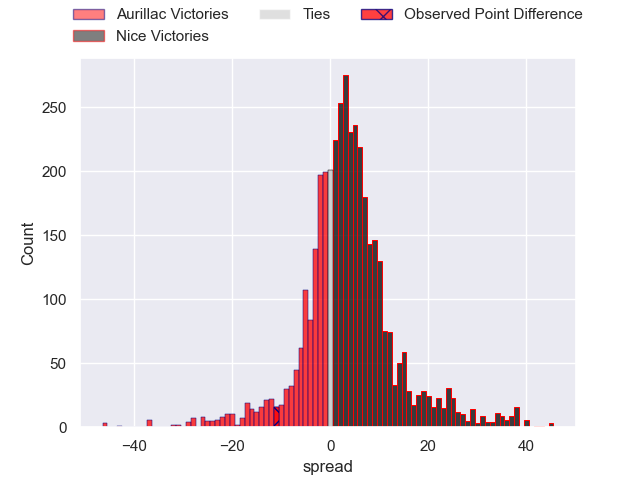
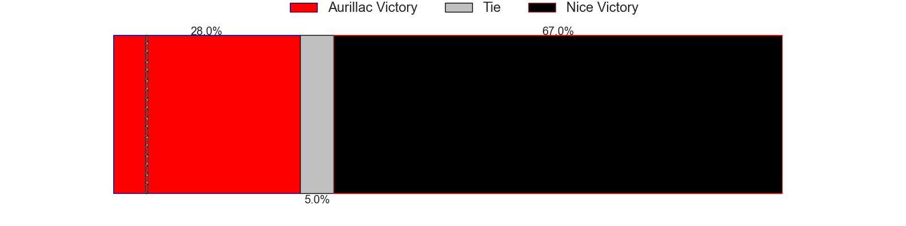
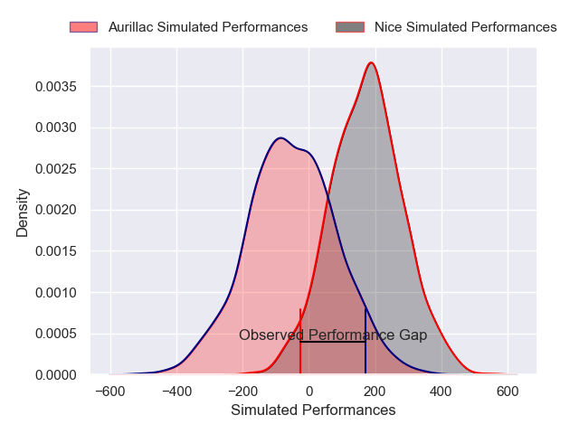
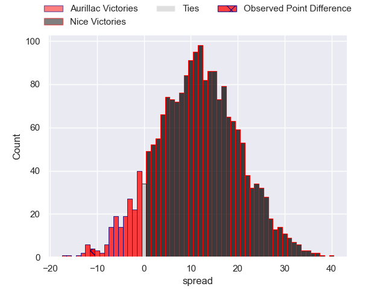
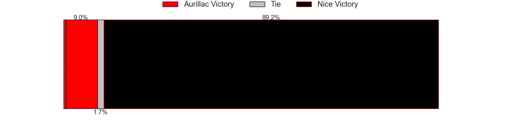

---  
layout: page  
title: Aurillac at Nice; 29-18  
date: 2025-02-07 18:00:00 -0500  
categories: "Pro D2 24/25" match review  
---
# Aurillac at Nice; 29-18

# Club Level Predictions

The first set of predictions treats a club as the smallest object, as the club develops its members, organizes a gameplan, and deploys its players as needed for each match. This club model has a prediction of 0.594, which translates to predicting Nice to win by 3.3.

Our Over/Under is 61.5 - and combined with the spread above, we have a predicted scoreline of 29 to 32

Each club has a rating and a rating deviation (similar to a Glicko rating), and expected performances can be generated. This allows for simulated matches and spreads like the ones below.
## Projected Performances - Club Model

## Projected Spreads - Club Model

## Projected Results - Club Model

# Player Level Predictions

Treating teams instead as an entity made up of the currently active players, I have ratings for each player in an altogether different system. These can be combined to form team ratings once teamsheets are announced, weighting starters a bit higher than the reserves. After the match is played, players can be weighted by their minutes on the field, allowing for an accurate measure of the team's composition. With these compiled team ratings, we can make predictions, measure inaccuracy, and update the individual player ratings.
## Prediction without Player Minutes: Nice by 12.4

Nice by 9.1 on a neutral pitch

## Projected Performances - Player Model

## Projected Spreads - Player Model

## Projected Results - Player Model

|   Away Minutes | Away Player             |   Away Percentile |   Number |   Home Percentile | Home Player              |   Home Minutes |
|---------------:|:------------------------|------------------:|---------:|------------------:|:-------------------------|---------------:|
|             80 | Gymael Jean-Jacques     |             67.33 |        1 |              3.81 | Jules Martinez           |             23 |
|             28 | Luka Nioradze           |              1.01 |        2 |             74.92 | Sione Anga'aelangi       |             16 |
|             68 | Giorgi Kartvelishvili   |              4.89 |        3 |              1.49 | Tom Ross                 |             80 |
|             16 | Heath Backhouse         |             76.68 |        4 |             98.37 | Tom Murday               |             66 |
|             80 | Mael Perrin             |             49.14 |        5 |             46.83 | Martin Freytes           |             80 |
|             67 | Didier Tison            |             10.57 |        6 |              0.38 | Bastien Berenguel        |             80 |
|             16 | Lucas Oudard            |             16.04 |        7 |             92.8  | Louis Suaud              |             37 |
|              1 | Aleksandre Burduli      |             17.3  |        8 |             32.28 | Ramiha Tarrel Tia Smiler |             13 |
|             53 | Boris Hadinegoro        |             48.7  |        9 |             40.7  | Thibault Dufau           |             29 |
|             80 | Ugo Seunes              |             80.85 |       10 |              2.13 | Paul Auradou             |             80 |
|             45 | Juun Pieters            |             62.17 |       11 |             36.98 | Simon Delas              |             35 |
|             52 | Ofa Manuofetoa          |             56.82 |       12 |              0.94 | Christa Powell           |             35 |
|             52 | Hugo Bastard            |             65.35 |       13 |             66.6  | Nathan Courtade          |             40 |
|             67 | Simeli Yabaki           |              9.13 |       14 |             83.17 | Christian Erasmus        |             38 |
|             45 | Axel Bevia              |             40.41 |       15 |             65.77 | Andrzej Charlat          |             52 |
|             45 | Abongile Nonkontwana    |              0.63 |       16 |             25.43 | Clément Chartier         |             23 |
|             80 | Théo Cambon             |             13.16 |       17 |             78.94 | Mathis Viard             |             52 |
|             80 | Robert Rodgers          |             10.86 |       18 |             59.65 | Jules Solinas            |             12 |
|             19 | Ronan Loughnane         |              8.75 |       19 |             20.17 | Hugo Sarrasin            |             12 |
|             80 | Mosa'ati Moala          |             28.21 |       20 |             62.11 | Julien Beaufils          |             29 |
|             80 | Dominic Robertson-McCoy |             63.85 |       21 |             25.93 | Sacha Idoumi             |             64 |
|             80 | Elijah Niko             |             24.25 |       22 |            nan    | Kevin Yameogo            |             80 |
|             71 | Leo Salvan              |             55.11 |       23 |             90.3  | Jordan Taufua            |             80 |

