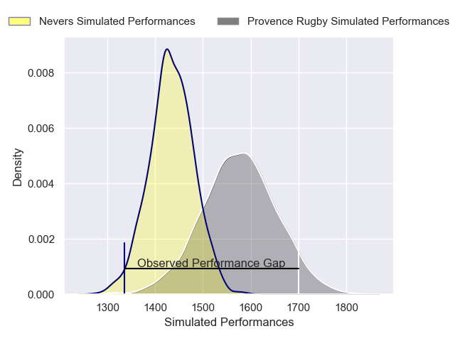
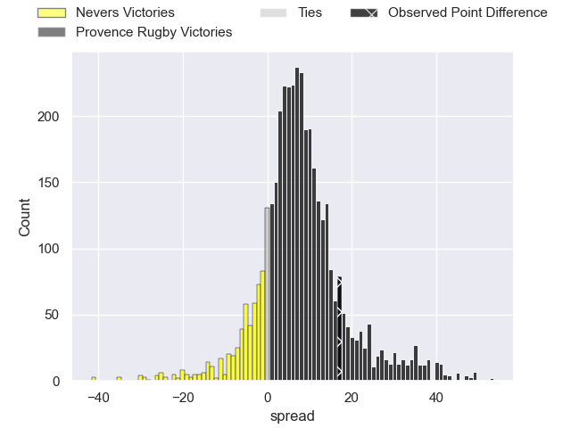
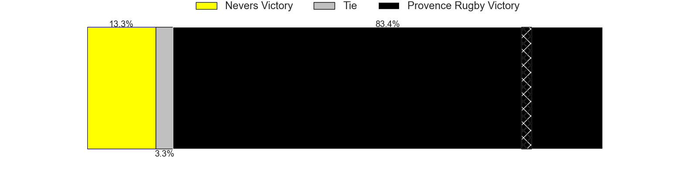
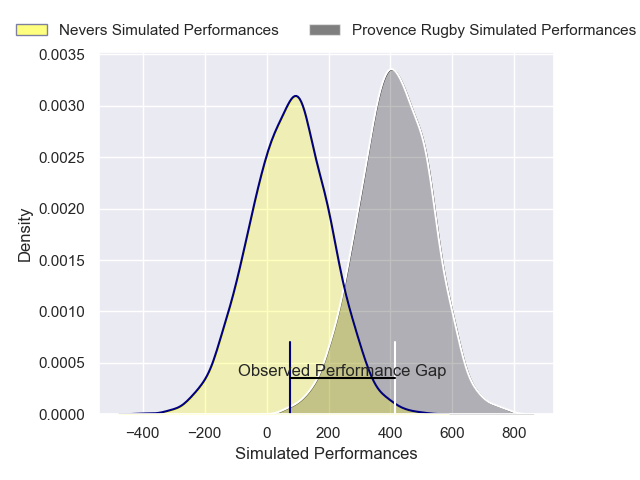
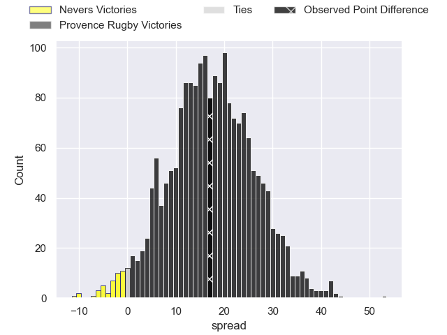
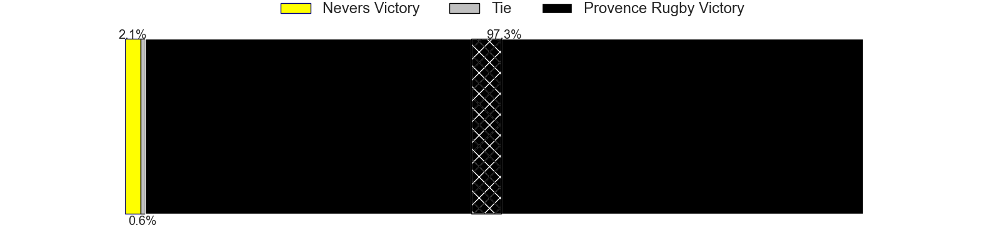

---  
layout: page  
title: Nevers at Provence Rugby; 21-38  
date: 2025-02-07 18:00:00 -0500  
categories: "Pro D2 24/25" match review  
---
# Nevers at Provence Rugby; 21-38

# Club Level Predictions

The first set of predictions treats a club as the smallest object, as the club develops its members, organizes a gameplan, and deploys its players as needed for each match. This club model has a prediction of 0.694, which translates to predicting Provence Rugby to win by 7.2.

Our Over/Under is 54.5 - and combined with the spread above, we have a predicted scoreline of 24 to 31

Each club has a rating and a rating deviation (similar to a Glicko rating), and expected performances can be generated. This allows for simulated matches and spreads like the ones below.
## Projected Performances - Club Model

## Projected Spreads - Club Model

## Projected Results - Club Model

# Player Level Predictions

Treating teams instead as an entity made up of the currently active players, I have ratings for each player in an altogether different system. These can be combined to form team ratings once teamsheets are announced, weighting starters a bit higher than the reserves. After the match is played, players can be weighted by their minutes on the field, allowing for an accurate measure of the team's composition. With these compiled team ratings, we can make predictions, measure inaccuracy, and update the individual player ratings.
## Prediction without Player Minutes: Provence Rugby by 19.6

Provence Rugby by 9.9 on a neutral pitch

## Projected Performances - Player Model

## Projected Spreads - Player Model

## Projected Results - Player Model

|   Away Minutes | Away Player                |   Away Percentile |   Number |   Home Percentile | Home Player           |   Home Minutes |
|---------------:|:---------------------------|------------------:|---------:|------------------:|:----------------------|---------------:|
|             65 | Aitor Kitutu               |             41.32 |        1 |             79.26 | Thomas Vernet         |             22 |
|             80 | Efi Ma'afu                 |             19.02 |        2 |             41.54 | Joseph Laget          |             22 |
|             80 | Farai Mudariki             |             13    |        3 |             84.44 | Paul Mallez           |             13 |
|             80 | Chris Gabriel              |             16.26 |        4 |              2.03 | Andres Zafra Tarazona |             51 |
|             28 | Kevin Noah                 |             14.52 |        5 |             81.12 | Izack Rodda           |             29 |
|             80 | Hugues Bastide             |             89.19 |        6 |             86.68 | Guillaume Piazzoli    |             52 |
|             28 | Steven David               |             43.63 |        7 |             37.26 | Ned Hanigan           |             13 |
|             52 | Jason-Colin Fraser         |             88.6  |        8 |             80.5  | Teimana Harrison      |             80 |
|             53 | Simon Tarel                |             11.58 |        9 |             33.86 | Arthur Coville        |             40 |
|             51 | Yohan Le Bourhis           |             74.15 |       10 |             77.56 | Jules Soulan          |             30 |
|             63 | Arthur Mathiron            |              9.76 |       11 |             91.4  | Nadir Bouhedjeur      |             52 |
|             80 | Noa Pommelet               |             35.72 |       12 |             87.99 | Kaveinga Finau        |             42 |
|              7 | Rudy Derrieux              |             66.49 |       13 |             99.79 | George North          |             52 |
|             80 | Gabin Rocher               |              9.08 |       14 |             26.96 | Adrien Lapegue-Lafaye |             80 |
|             80 | Dylan Jaminet              |             50.83 |       15 |             74.79 | Léo Drouet            |             80 |
|             51 | Lasha Pkhakadze            |            nan    |       16 |             58.35 | Nicolas Toth          |             80 |
|             80 | Jean-Maxence Jules-Rosette |             18.85 |       17 |             41.98 | Eliott Yemsi          |             80 |
|             21 | Luka Plataret              |             78.67 |       18 |             70.94 | Jules Plisson         |             80 |
|             80 | Kamaliele Tufele           |             61.48 |       19 |             75.12 | Josh Tyrell           |             29 |
|             30 | Alifereti Loaloa           |             71.23 |       20 |             84.27 | Charly Gambini        |             80 |
|             30 | Shaun Reynolds             |              7.69 |       21 |             33.33 | Kevin Viallard        |             80 |
|             12 | Hugo Bouyssou              |              2.63 |       22 |            nan    | Rémi Bouaffou         |             80 |
|             57 | Ugo Vignolles              |             40.66 |       23 |             39.09 | Eto Bainivalu         |             34 |

