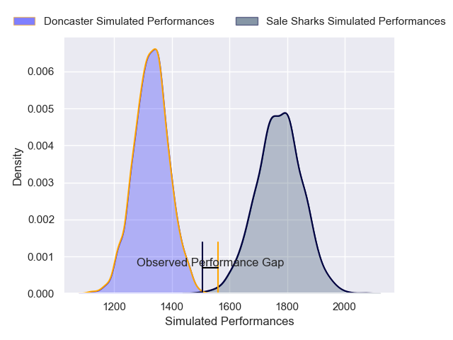
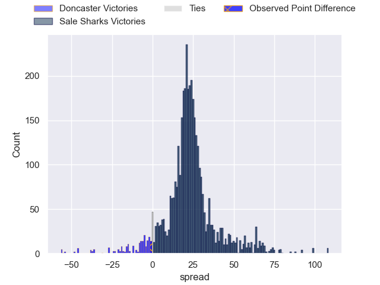
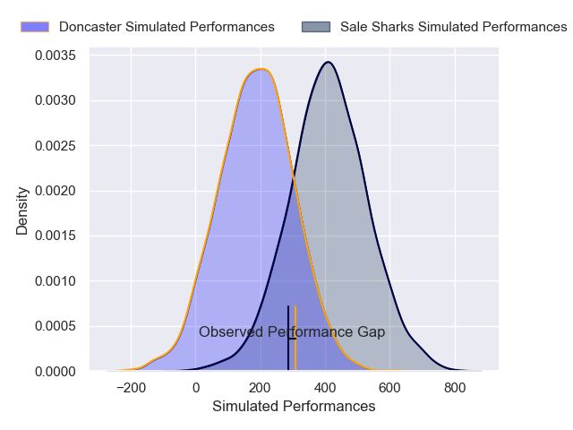
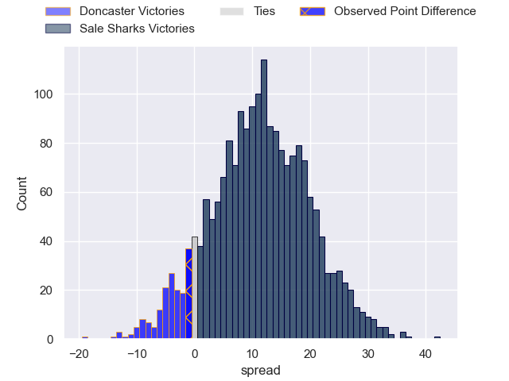
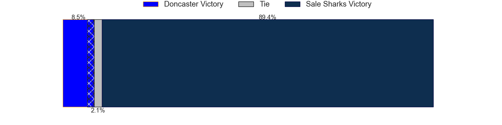

---  
layout: page  
title: Doncaster at Sale Sharks; 20-19  
date: 2025-02-07 18:00:00 -0500  
categories: "Premiership Rugby Cup 24/25" match review  
---
# Doncaster at Sale Sharks; 20-19

# Club Level Predictions

The first set of predictions treats a club as the smallest object, as the club develops its members, organizes a gameplan, and deploys its players as needed for each match. This club model has a prediction of 0.925, which translates to predicting Sale Sharks to win by 22.2.

Our Over/Under is 52.5 - and combined with the spread above, we have a predicted scoreline of 15 to 37

Each club has a rating and a rating deviation (similar to a Glicko rating), and expected performances can be generated. This allows for simulated matches and spreads like the ones below.
## Projected Performances - Club Model

## Projected Spreads - Club Model

## Projected Results - Club Model

# Player Level Predictions

Treating teams instead as an entity made up of the currently active players, I have ratings for each player in an altogether different system. These can be combined to form team ratings once teamsheets are announced, weighting starters a bit higher than the reserves. After the match is played, players can be weighted by their minutes on the field, allowing for an accurate measure of the team's composition. With these compiled team ratings, we can make predictions, measure inaccuracy, and update the individual player ratings.
## Prediction without Player Minutes: Sale Sharks by 7.8

Doncaster by 5.7 on a neutral pitch

## Projected Performances - Player Model

## Projected Spreads - Player Model

## Projected Results - Player Model

|   Away Minutes | Away Player        |   Away Percentile |   Number |   Home Percentile | Home Player          |   Home Minutes |
|---------------:|:-------------------|------------------:|---------:|------------------:|:---------------------|---------------:|
|             80 | Logovi'i Mulipola  |             95.39 |        1 |             93.66 | Bevan Rodd           |             21 |
|             80 | George Roberts     |             43.8  |        2 |             24.26 | Tadgh McElroy        |              4 |
|             55 | Joe Jones          |             31.93 |        3 |              6.09 | Jake Bridges         |             80 |
|             29 | Ben Murphy         |             53.44 |        4 |             46.18 | Alex Groves          |             14 |
|             80 | Josh Williams      |             81.7  |        5 |             21.3  | Hyron Andrews        |             80 |
|             29 | Adam Hopkinson     |             64.96 |        6 |             15.54 | Sam Dugdale          |             47 |
|             46 | Rhys Tait          |             76.54 |        7 |             22.68 | Tristan Woodman      |             80 |
|             80 | Morgan Strong      |             83.87 |        8 |             18.92 | Rouban Birch         |             56 |
|             54 | Alex Dolly         |             74.56 |        9 |             49.3  | Gus Warr             |             80 |
|             80 | Morgan Bunting     |             17.52 |       10 |             20.09 | Tom Curtis           |             78 |
|             64 | Maliq Holden       |             79.71 |       11 |             49.18 | Alex Wills           |             14 |
|             20 | Zach Kerr          |             38.46 |       12 |             14.75 | Rekeiti Ma'asi-White |              5 |
|             51 | Aidan Cross        |             54.06 |       13 |             73.34 | Sam Bedlow           |             49 |
|             44 | Semesa Rokoduguni  |             94.2  |       14 |             36.91 | Obi Ene              |             80 |
|             19 | Telusa Veainu      |             99.38 |       15 |             96.04 | Tom O'Flaherty       |             68 |
|             41 | Conor Davidson     |             55.14 |       16 |             18.68 | Tumy Onasanya        |             80 |
|             12 | Benjamin Chapman   |             12.57 |       17 |            nan    | Harry Thompson       |             80 |
|              6 | Lewis Thiede       |             99.01 |       18 |            nan    | Seb Kelly            |             25 |
|             19 | Archie Smeaton     |             51.35 |       19 |            nan    | Tom Furtado-Mills    |              2 |
|             26 | Taniela Ramasibana |             30.11 |       20 |             19.47 | Anerin (Nye) Thomas  |             80 |
|             17 | Jasper McGuire     |            nan    |       21 |             73.34 | Sam Bedlow           |             60 |
|             80 | Sam Wadsworth      |            nan    |       22 |            nan    | nan                  |            nan |

