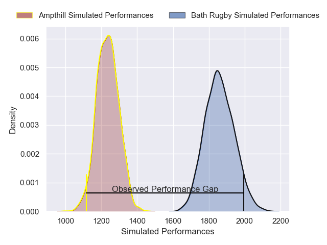
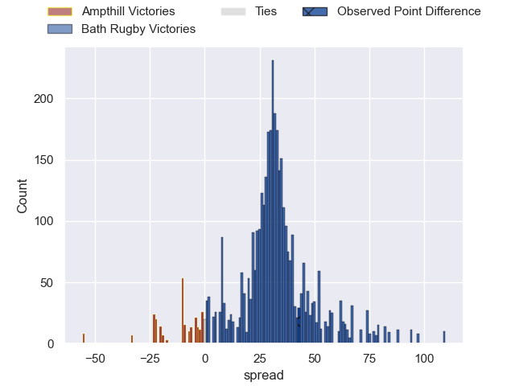
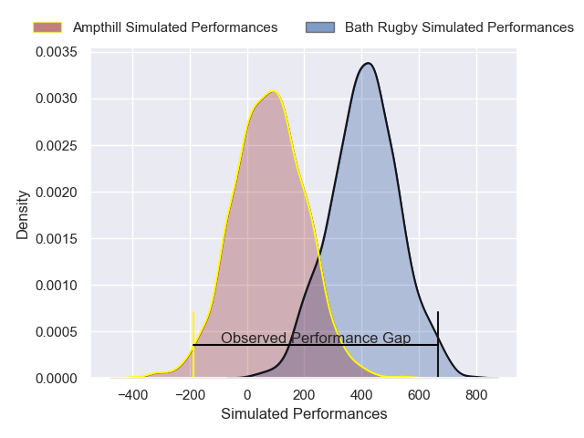
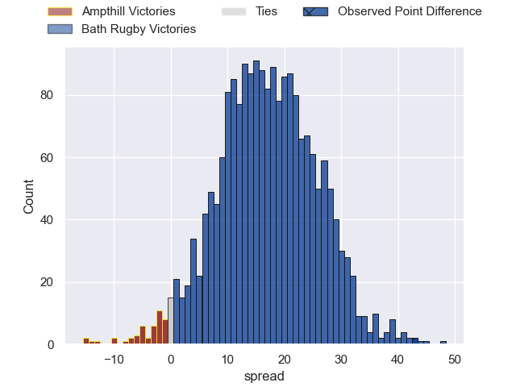

---  
layout: page  
title: Ampthill at Bath Rugby; 7-50  
date: 2025-02-08 18:00:00 -0500  
categories: "Premiership Rugby Cup 24/25" match review  
---
# Ampthill at Bath Rugby; 7-50

# Club Level Predictions

The first set of predictions treats a club as the smallest object, as the club develops its members, organizes a gameplan, and deploys its players as needed for each match. This club model has a prediction of 0.972, which translates to predicting Bath Rugby to win by 31.3.

Our Over/Under is 59.5 - and combined with the spread above, we have a predicted scoreline of 14 to 46

Each club has a rating and a rating deviation (similar to a Glicko rating), and expected performances can be generated. This allows for simulated matches and spreads like the ones below.
## Projected Performances - Club Model

## Projected Spreads - Club Model

## Projected Results - Club Model

# Player Level Predictions

Treating teams instead as an entity made up of the currently active players, I have ratings for each player in an altogether different system. These can be combined to form team ratings once teamsheets are announced, weighting starters a bit higher than the reserves. After the match is played, players can be weighted by their minutes on the field, allowing for an accurate measure of the team's composition. With these compiled team ratings, we can make predictions, measure inaccuracy, and update the individual player ratings.
## Prediction without Player Minutes: Bath Rugby by 19.2

Bath Rugby by 5.2 on a neutral pitch

## Projected Performances - Player Model

## Projected Spreads - Player Model

## Projected Results - Player Model

|   Away Minutes | Away Player                 |   Away Percentile |   Number |   Home Percentile | Home Player      |   Home Minutes |
|---------------:|:----------------------------|------------------:|---------:|------------------:|:-----------------|---------------:|
|             54 | Harrison Courtney           |             56.54 |        1 |             26.91 | Arthur Cordwell  |             80 |
|             80 | Luke Thompson               |             55.67 |        2 |             65.45 | Jasper Spandler  |             56 |
|             69 | James Johnston              |             10.53 |        3 |             37.2  | Kieran Verden    |             52 |
|             80 | Jake Parkinson              |             14.23 |        4 |             63.12 | Harvey Cuckson   |             80 |
|             80 | Aidan King                  |             28.94 |        5 |             73.77 | Ewan Richards    |             80 |
|             22 | Arthur Thomas               |             23.84 |        6 |             53.86 | Jack Bennett     |             80 |
|             44 | Barnaby Merrett             |             29.63 |        7 |             57.82 | Ethan Staddon    |             24 |
|             80 | Charles Rylands             |             10.32 |        8 |             76.56 | Arthur Green     |             80 |
|             28 | Rory Morgan                 |             21.05 |        9 |             65.96 | Neil Le Roux     |             80 |
|             20 | Josh Barton                 |             18.38 |       10 |             84.4  | Orlando Bailey   |             80 |
|             24 | Oran McNulty                |             10.34 |       11 |              8.6  | Louie Hennessey  |             80 |
|             80 | Fraser James Kevin Strachan |             74.6  |       12 |             89.15 | Will Butt        |             24 |
|             45 | Byron Sharwood              |             22.66 |       13 |             21.18 | Cameron Redpath  |             18 |
|             80 | Wilson Ijeh                 |             33.91 |       14 |             62.13 | Austin Emens     |             36 |
|             45 | Evan Mitchell               |             15    |       15 |             62.29 | Ciaran Donoghue  |             59 |
|             74 | Richard Barrington          |             63.62 |       16 |             23.37 | Archie Stanley   |             16 |
|             40 | Callum Norrie               |              6.42 |       17 |            nan    | Scott Kirk       |             20 |
|             17 | Tino Mapapalangi            |             14.38 |       18 |             51.66 | Johnny Stewart   |             32 |
|             27 | Cameron Rafferty            |            nan    |       19 |             61.08 | Mackenzie Graham |             24 |
|             80 | Sid Blackmore               |             59.65 |       20 |             53.98 | Tom Cowan        |             21 |
|             26 | Charlie West                |            nan    |       21 |            nan    | Will Parry       |             36 |
|             80 | Tom Barton                  |            nan    |       22 |             18.25 | Ieuan Davies     |             53 |
|            nan | nan                         |            nan    |       23 |            nan    | Tyler Offiah     |             80 |

