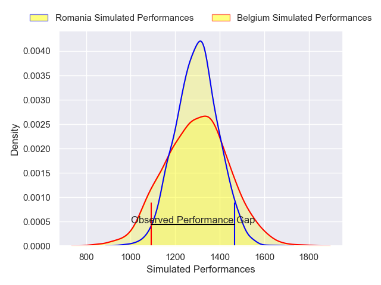
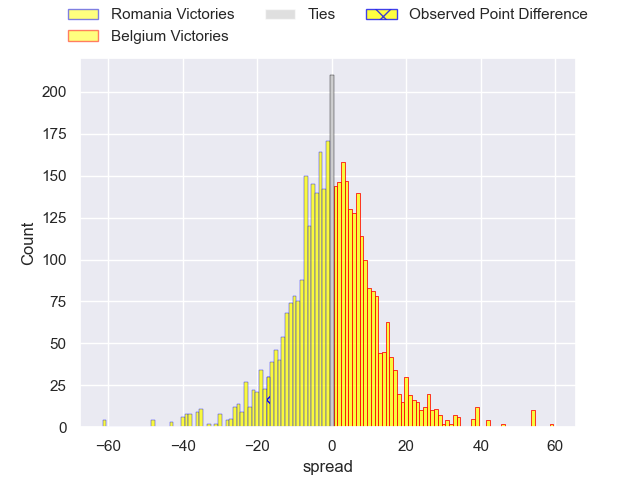
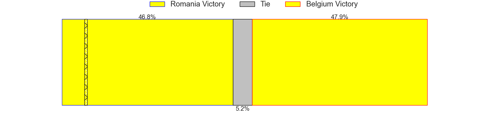
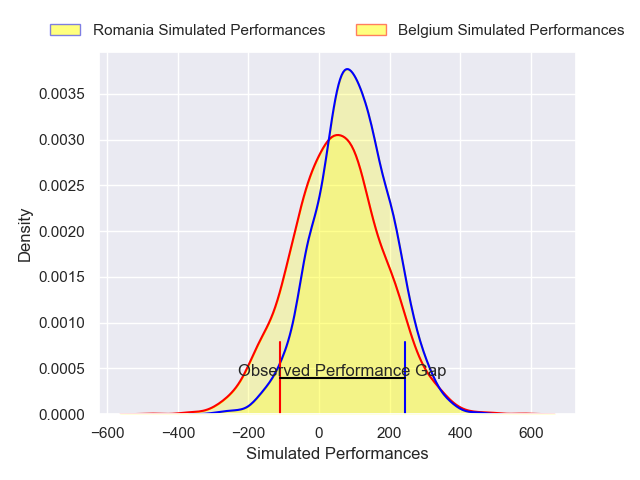
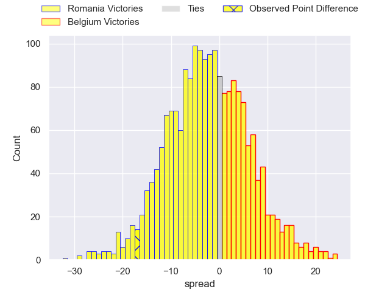
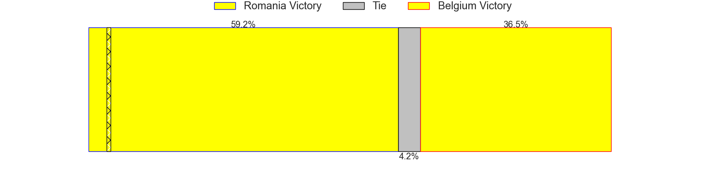

---  
layout: page  
title: Romania at Belgium; 31-14  
date: 2025-02-08 18:00:00 -0500  
categories: "Rugby Europe Championship 2025" match review  
---
# Romania at Belgium; 31-14

# Club Level Predictions

The first set of predictions treats a club as the smallest object, as the club develops its members, organizes a gameplan, and deploys its players as needed for each match. This club model has a prediction of 0.496, which translates to predicting Romania to win by 0.2.

Our Over/Under is 52.5 - and combined with the spread above, we have a predicted scoreline of 26 to 26

Each club has a rating and a rating deviation (similar to a Glicko rating), and expected performances can be generated. This allows for simulated matches and spreads like the ones below.
## Projected Performances - Club Model

## Projected Spreads - Club Model

## Projected Results - Club Model

# Player Level Predictions

Treating teams instead as an entity made up of the currently active players, I have ratings for each player in an altogether different system. These can be combined to form team ratings once teamsheets are announced, weighting starters a bit higher than the reserves. After the match is played, players can be weighted by their minutes on the field, allowing for an accurate measure of the team's composition. With these compiled team ratings, we can make predictions, measure inaccuracy, and update the individual player ratings.
## Prediction without Player Minutes: Romania by 0.4

Romania by 3.2 on a neutral pitch

## Projected Performances - Player Model

## Projected Spreads - Player Model

## Projected Results - Player Model

|   Away Minutes | Away Player       |   Away Percentile |   Number |   Home Percentile | Home Player             |   Home Minutes |
|---------------:|:------------------|------------------:|---------:|------------------:|:------------------------|---------------:|
|              1 | Alexandru Savin   |             63.1  |        1 |             38.23 | Charlesty Berguet       |             28 |
|             34 | Stefan Buruiana   |             72.73 |        2 |             37.71 | Alexandre Raynier       |             80 |
|             17 | Cosmin Manole     |             51.66 |        3 |             45.94 | Maxime Jadot            |             80 |
|             13 | Adrian Motoc      |              1.25 |        4 |              8.73 | Gillian Benoy           |             80 |
|             43 | Andrei Mahu       |             64.4  |        5 |              4.13 | Maximilien Hendrickx    |             80 |
|             30 | Cristi Boboc      |             68.49 |        6 |              5    | Jean-Maurice Decubber   |             80 |
|              8 | Cristian Chirica  |              8.74 |        7 |             39.77 | William Van Bost        |             63 |
|             22 | Adrian Mitu       |             47.26 |        8 |             21.1  | Thomas De Molder        |             60 |
|             22 | Gabriel Rupanu    |             59.83 |        9 |              2.96 | Julien Berger           |             80 |
|              8 | Hinckley Vaovasa  |             56.38 |       10 |              5.32 | Hugo de Francq          |             80 |
|             16 | Tevita Manumua    |              7.03 |       11 |             25.1  | Ervin Muric             |             58 |
|             20 | Jason Tomane      |             80.54 |       12 |              4.27 | Jens Torfs              |             80 |
|             61 | Taylor Gontineac  |             84.91 |       13 |             31.32 | Théo Adaba              |              5 |
|             22 | Iliesa Tiqe       |             53.42 |       14 |             68.06 | Thomas Wallraf          |              5 |
|             67 | Marius Simionescu |              5.77 |       15 |             48.66 | Jordan Gott             |             46 |
|             67 | Tudor Butnariu    |            nan    |       16 |             29.68 | Bruno Vliegen           |             50 |
|             62 | Iulian Hartig     |             21.23 |       17 |             35.86 | Alexis Cuffolo          |             80 |
|             62 | Gheorghe Gajion   |             81.09 |       18 |            nan    | Jean-Baptiste De Clercq |             80 |
|             71 | Marius Iftimiciuc |             13.05 |       19 |             24.11 | Toon Deceuninck         |             48 |
|             80 | Nicolaas Immelman |             80.61 |       20 |            nan    | Maxime Vacquier         |             48 |
|             80 | Alin Conache      |             50.09 |       21 |              6.14 | Florian Remue           |             67 |
|             80 | Mihai Graure      |             60.35 |       22 |             36.7  | Siméon Soenen           |             13 |
|             50 | Vlad Neculau      |             30.93 |       23 |            nan    | Maurice Fromont         |             47 |

