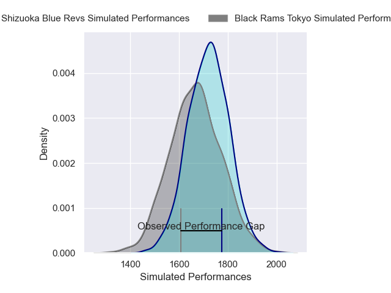
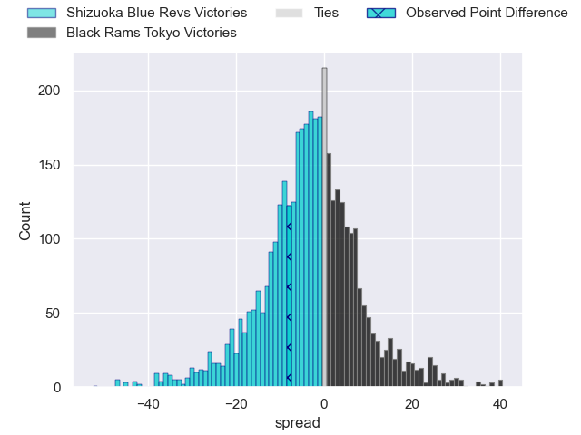
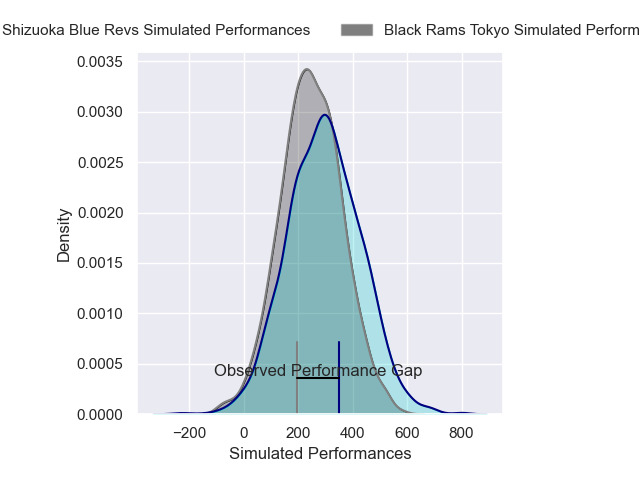
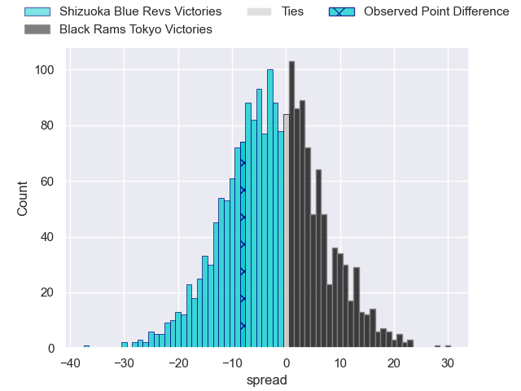

---  
layout: page  
title: Shizuoka Blue Revs at Black Rams Tokyo; 32-24  
date: 2025-02-08 18:00:00 -0500  
categories: "Japan Rugby League One 24/25" match review  
---
# Shizuoka Blue Revs at Black Rams Tokyo; 32-24

# Club Level Predictions

The first set of predictions treats a club as the smallest object, as the club develops its members, organizes a gameplan, and deploys its players as needed for each match. This club model has a prediction of 0.426, which translates to predicting Shizuoka Blue Revs to win by 2.7.

Our Over/Under is 68.5 - and combined with the spread above, we have a predicted scoreline of 35 to 33

Each club has a rating and a rating deviation (similar to a Glicko rating), and expected performances can be generated. This allows for simulated matches and spreads like the ones below.
## Projected Performances - Club Model

## Projected Spreads - Club Model

## Projected Results - Club Model

# Player Level Predictions

Treating teams instead as an entity made up of the currently active players, I have ratings for each player in an altogether different system. These can be combined to form team ratings once teamsheets are announced, weighting starters a bit higher than the reserves. After the match is played, players can be weighted by their minutes on the field, allowing for an accurate measure of the team's composition. With these compiled team ratings, we can make predictions, measure inaccuracy, and update the individual player ratings.
## Prediction without Player Minutes: Shizuoka Blue Revs by 5.3

Shizuoka Blue Revs by 9.5 on a neutral pitch

## Projected Performances - Player Model

## Projected Spreads - Player Model

## Projected Results - Player Model

|   Away Minutes | Away Player             |   Away Percentile |   Number |   Home Percentile | Home Player       |   Home Minutes |
|---------------:|:------------------------|------------------:|---------:|------------------:|:------------------|---------------:|
|             40 | Kenta Yamashita         |             72.76 |        1 |             24.28 | Taishi Tsumura    |             29 |
|             75 | Takeshi Hino            |             98.25 |        2 |             72.95 | Ko Sato           |             29 |
|             80 | Bunkei Kaku             |             59.26 |        3 |             11.6  | Shohei Oyama      |             80 |
|              5 | Yuya Odo                |             95.84 |        4 |             35.14 | Harrison Fox      |             29 |
|             80 | Murray Douglas          |             92.45 |        5 |             25.07 | Josh Goodhue      |             13 |
|             80 | Vueti Tupou             |             63.51 |        6 |              1.54 | Mike Stolberg     |             10 |
|             80 | Takuma Shoji            |             57.63 |        7 |             81.18 | Liam Gill         |             10 |
|             72 | Malgene Ilaua           |             40.22 |        8 |              7.1  | Amato Fakatava    |             62 |
|             64 | Shuntaro Kitamura       |             64.56 |        9 |             96.49 | TJ Perenara       |             80 |
|             59 | Sam Greene              |              7.26 |       10 |             31.62 | Ichigo Nakakusu   |             62 |
|             80 | Malo Tuitama            |             90.92 |       11 |             61.35 | Netani Vakayalia  |             50 |
|             60 | Viliami Tahitu'a        |             81.98 |       12 |             49.84 | Yuki Ikeda        |             62 |
|             80 | Charles Piutau          |             96    |       13 |              6.95 | Viliami Lolohea   |             80 |
|             62 | Valynce Te Whare-Crosby |             80.29 |       14 |             24.54 | Semisi Tupou      |             72 |
|              8 | Futo Yamaguchi          |             59.58 |       15 |             35.83 | Taira Main        |             80 |
|             32 | Sean Vete               |             58.27 |       16 |             45.43 | Kazuma Nishi      |             61 |
|             64 | Shunsuke Sakuta         |            nan    |       17 |             92.43 | Paddy Ryan        |             16 |
|             64 | Shunsuke Sakuta         |            nan    |       17 |             92.43 | Paddy Ryan        |             65 |
|             18 | Kazuhiro Kawata         |            nan    |       18 |             41.43 | Reijiro Yamamoto  |             80 |
|             30 | Eishin Kuwano           |             86.74 |       19 |             70.17 | Shuhei Matsuhashi |             20 |
|             80 | Sylvian Mahuza          |             63.86 |       20 |            nan    | Shin Ouchi        |             21 |
|             70 | Kakeru Okamura          |             39.32 |       21 |             44.79 | Kotaro Ito        |             40 |
|             60 | Sione Vuna              |             57.2  |       22 |            nan    | nan               |            nan |
|             56 | Kodai Okazaki           |             53.68 |       23 |            nan    | nan               |            nan |

