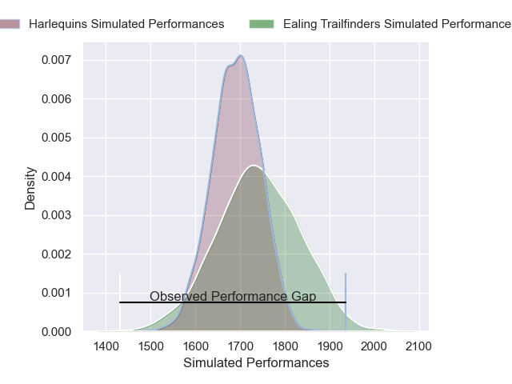
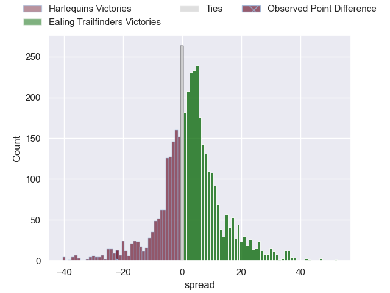
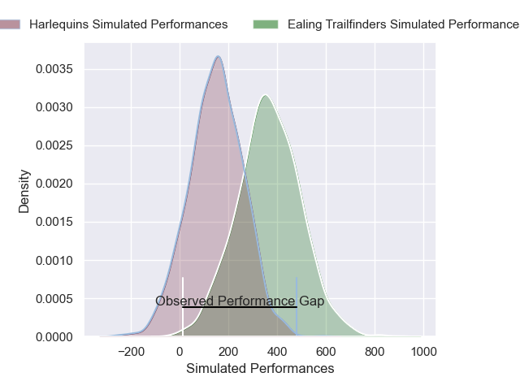
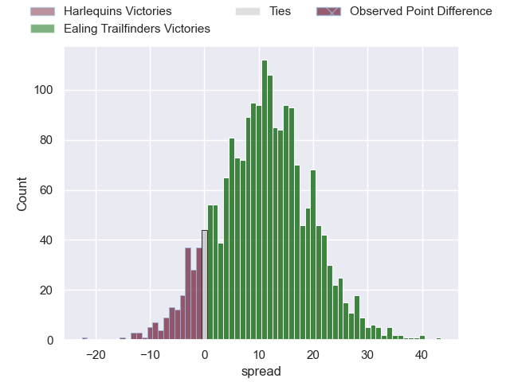
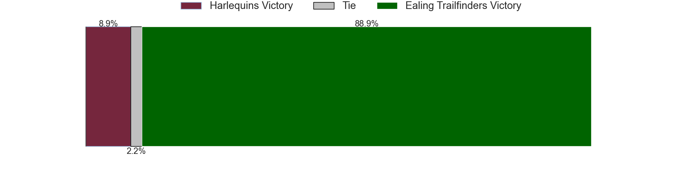

---  
layout: page  
title: Harlequins at Ealing Trailfinders; 32-10  
date: 2025-02-08 18:00:00 -0500  
categories: "Premiership Rugby Cup 24/25" match review  
---
# Harlequins at Ealing Trailfinders; 32-10

# Club Level Predictions

The first set of predictions treats a club as the smallest object, as the club develops its members, organizes a gameplan, and deploys its players as needed for each match. This club model has a prediction of 0.575, which translates to predicting Ealing Trailfinders to win by 2.7.

Our Over/Under is 69.5 - and combined with the spread above, we have a predicted scoreline of 33 to 36

Each club has a rating and a rating deviation (similar to a Glicko rating), and expected performances can be generated. This allows for simulated matches and spreads like the ones below.
## Projected Performances - Club Model

## Projected Spreads - Club Model

## Projected Results - Club Model

# Player Level Predictions

Treating teams instead as an entity made up of the currently active players, I have ratings for each player in an altogether different system. These can be combined to form team ratings once teamsheets are announced, weighting starters a bit higher than the reserves. After the match is played, players can be weighted by their minutes on the field, allowing for an accurate measure of the team's composition. With these compiled team ratings, we can make predictions, measure inaccuracy, and update the individual player ratings.
## Prediction without Player Minutes: Ealing Trailfinders by 13.4

Ealing Trailfinders by 9.2 on a neutral pitch

## Projected Performances - Player Model

## Projected Spreads - Player Model

## Projected Results - Player Model

|   Away Minutes | Away Player      |   Away Percentile |   Number |   Home Percentile | Home Player         |   Home Minutes |
|---------------:|:-----------------|------------------:|---------:|------------------:|:--------------------|---------------:|
|             80 | Wyn Jones        |             87.31 |        1 |             93.95 | Lefty Zigiriadis    |             52 |
|             80 | Sam Riley        |             94.61 |        2 |             73.74 | Mike Willemse       |             63 |
|             28 | William Hobson   |             83.17 |        3 |             61.28 | George Davis        |             80 |
|             28 | Joe Launchbury   |             94.82 |        4 |             95.11 | Bobby de Wee        |             12 |
|             28 | George Hammond   |             45.01 |        5 |             26.97 | Sean Lonsdale       |             46 |
|             12 | Jack Kenningham  |             79.06 |        6 |             81.56 | Rob Farrar          |             80 |
|             26 | Will Evans       |             55.72 |        7 |             66.19 | Jordy Reid          |             50 |
|             80 | Lucas Schmid     |             70.89 |        8 |             28.9  | Will Montgomery     |             80 |
|             25 | Will Porter      |             34.96 |        9 |             92    | Lloyd Williams      |             22 |
|              3 | Jarrod Evans     |             41.91 |       10 |             77.45 | Dan Jones           |             80 |
|             80 | Cassius Cleaves  |             82.22 |       11 |             85.65 | Michael Dykes       |             28 |
|             52 | Ben Waghorn      |             57.23 |       12 |             20.29 | Francis Moore       |             68 |
|             53 | Will Joseph      |             85.33 |       13 |             78.77 | Reuben Bird-Tulloch |             80 |
|             80 | Nick David       |             83.56 |       14 |             94.68 | Angus Kernohan      |             10 |
|             52 | Cameron Anderson |             72.16 |       15 |             86.39 | Tobi Wilson         |             31 |
|             80 | Jordan Els       |            nan    |       16 |             89.05 | Kyle John Whyte     |             80 |
|             52 | Simon Kerrod     |             20.56 |       17 |             80.64 | Cameron Terry       |              4 |
|             80 | Lewis Gjaltema   |             41.91 |       18 |             68.08 | Adam Nicol          |             80 |
|             49 | Jamie Benson     |             20.21 |       19 |             40.4  | Matas Jurevicius    |             68 |
|            nan | nan              |            nan    |       20 |             55.91 | Danny Bridge        |             80 |
|            nan | nan              |            nan    |       21 |             91.83 | Craig Hampson       |             54 |
|            nan | nan              |            nan    |       22 |             33.53 | Ollie Newman        |             77 |

