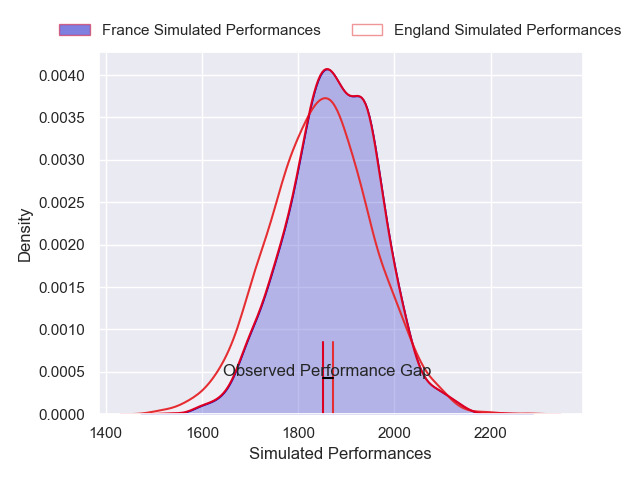
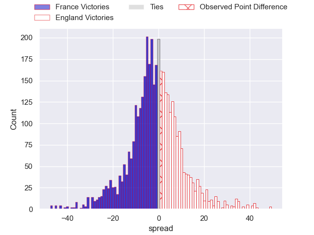
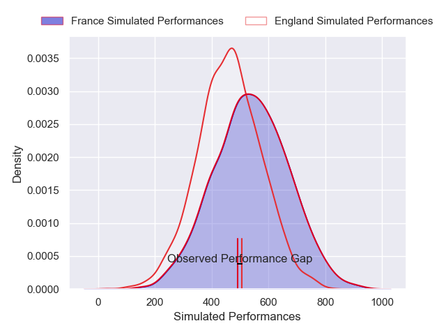
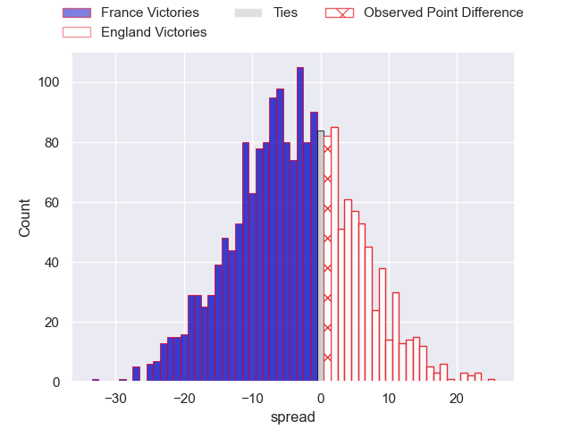

---  
layout: page  
title: France at England; 25-26  
date: 2025-02-08 18:00:00 -0500  
categories: "Six Nations Championship 2025" match review  
---
# France at England; 25-26

# Club Level Predictions

The first set of predictions treats a club as the smallest object, as the club develops its members, organizes a gameplan, and deploys its players as needed for each match. This club model has a prediction of 0.469, which translates to predicting France to win by 1.1.

Our Over/Under is 40.5 - and combined with the spread above, we have a predicted scoreline of 21 to 20

Each club has a rating and a rating deviation (similar to a Glicko rating), and expected performances can be generated. This allows for simulated matches and spreads like the ones below.
## Projected Performances - Club Model

## Projected Spreads - Club Model

## Projected Results - Club Model

# Player Level Predictions

Treating teams instead as an entity made up of the currently active players, I have ratings for each player in an altogether different system. These can be combined to form team ratings once teamsheets are announced, weighting starters a bit higher than the reserves. After the match is played, players can be weighted by their minutes on the field, allowing for an accurate measure of the team's composition. With these compiled team ratings, we can make predictions, measure inaccuracy, and update the individual player ratings.
## Prediction without Player Minutes: France by 7.3

France by 13.3 on a neutral pitch

## Projected Performances - Player Model

## Projected Spreads - Player Model

## Projected Results - Player Model

|   Away Minutes | Away Player           |   Away Percentile |   Number |   Home Percentile | Home Player               |   Home Minutes |
|---------------:|:----------------------|------------------:|---------:|------------------:|:--------------------------|---------------:|
|             30 | Jean-Baptiste Gros    |             98.51 |        1 |             84.41 | Ellis Genge               |              0 |
|             23 | Peato Mauvaka         |             93.6  |        2 |              0.17 | Luke Cowan-Dickie         |             80 |
|             23 | Uini Atonio           |             98.59 |        3 |             73.47 | Will Stuart               |              4 |
|             80 | Alexandre Roumat      |             96.07 |        4 |             99.23 | Maro Itoje                |             80 |
|             28 | Emmanuel Meafou       |             78.12 |        5 |             94.05 | George Martin             |             80 |
|             52 | Francois Cros         |             95.77 |        6 |             83.96 | Tom Curry                 |             40 |
|             80 | Paul Boudehent        |              6.92 |        7 |             99.81 | Ben Earl                  |             57 |
|             27 | Gregory Alldritt      |             98.95 |        8 |             87.34 | Tom Willis                |             57 |
|             30 | Antoine Dupont        |             99.83 |        9 |             97.39 | Alex Mitchell             |             13 |
|             80 | Matthieu Jalibert     |             97.23 |       10 |             80.43 | Fin Smith                 |             26 |
|             67 | Louis Bielle-Biarrey  |             74.14 |       11 |              1.14 | Ollie Sleightholme        |              0 |
|             80 | Yoram Moefana         |             88.87 |       12 |             97.81 | Henry Slade               |             18 |
|             13 | Pierre-Louis Barassi  |             86.58 |       13 |             71.8  | Ollie Lawrence            |             57 |
|             80 | Damian Penaud         |             97.43 |       14 |             92.11 | Tommy Freeman             |             80 |
|             80 | Thomas Ramos          |             94.64 |       15 |             77.32 | Marcus Smith              |             26 |
|             60 | Julien Marchand       |             99.16 |       16 |            100    | Jamie George              |             80 |
|             35 | Cyril Baille          |             97.6  |       17 |              2.65 | Fin Baxter                |             18 |
|             56 | Georges-Henri Colombe |              6.05 |       18 |             91.46 | Joe Heyes                 |             67 |
|             56 | Hugo Auradou          |             40.92 |       19 |             55.33 | Ollie Chessum             |             80 |
|             63 | Mickael Guillard      |             63.34 |       20 |             68.68 | Chandler Cunningham-South |             80 |
|             69 | Oscar Jegou           |             70.99 |       21 |             72.53 | Ben Curry                 |             50 |
|             80 | Nolann Le Garrec      |             79.83 |       22 |             95.48 | Harry Randall             |             23 |
|             21 | Emilien Gailleton     |             60.87 |       23 |             93.4  | Elliot Daly               |             50 |

