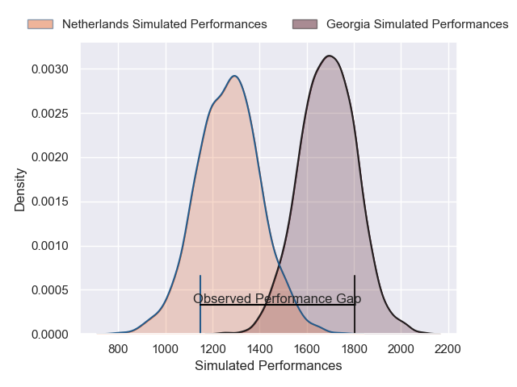
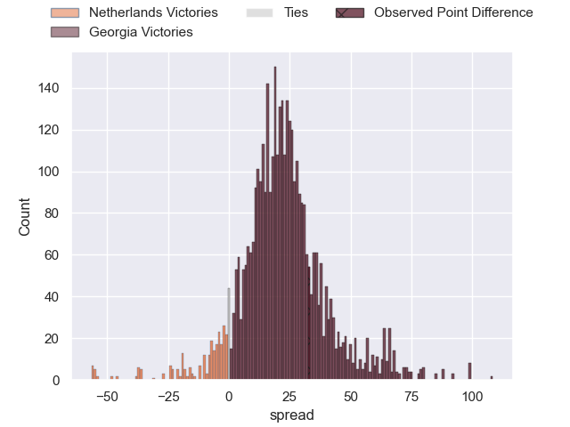
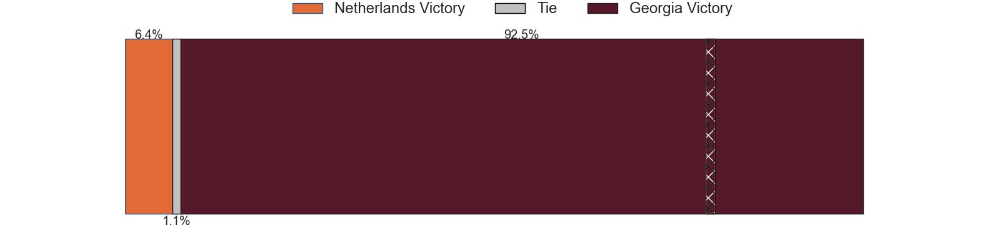
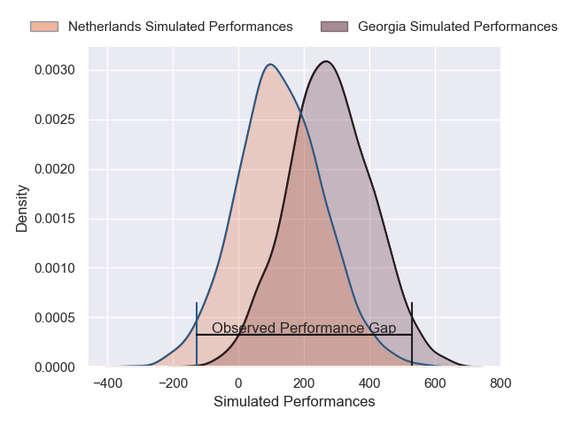
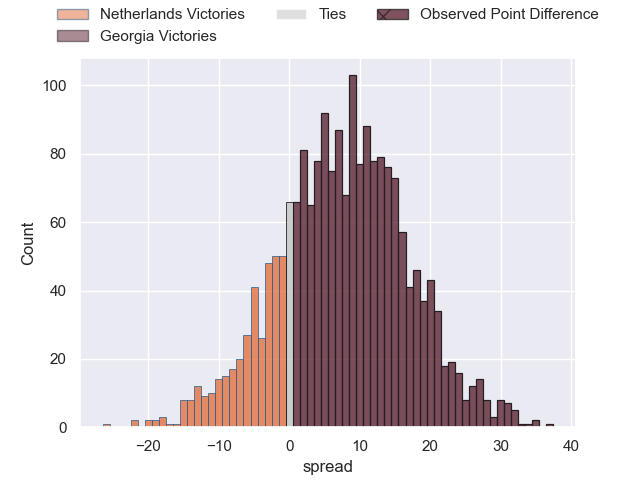
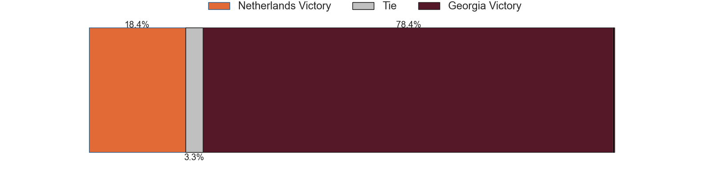

---  
layout: page  
title: Netherlands at Georgia; 7-40  
date: 2025-02-08 18:00:00 -0500  
categories: "Rugby Europe Championship 2025" match review  
---
# Netherlands at Georgia; 7-40

# Club Level Predictions

The first set of predictions treats a club as the smallest object, as the club develops its members, organizes a gameplan, and deploys its players as needed for each match. This club model has a prediction of 0.903, which translates to predicting Georgia to win by 21.1.

Our Over/Under is 46.5 - and combined with the spread above, we have a predicted scoreline of 13 to 34

Each club has a rating and a rating deviation (similar to a Glicko rating), and expected performances can be generated. This allows for simulated matches and spreads like the ones below.
## Projected Performances - Club Model

## Projected Spreads - Club Model

## Projected Results - Club Model

# Player Level Predictions

Treating teams instead as an entity made up of the currently active players, I have ratings for each player in an altogether different system. These can be combined to form team ratings once teamsheets are announced, weighting starters a bit higher than the reserves. After the match is played, players can be weighted by their minutes on the field, allowing for an accurate measure of the team's composition. With these compiled team ratings, we can make predictions, measure inaccuracy, and update the individual player ratings.
## Prediction without Player Minutes: Georgia by 11.4

Georgia by 7.4 on a neutral pitch

## Projected Performances - Player Model

## Projected Spreads - Player Model

## Projected Results - Player Model

|   Away Minutes | Away Player         |   Away Percentile |   Number |   Home Percentile | Home Player          |   Home Minutes |
|---------------:|:--------------------|------------------:|---------:|------------------:|:---------------------|---------------:|
|             80 | Odin Ruijgrok       |             35.97 |        1 |             75.56 | Giorgi Mamaiashvili  |             78 |
|             60 | Robbie Coetzee      |             34.21 |        2 |             77.84 | Vano Karkadze        |             80 |
|             80 | Gabor Besuijen      |             31.6  |        3 |             80.16 | Irakli Aptsiauri     |             80 |
|             75 | Chris Van Leeuwen   |             35.04 |        4 |             84.7  | Mikheil Babunashvili |             58 |
|             80 | Koen Bloemen        |             19.55 |        5 |             60.79 | Lado Chachanidze     |             75 |
|             80 | Tim De Jong         |             17.18 |        6 |             80.21 | Beka Gorgadze        |             80 |
|             67 | Joris Smits         |             32.92 |        7 |             92.08 | Beka Saghinadze      |             80 |
|             75 | Christopher Raymond |             16.13 |        8 |             16.99 | Tornike Jalagonia    |             46 |
|             80 | Amir Rademaker      |             18.6  |        9 |             13.68 | Vasil Lobzhanidze    |             80 |
|             80 | Vikas Meijer        |             15.17 |       10 |             73.08 | Luka Matkava         |             50 |
|             32 | Daan Van Der Avoird |             34.98 |       11 |             95.17 | Sandro Todua         |              5 |
|             13 | David Weersma       |             48.79 |       12 |             69.02 | Tornike Kakhoidze    |             22 |
|             32 | Oliva Sialau        |             25.61 |       13 |             98.1  | Giorgi Kveseladze    |              5 |
|              0 | Tc Campbell         |             49.28 |       14 |             94.49 | Aka Tabutsadze       |             79 |
|             20 | Mees Van Oord       |             40.83 |       15 |             82.92 | Davit Niniashvili    |              1 |
|             34 | Lars Linnenbank     |            nan    |       16 |             21.12 | Irakli Kvatadze      |             80 |
|             30 | Shane Fikken        |            nan    |       17 |            nan    | Luka Goginava        |             80 |
|             57 | Thymo Peters        |            nan    |       18 |             90.09 | Merab Sharikadze     |             80 |
|             30 | Monty Leverstein    |             37.37 |       19 |             86.25 | Giorgi Javakhia      |             23 |
|             34 | Spike Salman        |             37.84 |       20 |             88.8  | Giorgi Tsutskiridze  |              5 |
|             80 | Mark Coebergh       |            nan    |       21 |             68.42 | Gela Aprasidze       |             50 |
|             80 | Mees Voets          |            nan    |       22 |            nan    | Giorgi Khaindrava    |             30 |
|             33 | Kaj Verhoorn        |            nan    |       23 |             55    | Dachi Papunashvili   |             80 |

