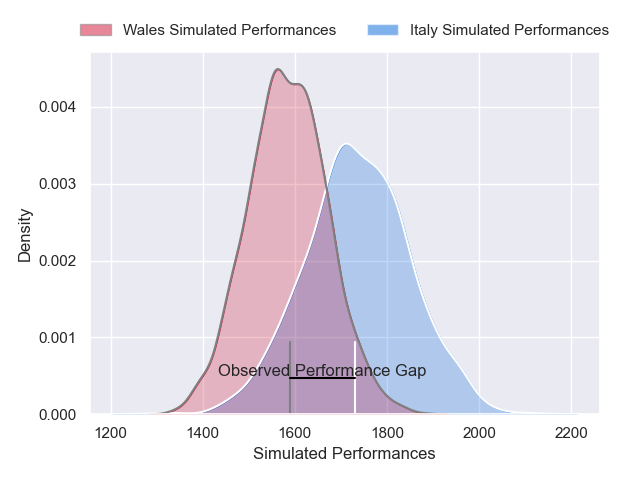
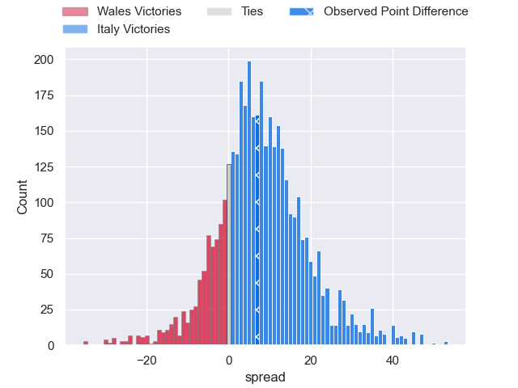
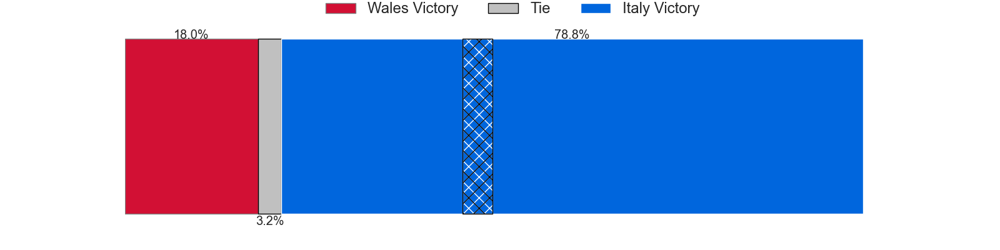
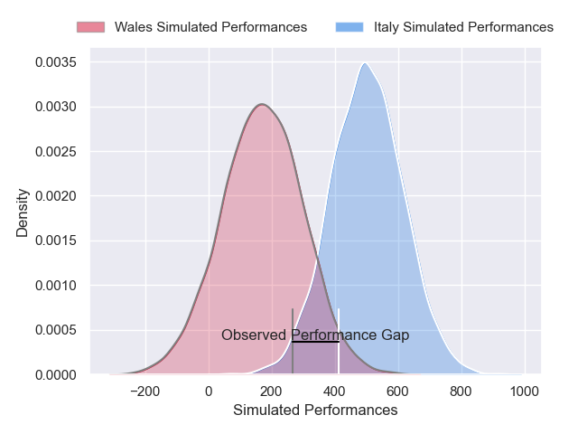
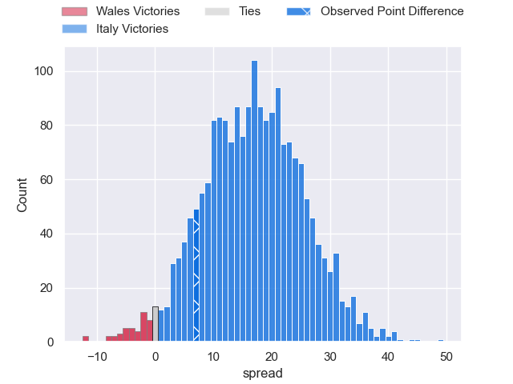

---  
layout: page  
title: Wales at Italy; 15-22  
date: 2025-02-08 18:00:00 -0500  
categories: "Six Nations Championship 2025" match review  
---
# Wales at Italy; 15-22

# Club Level Predictions

The first set of predictions treats a club as the smallest object, as the club develops its members, organizes a gameplan, and deploys its players as needed for each match. This club model has a prediction of 0.699, which translates to predicting Italy to win by 7.6.

Our Over/Under is 47.5 - and combined with the spread above, we have a predicted scoreline of 20 to 28

Each club has a rating and a rating deviation (similar to a Glicko rating), and expected performances can be generated. This allows for simulated matches and spreads like the ones below.
## Projected Performances - Club Model

## Projected Spreads - Club Model

## Projected Results - Club Model

# Player Level Predictions

Treating teams instead as an entity made up of the currently active players, I have ratings for each player in an altogether different system. These can be combined to form team ratings once teamsheets are announced, weighting starters a bit higher than the reserves. After the match is played, players can be weighted by their minutes on the field, allowing for an accurate measure of the team's composition. With these compiled team ratings, we can make predictions, measure inaccuracy, and update the individual player ratings.
## Prediction without Player Minutes: Italy by 17.6

Italy by 12.4 on a neutral pitch

## Projected Performances - Player Model

## Projected Spreads - Player Model

## Projected Results - Player Model

|   Away Minutes | Away Player      |   Away Percentile |   Number |   Home Percentile | Home Player        |   Home Minutes |
|---------------:|:-----------------|------------------:|---------:|------------------:|:-------------------|---------------:|
|             35 | Gareth Thomas    |             50.29 |        1 |             63.46 | Danilo Fischetti   |             18 |
|             35 | Evan Lloyd       |             35.43 |        2 |             96.34 | Giacomo Nicotera   |             69 |
|             80 | Henry Thomas     |             75.06 |        3 |             93.17 | Simone Ferrari     |             80 |
|             18 | Will Rowlands    |             19.65 |        4 |             60.41 | Niccolo Cannone    |             45 |
|             11 | Freddie Thomas   |             70.09 |        5 |             94.09 | Federico Ruzza     |             58 |
|             80 | James Botham     |             77.99 |        6 |             83.78 | Sebastian Negri    |             67 |
|             80 | Jac Morgan       |             95.17 |        7 |             96.04 | Michele Lamaro     |             49 |
|             21 | Taulupe Faletau  |             80    |        8 |             96.99 | Lorenzo Cannone    |             13 |
|             35 | Tomos Williams   |             85.26 |        9 |             72.98 | Martin Page-Relo   |             53 |
|             16 | Ben Thomas       |             43.16 |       10 |             80.56 | Paolo Garbisi      |             67 |
|             22 | Josh Adams       |             83.86 |       11 |             97.1  | Monty Ioane        |             80 |
|             80 | Eddie James      |             79.35 |       12 |             94.2  | Tommaso Menoncello |             27 |
|             28 | Nick Tompkins    |             99.68 |       13 |             91.89 | Juan Ignacio Brex  |             13 |
|             58 | Tom Rogers       |             82.03 |       14 |             97.87 | Ange Capuozzo      |             62 |
|             80 | Blair Murray     |             48.12 |       15 |             64.38 | Tommaso Allan      |             31 |
|             52 | Elliot Dee       |             87.96 |       16 |             85.69 | Gianmarco Lucchesi |             80 |
|             80 | Nicky Smith      |             79.59 |       17 |             64.03 | Luca Rizzoli       |             62 |
|             18 | Keiron Assiratti |              3.37 |       18 |             81.23 | Marco Riccioni     |             45 |
|             62 | Keiron Assiratti |              3.37 |       18 |             81.23 | Marco Riccioni     |             45 |
|             80 | Teddy Williams   |              8.81 |       19 |             73.86 | Dino Lamb          |             22 |
|             54 | Aaron Wainwright |             25.16 |       20 |             74.13 | Manuel Zuliani     |             27 |
|             35 | Rhodri Williams  |             78.25 |       21 |             75.27 | Ross Vintcent      |             80 |
|             80 | Dan Edwards      |             79.7  |       22 |             61.58 | Alessandro Garbisi |             45 |
|             18 | Josh Hathaway    |             70.82 |       23 |             16.62 | Jacopo Trulla      |             59 |

