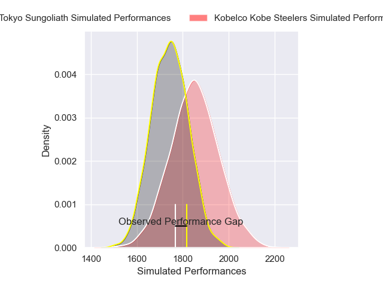
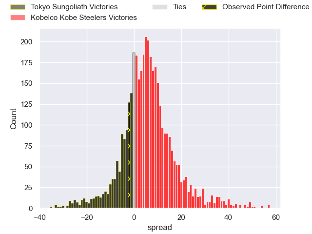
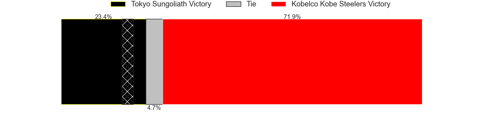
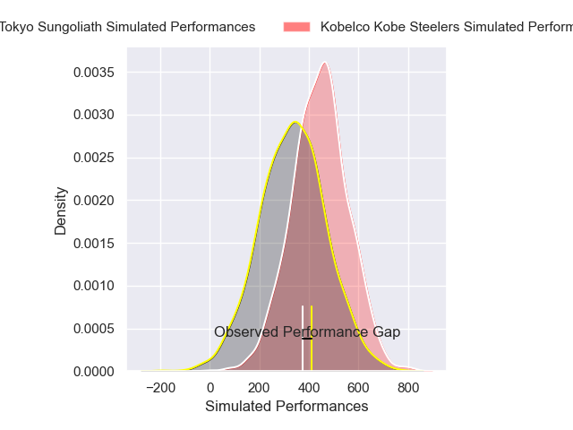
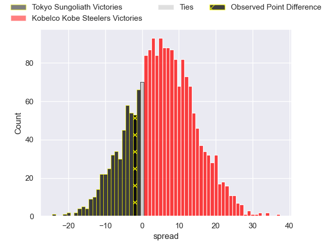
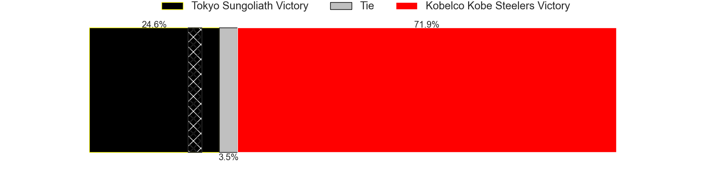

---  
layout: page  
title: Tokyo Sungoliath at Kobelco Kobe Steelers; 31-29  
date: 2025-02-08 18:00:00 -0500  
categories: "Japan Rugby League One 24/25" match review  
---
# Tokyo Sungoliath at Kobelco Kobe Steelers; 31-29

# Club Level Predictions

The first set of predictions treats a club as the smallest object, as the club develops its members, organizes a gameplan, and deploys its players as needed for each match. This club model has a prediction of 0.643, which translates to predicting Kobelco Kobe Steelers to win by 5.3.

Our Over/Under is 66.5 - and combined with the spread above, we have a predicted scoreline of 31 to 36

Each club has a rating and a rating deviation (similar to a Glicko rating), and expected performances can be generated. This allows for simulated matches and spreads like the ones below.
## Projected Performances - Club Model

## Projected Spreads - Club Model

## Projected Results - Club Model

# Player Level Predictions

Treating teams instead as an entity made up of the currently active players, I have ratings for each player in an altogether different system. These can be combined to form team ratings once teamsheets are announced, weighting starters a bit higher than the reserves. After the match is played, players can be weighted by their minutes on the field, allowing for an accurate measure of the team's composition. With these compiled team ratings, we can make predictions, measure inaccuracy, and update the individual player ratings.
## Prediction without Player Minutes: Kobelco Kobe Steelers by 13.1

Kobelco Kobe Steelers by 8.3 on a neutral pitch

## Projected Performances - Player Model

## Projected Spreads - Player Model

## Projected Results - Player Model

|   Away Minutes | Away Player         |   Away Percentile |   Number |   Home Percentile | Home Player          |   Home Minutes |
|---------------:|:--------------------|------------------:|---------:|------------------:|:---------------------|---------------:|
|             51 | Kenta Kobayashi     |             43.65 |        1 |             61.58 | Shigure Takao        |             61 |
|             29 | Kosuke Horikoshi    |             69.93 |        2 |             99.66 | George Turner        |             80 |
|             64 | Shinnosuke Kakinaga |             87.63 |        3 |             29.54 | Sho Maeda            |             80 |
|             55 | Sam Jeffries        |             93.08 |        4 |             86.92 | Gerard Cowley-Tuioti |             15 |
|             80 | Harry Hockings      |             98.08 |        5 |            100    | Brodie Retallick     |             61 |
|             80 | Sean McMahon        |             97.19 |        6 |             63.72 | Takara Imamura       |             25 |
|             71 | Kanji Shimokawa     |             78.47 |        7 |             80.6  | Tiennan Costley      |             80 |
|             67 | Tamati Ioane        |             11.58 |        8 |             61.05 | Amanaki Saumaki      |             21 |
|             80 | Yutaka Nagare       |             56.99 |        9 |             91.5  | Atsushi Hiwasa       |             25 |
|             64 | Mikiya Takamoto     |             54.24 |       10 |             91.53 | Bryn Gatland         |             34 |
|             80 | Taiga Ozaki         |             70.12 |       11 |             55.42 | Kenta Matsunaga      |             80 |
|             80 | Shogo Nakano        |             16.72 |       12 |             61.13 | Timothy Lafaele      |             26 |
|             19 | Isaiah Punivai      |             40.75 |       13 |             68.03 | Michael Little       |             25 |
|             62 | Seiya Ozaki         |             91.89 |       14 |             21.3  | Ataata Moeakiola     |             54 |
|             10 | Ryosuke Kawase      |             21.84 |       15 |             92.04 | Rakuhei Yamashita    |             80 |
|             46 | Yukio Morikawa      |             84.98 |       16 |             73.14 | Kenta Matsuoka       |             67 |
|             80 | Kan Nakano          |             13.2  |       17 |             87.25 | Ngani Laumape        |             80 |
|             15 | Trevor Hosea        |             22.12 |       18 |             72.21 | Waisake Raratubua    |             67 |
|             29 | Ryuga Hashimoto     |             70.81 |       19 |             94.19 | Hiroshi Yamashita    |             21 |
|             80 | Cheslin Kolbe       |             99.91 |       20 |             40.35 | Willie Potgieter     |             80 |
|             65 | Kenta Fukuda        |             71.5  |       21 |             47.79 | Daiki Nakajima       |             26 |
|             80 | Tatsuya Miyazaki    |             19.93 |       22 |             53.63 | Ryota Funabiki       |             14 |

