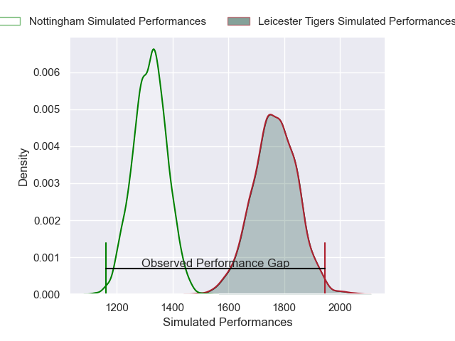
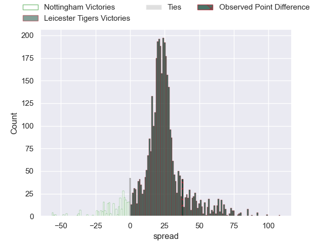
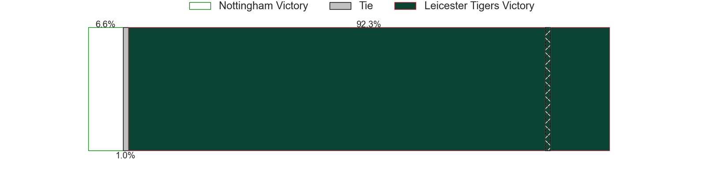
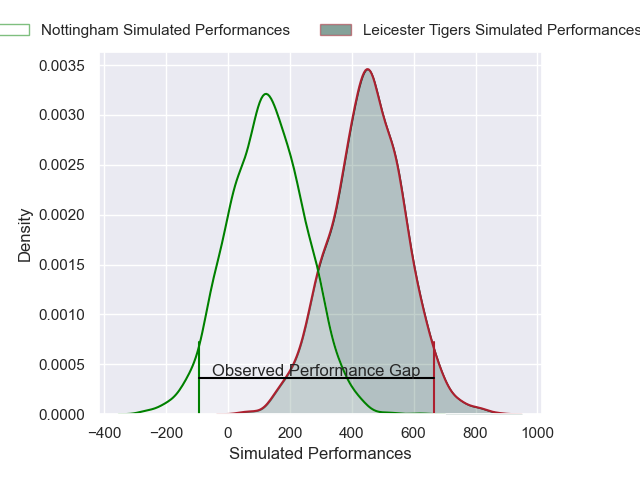
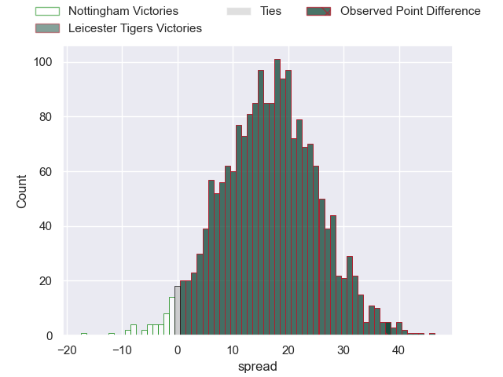
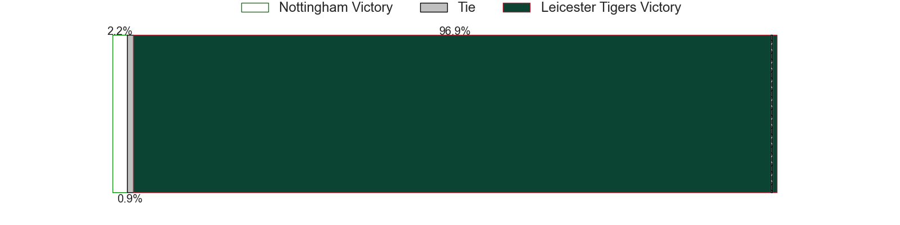

---  
layout: page  
title: Nottingham at Leicester Tigers; 19-57  
date: 2025-02-08 18:00:00 -0500  
categories: "Premiership Rugby Cup 24/25" match review  
---
# Nottingham at Leicester Tigers; 19-57

# Club Level Predictions

The first set of predictions treats a club as the smallest object, as the club develops its members, organizes a gameplan, and deploys its players as needed for each match. This club model has a prediction of 0.926, which translates to predicting Leicester Tigers to win by 22.3.

Our Over/Under is 69.5 - and combined with the spread above, we have a predicted scoreline of 23 to 46

Each club has a rating and a rating deviation (similar to a Glicko rating), and expected performances can be generated. This allows for simulated matches and spreads like the ones below.
## Projected Performances - Club Model

## Projected Spreads - Club Model

## Projected Results - Club Model

# Player Level Predictions

Treating teams instead as an entity made up of the currently active players, I have ratings for each player in an altogether different system. These can be combined to form team ratings once teamsheets are announced, weighting starters a bit higher than the reserves. After the match is played, players can be weighted by their minutes on the field, allowing for an accurate measure of the team's composition. With these compiled team ratings, we can make predictions, measure inaccuracy, and update the individual player ratings.
## Prediction without Player Minutes: Leicester Tigers by 18.9

Leicester Tigers by 3.6 on a neutral pitch

## Projected Performances - Player Model

## Projected Spreads - Player Model

## Projected Results - Player Model

|   Away Minutes | Away Player        |   Away Percentile |   Number |   Home Percentile | Home Player           |   Home Minutes |
|---------------:|:-------------------|------------------:|---------:|------------------:|:----------------------|---------------:|
|             80 | Aniseko Sio        |             30.93 |        1 |             93.86 | James Cronin          |             80 |
|             80 | Jack Dickinson     |             52.19 |        2 |             56.57 | Finn Theobald-Thomas  |             46 |
|             31 | Dan Richardson     |             82.42 |        3 |             51.58 | Tubuna Maka           |             40 |
|             31 | Jay Ecclesfield    |             22.74 |        4 |             72.36 | Tom Manz              |             55 |
|             22 | Sebastien Ferreira |              3.55 |        5 |             22.07 | Come Clayver Joussain |             30 |
|             26 | Kody Vereti        |             44    |        6 |             90.01 | Finn Carnduff         |             25 |
|             16 | Nathan Tweedy      |             34.87 |        7 |             80.79 | Emeka Ilione          |             25 |
|             49 | James Cherry       |             57.17 |        8 |              2.11 | Kyle Hatherell        |             80 |
|             80 | Josh Goodwin       |             26.78 |        9 |             79.3  | Tom Whiteley          |             49 |
|             28 | Jai Johal          |             28.09 |       10 |             32.34 | Ben Volavola          |             30 |
|             18 | Ryan Olowofela     |             85.74 |       11 |             78.8  | Will Wand             |             80 |
|             80 | Gwyn Parks         |             12.7  |       12 |             42.87 | Joseph Woodward       |             80 |
|             80 | Levi Roper         |             48.8  |       13 |             95.63 | Dan Kelly             |             62 |
|             54 | David Williams     |             17.11 |       14 |             40.97 | George Pearson        |             49 |
|             31 | Jack Stapley       |              1.65 |       15 |             17.53 | James Shillcock       |             80 |
|             17 | Kai Owen           |             78.36 |       16 |             23.4  | Charlie Clare         |             80 |
|             80 | Harry Clayton      |             79.8  |       17 |             54.89 | Cameron Miell         |             58 |
|             80 | Ale Loman          |             92.62 |       18 |             18.74 | Xavier Valentine      |             34 |
|             80 | Jacob Wright       |             16.67 |       19 |             69.67 | Cameron Henderson     |             40 |
|             26 | Jack Shine         |             55.37 |       20 |            nan    | Joshua Manz           |             80 |
|             78 | Will Yarnell       |             41.04 |       21 |             71.3  | Ollie Allan           |             19 |
|             31 | Harry Graham       |             76.24 |       22 |             28.61 | Malelili Satala       |             70 |
|             80 | Javiah Pohe        |             11.34 |       23 |             38.09 | Tom Threlfall         |             54 |

