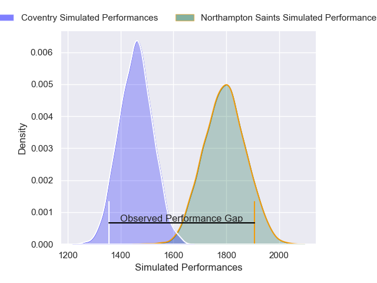
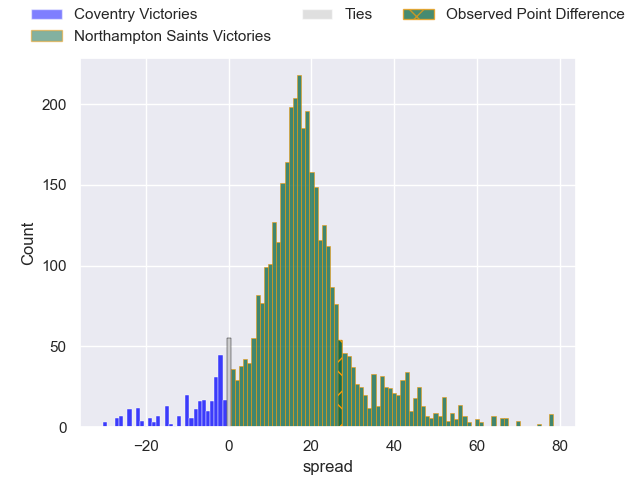
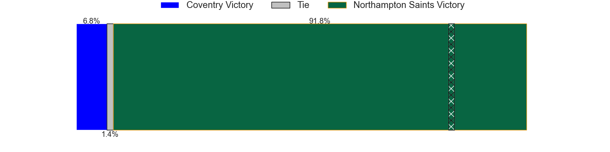
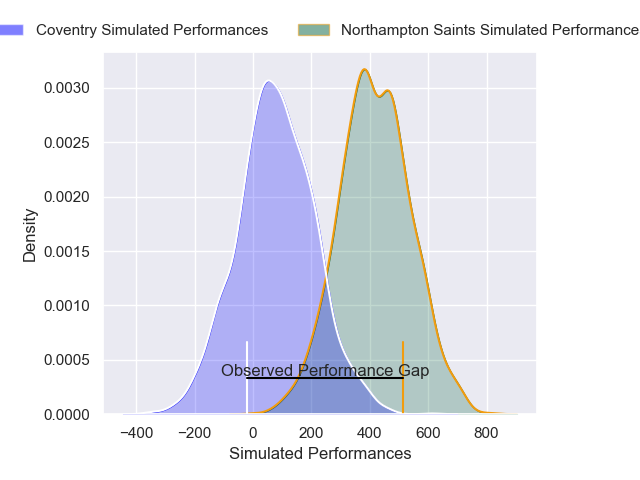
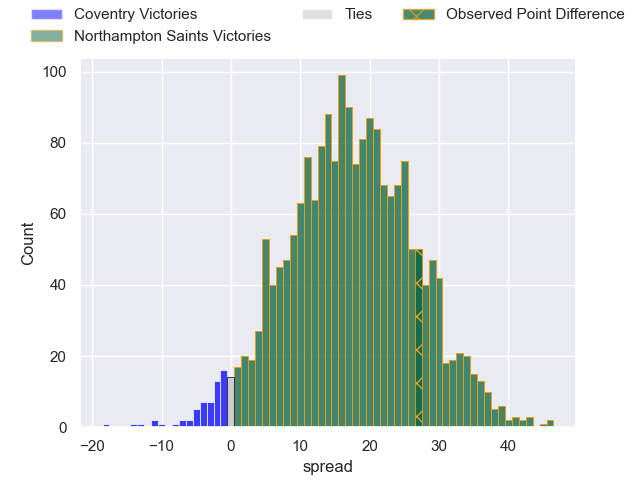
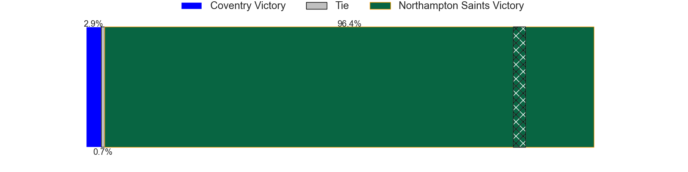

---  
layout: page  
title: Coventry at Northampton Saints; 23-50  
date: 2025-02-08 18:00:00 -0500  
categories: "Premiership Rugby Cup 24/25" match review  
---
# Coventry at Northampton Saints; 23-50

# Club Level Predictions

The first set of predictions treats a club as the smallest object, as the club develops its members, organizes a gameplan, and deploys its players as needed for each match. This club model has a prediction of 0.873, which translates to predicting Northampton Saints to win by 17.1.

Our Over/Under is 65.5 - and combined with the spread above, we have a predicted scoreline of 24 to 41

Each club has a rating and a rating deviation (similar to a Glicko rating), and expected performances can be generated. This allows for simulated matches and spreads like the ones below.
## Projected Performances - Club Model

## Projected Spreads - Club Model

## Projected Results - Club Model

# Player Level Predictions

Treating teams instead as an entity made up of the currently active players, I have ratings for each player in an altogether different system. These can be combined to form team ratings once teamsheets are announced, weighting starters a bit higher than the reserves. After the match is played, players can be weighted by their minutes on the field, allowing for an accurate measure of the team's composition. With these compiled team ratings, we can make predictions, measure inaccuracy, and update the individual player ratings.
## Prediction without Player Minutes: Northampton Saints by 12.5

Coventry by 2.5 on a neutral pitch

## Projected Performances - Player Model

## Projected Spreads - Player Model

## Projected Results - Player Model

|   Away Minutes | Away Player          |   Away Percentile |   Number |   Home Percentile | Home Player             |   Home Minutes |
|---------------:|:---------------------|------------------:|---------:|------------------:|:------------------------|---------------:|
|             21 | Toby Trinder         |             90.46 |        1 |             83.32 | Tarek Haffar            |             18 |
|             53 | Jordon Poole         |             91.72 |        2 |             86.82 | Craig Wright            |             62 |
|             80 | Eliot Salt           |             14.11 |        3 |             70.62 | Luke Green              |             16 |
|             80 | Obinna Nkwocha       |             36.92 |        4 |             62.21 | Ed Prowse               |             80 |
|             80 | James Tyas           |             48.65 |        5 |             26.35 | Tom Lockett             |             80 |
|             80 | Tom Ball             |             88.65 |        6 |              5.43 | Josh Kemeny             |             80 |
|             22 | Aaron Hinkley        |             16    |        7 |             54.9  | Angus Scott-Young       |             28 |
|             11 | Senitiki Nayalo      |             98.53 |        8 |             15.16 | Fyn Brown               |             28 |
|             40 | Sam Maunder          |             33.98 |        9 |             44.07 | Tom James               |             80 |
|             27 | Tommy Mathews        |             60.81 |       10 |             75    | George Makepeace-Cubitt |             28 |
|             15 | James Martin         |             88.97 |       11 |              3.3  | Tom Seabrook            |             26 |
|             15 | Thomas Hitchcock     |             67.19 |       12 |             54.23 | Charlie Savala          |             54 |
|             65 | Dafydd-Rhys Tiueti   |             13.17 |       13 |             41.38 | Billy Pasco             |             80 |
|             59 | David Opoku-Fordjour |              5.47 |       14 |             18.38 | William Glister         |             22 |
|             80 | Ryan Hutler          |             56.12 |       15 |             73.88 | James Ramm              |             80 |
|             80 | Jevaughn Warren      |             19.92 |       16 |             51.7  | Tom West                |             80 |
|             62 | Vilikesa Nairau      |             68.71 |       17 |              9.63 | Beltus Nonleh           |             80 |
|             44 | Will Biggs           |            nan    |       18 |             36    | Archie Benson           |             36 |
|             80 | Theodore Mannion     |            nan    |       19 |             95    | Temo Mayanavanua        |             69 |
|             80 | Rhys Anstey          |             18.65 |       20 |            nan    | Jonny Weimann           |             53 |
|             60 | Daniel Okeke         |             72.63 |       21 |            nan    | Iakopo Petelo Mapu      |             80 |
|             48 | Josh Barton          |             18.05 |       22 |             31.39 | Rafe Witheat            |             40 |
|             80 | Charlie Robson       |             31.02 |       23 |            nan    | nan                     |            nan |

