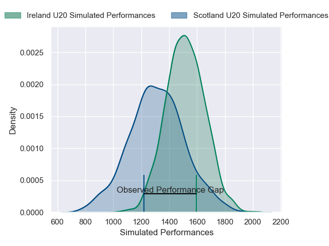
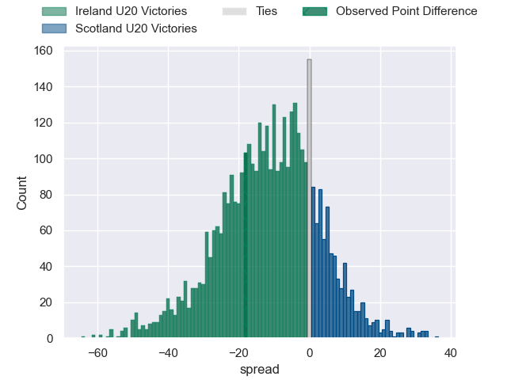
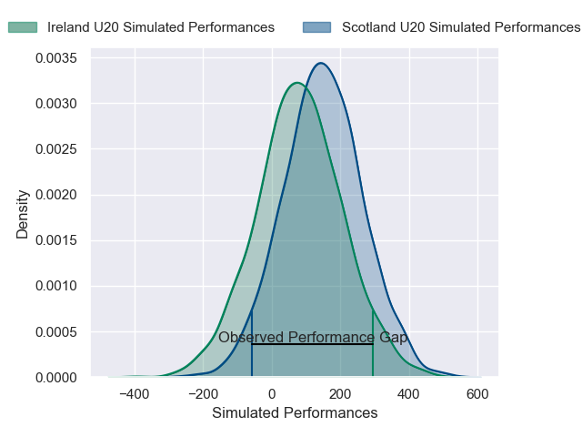
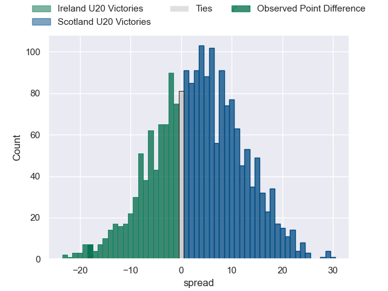

---  
layout: page  
title: Ireland U20 at Scotland U20; 33-15  
date: 2025-02-08 18:00:00 -0500  
categories: "U20 Six Nations Championship 2025" match review  
---
# Ireland U20 at Scotland U20; 33-15

# Club Level Predictions

The first set of predictions treats a club as the smallest object, as the club develops its members, organizes a gameplan, and deploys its players as needed for each match. This club model has a prediction of 0.255, which translates to predicting Ireland U20 to win by 10.2.

Our Over/Under is 52.5 - and combined with the spread above, we have a predicted scoreline of 31 to 21

Each club has a rating and a rating deviation (similar to a Glicko rating), and expected performances can be generated. This allows for simulated matches and spreads like the ones below.
## Projected Performances - Club Model

## Projected Spreads - Club Model

## Projected Results - Club Model

# Player Level Predictions

Treating teams instead as an entity made up of the currently active players, I have ratings for each player in an altogether different system. These can be combined to form team ratings once teamsheets are announced, weighting starters a bit higher than the reserves. After the match is played, players can be weighted by their minutes on the field, allowing for an accurate measure of the team's composition. With these compiled team ratings, we can make predictions, measure inaccuracy, and update the individual player ratings.
## Prediction without Player Minutes: Scotland U20 by 4.3

Scotland U20 by 2.1 on a neutral pitch

## Projected Performances - Player Model

## Projected Spreads - Player Model

## Projected Results - Player Model

|   Away Minutes | Away Player         |   Away Percentile |   Number |   Home Percentile | Home Player          |   Home Minutes |
|---------------:|:--------------------|------------------:|---------:|------------------:|:---------------------|---------------:|
|             80 | Billy Bohan         |             60.03 |        1 |             32.92 | Ollie Mckenna        |             34 |
|             18 | Henry Walker        |             45.96 |        2 |             25.08 | Joe Roberts          |             59 |
|             62 | Alex Mullan         |             66.67 |        3 |             36.82 | Ollie Blyth-Lafferty |             23 |
|             36 | Mahon Ronan         |             40.02 |        4 |             44.15 | Charlie Moss         |              5 |
|             54 | Billy Corrigan      |             62.28 |        5 |             35.7  | Dan Halkon           |             30 |
|             69 | Michael Foy         |             53.7  |        6 |             34.29 | Christian Lindsay    |             34 |
|             80 | Bobby Power         |             69.64 |        7 |             43.42 | Billy Allen          |              5 |
|             80 | Éanna Mccarthy      |             57.81 |        8 |             33.54 | Reuben Logan         |             22 |
|             80 | Clark Logan         |             57.22 |        9 |             43.3  | Noah Cowan           |              5 |
|             24 | Sam Wisniewski      |             48.3  |       10 |             26.81 | Mathew Urwin         |             46 |
|             20 | Ciarán Mangan       |             53.99 |       11 |             30.32 | Fergus Watson        |             50 |
|             22 | Connor Fahy         |             33.61 |       12 |             21.9  | Kerr Yule            |             80 |
|             16 | Gene O'Leary Kareem |             31.43 |       13 |             21.9  | Johnny Ventisei      |             80 |
|             40 | Charlie Molony      |             45.72 |       14 |             34.32 | Nairn Moncrieff      |             40 |
|             67 | Daniel Green        |             50.72 |       15 |             21.44 | Jack Brown           |             75 |
|             52 | Connor Magee        |            nan    |       16 |            nan    | Seb Stephen          |             40 |
|             40 | Paddy Moore         |            nan    |       17 |            nan    | Jake Shearer         |             65 |
|             80 | Tom Mcallister      |            nan    |       18 |            nan    | Jamie Stewart        |             40 |
|             62 | David Walsh         |            nan    |       19 |            nan    | Bart Godsell         |             80 |
|             80 | Oisin Minogue       |            nan    |       20 |            nan    | Ollie Duncan         |             80 |
|             67 | Will Wooton         |            nan    |       21 |            nan    | Hector Patterson     |             80 |
|             80 | Dylan Hicks         |            nan    |       22 |            nan    | Ross Wolfenden       |             80 |
|             34 | Eoghan Smyth        |             32.15 |       23 |            nan    | Campbell Waugh       |             72 |

