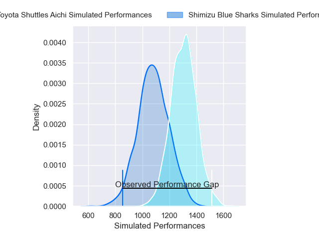
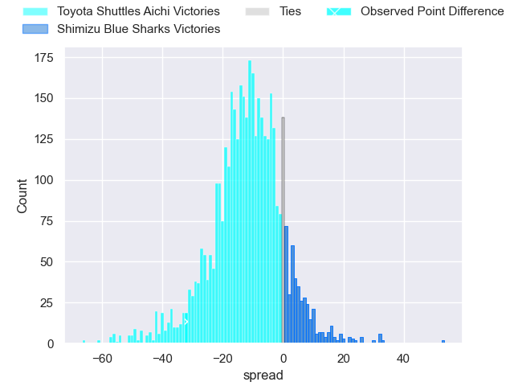
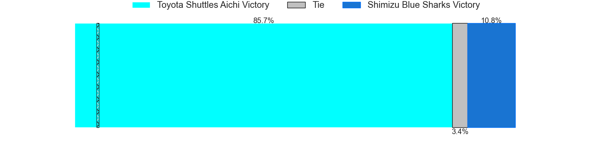
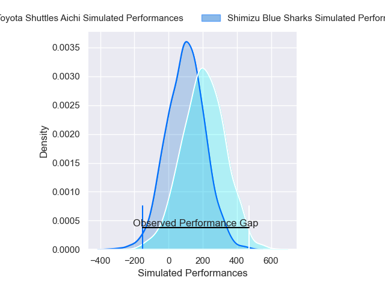
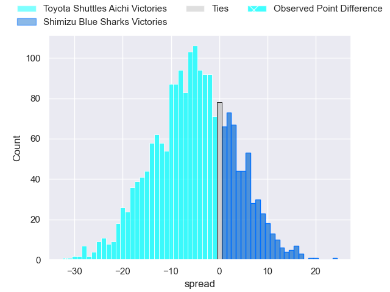
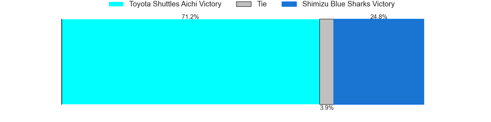

---  
layout: page  
title: Toyota Shuttles Aichi at Shimizu Blue Sharks; 47-15  
date: 2025-02-08 18:00:00 -0500  
categories: "Japan Rugby League One D2 24/25" match review  
---
# Toyota Shuttles Aichi at Shimizu Blue Sharks; 47-15

# Club Level Predictions

The first set of predictions treats a club as the smallest object, as the club develops its members, organizes a gameplan, and deploys its players as needed for each match. This club model has a prediction of 0.223, which translates to predicting Toyota Shuttles Aichi to win by 11.3.

Our Over/Under is 61.5 - and combined with the spread above, we have a predicted scoreline of 36 to 25

Each club has a rating and a rating deviation (similar to a Glicko rating), and expected performances can be generated. This allows for simulated matches and spreads like the ones below.
## Projected Performances - Club Model

## Projected Spreads - Club Model

## Projected Results - Club Model

# Player Level Predictions

Treating teams instead as an entity made up of the currently active players, I have ratings for each player in an altogether different system. These can be combined to form team ratings once teamsheets are announced, weighting starters a bit higher than the reserves. After the match is played, players can be weighted by their minutes on the field, allowing for an accurate measure of the team's composition. With these compiled team ratings, we can make predictions, measure inaccuracy, and update the individual player ratings.
## Prediction without Player Minutes: Toyota Shuttles Aichi by 3.6

Toyota Shuttles Aichi by 6.3 on a neutral pitch

## Projected Performances - Player Model

## Projected Spreads - Player Model

## Projected Results - Player Model

|   Away Minutes | Away Player        |   Away Percentile |   Number |   Home Percentile | Home Player         |   Home Minutes |
|---------------:|:-------------------|------------------:|---------:|------------------:|:--------------------|---------------:|
|             67 | Tomoki Yamaguchi   |             72.89 |        1 |             74.46 | Sanshiro Nomura     |             20 |
|             40 | Akito Fujinami     |             33.16 |        2 |             52.36 | Naomichi Tatekawa   |             71 |
|             27 | Nobuyuki Takahashi |             81.92 |        3 |             79.02 | Uha Lee             |              9 |
|              3 | Taishi Nakamura    |             64.2  |        4 |             11.32 | Sosiceni Tokoqio    |             80 |
|             13 | James Gaskell      |             55.18 |        5 |             48.56 | Tom Rowe            |              3 |
|             80 | Tama Kapene        |             84.44 |        6 |              2.4  | Yutaro Shirako      |             13 |
|             80 | Chang Chao Yi      |             76.46 |        7 |             29.2  | Josh Basham         |             67 |
|             20 | Taleni Seu         |             91.56 |        8 |             10.34 | Michael Va'a Toloke |             26 |
|             82 | Atsushi Yumoto     |             68.52 |        9 |             22.43 | Tatsuya Kanetsuki   |             26 |
|             82 | Freddie Burns      |             95.11 |       10 |             95.96 | Lima Sopoaga        |             26 |
|             30 | Chance Peni        |             57.6  |       11 |              3.61 | Naoki Moriya        |             20 |
|             62 | James Mollentze    |             26.22 |       12 |              7.18 | Soichiro Kuwata     |             40 |
|             47 | Keita Ichikawa     |             28.2  |       13 |             20.19 | Terrence Hepetema   |              9 |
|             52 | Hiroaki Saito      |             26.81 |       14 |             30.42 | Yushi Takai         |             71 |
|             62 | Josua Kerevi       |             83.71 |       15 |             67.63 | Coenie van Wyk      |             16 |
|             72 | Keita Fujiwara     |             92.87 |       16 |            nan    | Essendon Tuitupou   |             60 |
|             10 | Taiga Matsuoka     |            nan    |       17 |             12.63 | Kaito Tamori        |             80 |
|             80 | Ryota Fukamura     |             26.37 |       18 |             10.76 | Murphy Taramai      |             80 |
|             60 | Hiroto Ogasahara   |             52    |       19 |             31.53 | Noah Foster         |             53 |
|             80 | Takuya Tsushida    |            nan    |       20 |             66.38 | Koyo Adachi         |             82 |
|             80 | Takuma Oyama       |             64.81 |       21 |            nan    | Ryota Saito         |             77 |
|             23 | Daigo Doi          |            nan    |       22 |             53.98 | Fumiyake Mato       |             82 |
|             78 | Isi Manu           |              4.61 |       23 |            nan    | Reijiro Usui        |             82 |

