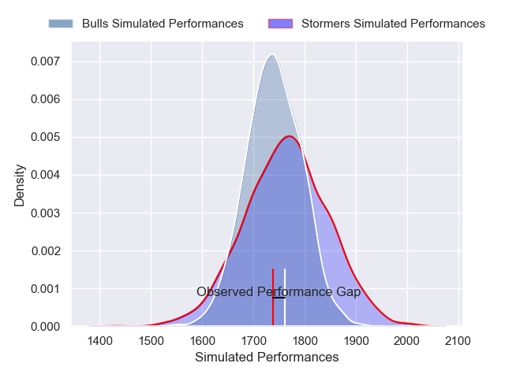
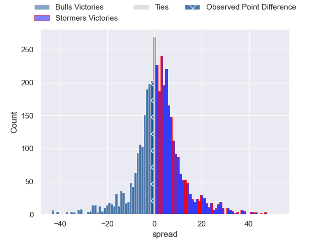
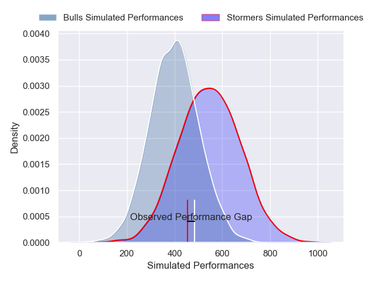
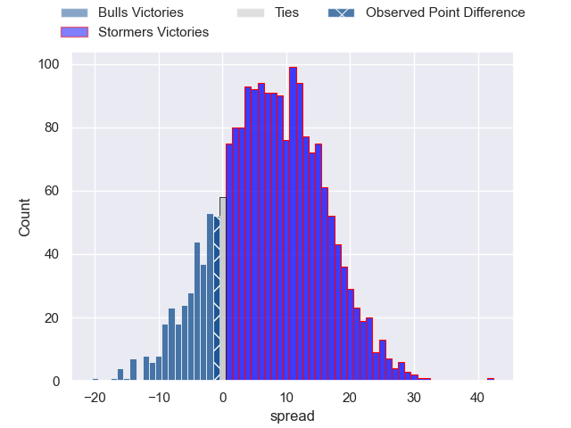

---  
layout: page  
title: Bulls at Stormers; 33-32  
date: 2025-02-08 18:00:00 -0500  
categories: "United Rugby Championship 24/25" match review  
---
# Bulls at Stormers; 33-32

# Club Level Predictions

The first set of predictions treats a club as the smallest object, as the club develops its members, organizes a gameplan, and deploys its players as needed for each match. This club model has a prediction of 0.536, which translates to predicting Stormers to win by 1.3.

Our Over/Under is 42.5 - and combined with the spread above, we have a predicted scoreline of 21 to 22

Each club has a rating and a rating deviation (similar to a Glicko rating), and expected performances can be generated. This allows for simulated matches and spreads like the ones below.
## Projected Performances - Club Model

## Projected Spreads - Club Model

## Projected Results - Club Model

# Player Level Predictions

Treating teams instead as an entity made up of the currently active players, I have ratings for each player in an altogether different system. These can be combined to form team ratings once teamsheets are announced, weighting starters a bit higher than the reserves. After the match is played, players can be weighted by their minutes on the field, allowing for an accurate measure of the team's composition. With these compiled team ratings, we can make predictions, measure inaccuracy, and update the individual player ratings.
## Prediction without Player Minutes: Stormers by 1.7

Bulls by 6.8 on a neutral pitch

## Projected Performances - Player Model

## Projected Spreads - Player Model

## Projected Results - Player Model

|   Away Minutes | Away Player         |   Away Percentile |   Number |   Home Percentile | Home Player         |   Home Minutes |
|---------------:|:--------------------|------------------:|---------:|------------------:|:--------------------|---------------:|
|             82 | Jan-Hendrik Wessels |             53.94 |        1 |             89.54 | Sti Sithole         |             52 |
|             62 | Johan Grobbelaar    |             94.43 |        2 |             70.1  | Joseph Dweba        |              9 |
|             10 | Wilco Louw          |             99.5  |        3 |             73.69 | Frans Malherbe      |             82 |
|             20 | Cobus Wiese         |             94.62 |        4 |             77.88 | Salmaan Moerat      |             10 |
|              4 | JF van Heerden      |             10.38 |        5 |             86.15 | Ruben van Heerden   |             82 |
|             35 | Marcell Coetzee     |             95.34 |        6 |             93.31 | Deon Fourie         |             80 |
|             72 | Reinhardt Ludwig    |             78.18 |        7 |             65.57 | Ben-Jason Dixon     |             27 |
|             72 | Cameron Hanekom     |             62.11 |        8 |             83.79 | Evan Roos           |             62 |
|             45 | Embrose Papier      |             92.04 |        9 |             22.12 | Stefan Ungerer      |             82 |
|             35 | Willie le Roux      |             96.61 |       10 |             40.47 | Jurie Matthee       |             29 |
|             45 | Sergeal Petersen    |             97.64 |       11 |             83.51 | Leolin Zas          |             82 |
|             82 | Harold Vorster      |             97.28 |       12 |             91.54 | Daniel du Plessis   |             16 |
|             20 | David Kriel         |             81.71 |       13 |             63.11 | Wandisile Simelane  |             58 |
|             35 | Canan Moodie        |             99.53 |       14 |             90.39 | Ben Loader          |             16 |
|             35 | Devon Williams      |             91.22 |       15 |             98.57 | Warrick Gelant      |             55 |
|             72 | Akker van der Merwe |             96.96 |       16 |             76.18 | Andre-Hugo Venter   |             82 |
|             22 | Gerhard Steenekamp  |             90.04 |       17 |             99.92 | Brok Harris         |             66 |
|             22 | Francois Klopper    |             15.27 |       18 |             16.76 | Sazi Sandi          |             41 |
|             13 | Ruan Vermaak        |              2.88 |       19 |             18.94 | Gary Porter         |             82 |
|             35 | Nizaam Carr         |             97.47 |       20 |             43.16 | Marcel Theunissen   |             82 |
|             20 | Zak Burger          |             93.81 |       21 |             93.1  | Herschel Jantjies   |             41 |
|             30 | Boeta Chamberlain   |             64.62 |       22 |             53.08 | Jonathan Roche      |             80 |
|             78 | Sebastian de Klerk  |             92.65 |       23 |             94.69 | Clayton Blommetjies |             82 |

