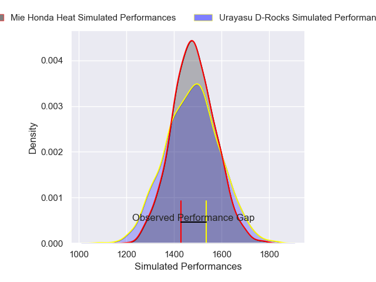
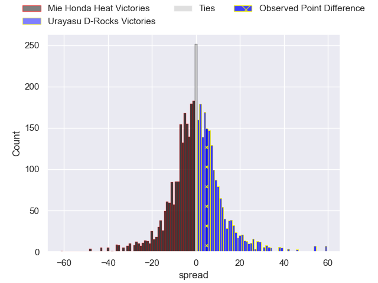
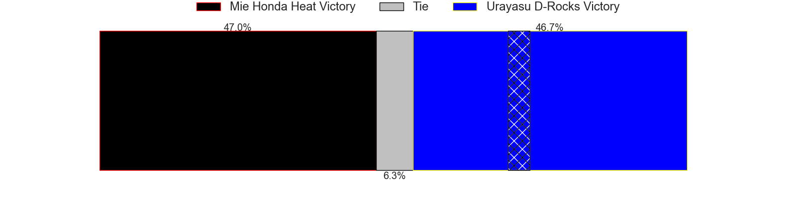
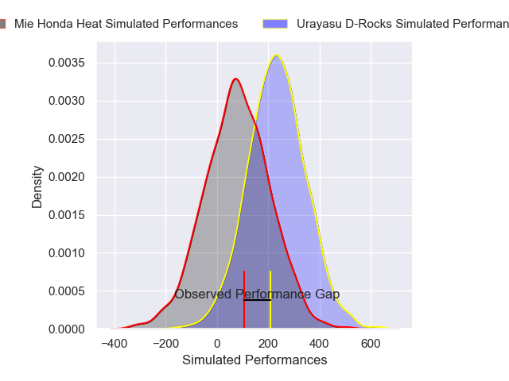
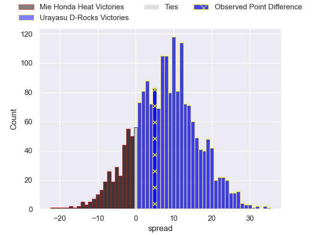
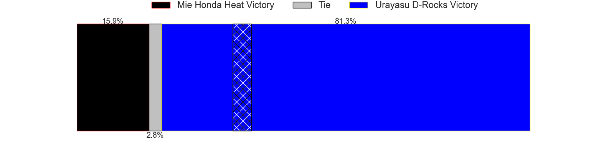

---  
layout: page  
title: Mie Honda Heat at Urayasu D-Rocks; 26-31  
date: 2025-02-08 18:00:00 -0500  
categories: "Japan Rugby League One 24/25" match review  
---
# Mie Honda Heat at Urayasu D-Rocks; 26-31

# Club Level Predictions

The first set of predictions treats a club as the smallest object, as the club develops its members, organizes a gameplan, and deploys its players as needed for each match. This club model has a prediction of 0.494, which translates to predicting Mie Honda Heat to win by 0.2.

Our Over/Under is 56.5 - and combined with the spread above, we have a predicted scoreline of 28 to 28

Each club has a rating and a rating deviation (similar to a Glicko rating), and expected performances can be generated. This allows for simulated matches and spreads like the ones below.
## Projected Performances - Club Model

## Projected Spreads - Club Model

## Projected Results - Club Model

# Player Level Predictions

Treating teams instead as an entity made up of the currently active players, I have ratings for each player in an altogether different system. These can be combined to form team ratings once teamsheets are announced, weighting starters a bit higher than the reserves. After the match is played, players can be weighted by their minutes on the field, allowing for an accurate measure of the team's composition. With these compiled team ratings, we can make predictions, measure inaccuracy, and update the individual player ratings.
## Prediction without Player Minutes: Urayasu D-Rocks by 5.4

Urayasu D-Rocks by 1.1 on a neutral pitch

## Projected Performances - Player Model

## Projected Spreads - Player Model

## Projected Results - Player Model

|   Away Minutes | Away Player            |   Away Percentile |   Number |   Home Percentile | Home Player         |   Home Minutes |
|---------------:|:-----------------------|------------------:|---------:|------------------:|:--------------------|---------------:|
|             59 | Tatsuhiko Tsurukawa    |              2.99 |        1 |              7.21 | Hidetomo Nabeshima  |             14 |
|             80 | Koki Hida              |             55.05 |        2 |             14.31 | Ryuji Fujimura      |             29 |
|             20 | Katsuyuki Hoshino      |             17.83 |        3 |             42.95 | Ryom Kim            |             51 |
|             80 | Mark Abbott            |             37.04 |        4 |             63.82 | Uwe Helu            |             29 |
|             64 | Franco Mostert         |             93.38 |        5 |             73.7  | Lourens Erasmus     |             80 |
|             20 | Pablo Matera           |             99.42 |        6 |             31.32 | Zephania Tuinona    |             80 |
|             80 | Tony Ray Hunt          |              9.7  |        7 |             21.9  | Tetta Shigemitsu    |             20 |
|             80 | Talifolofola Tangipa   |             27.43 |        8 |             73.42 | Jasper Wiese        |             15 |
|             19 | Taichi Takenaka        |             18.78 |        9 |             74.61 | Ren Iinuma          |             64 |
|             67 | Hayata Nakao           |             81.7  |       10 |             89.15 | Yu Tamura           |             65 |
|             46 | Haruhiko Uemura        |             10.65 |       11 |             21.58 | Caleb Cavubati      |             80 |
|             80 | Fraser Quirk           |              5.1  |       12 |             93.96 | Samu Kerevi         |             24 |
|             80 | Kyogo Okano            |             39.44 |       13 |             17.38 | Shane Gates         |             80 |
|             75 | FC du Plessis          |             65.4  |       14 |             15.02 | Kai Ishii           |             20 |
|             62 | Tom Banks              |             80.41 |       15 |             62.27 | Otere Black         |             21 |
|             80 | Soki Watanabe          |             20.06 |       16 |             29.97 | Hendrik Tui         |             40 |
|             80 | Feinga Kihe Lotu Fakai |            nan    |       17 |            nan    | Sekonaia Pole       |             80 |
|             16 | Janko Swanepoel        |             84.84 |       18 |            nan    | Wimpie van der Walt |             26 |
|             19 | Tevita Tupou           |             78.87 |       19 |             66.67 | Shin Takeuchi       |             80 |
|             19 | Azuma Doei             |             55.48 |       20 |             94.9  | Tone Tukufuka       |             34 |
|             19 | Takumi Fuji            |             14.34 |       21 |             81.48 | Kianu Kereru-Symes  |             48 |
|             13 | Ikuma Yamada           |             62.29 |       22 |              1.91 | Norifumi Hashimoto  |             61 |
|             13 | Waimana Kapa           |             22.96 |       23 |             83.09 | Takuhei Yasuda      |             64 |

