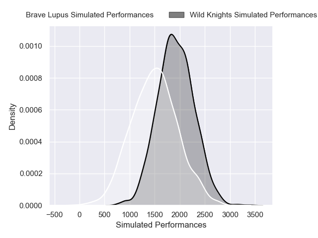
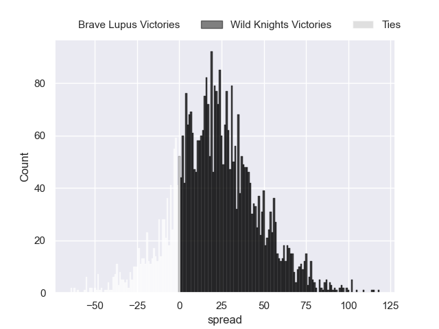

---  
layout: page  
title: Brave Lupus at Wild Knights; 28-28  
date: 2025-02-08 18:00:00 -0500  
categories: "Japan Rugby League One - Division 1 2025" match review  
---
# Brave Lupus at Wild Knights; 28-28

# Club Level Predictions

The first set of predictions treats a club as the smallest object, as the club develops its members, organizes a gameplan, and deploys its players as needed for each match. This club model has a prediction of 0.8, which translates to predicting Wild Knights to win by 20.7.

Our Over/Under is 38.5 - and combined with the spread above, we have a predicted scoreline of 9 to 30

Each club has a rating and a rating deviation (similar to a Glicko rating), and expected performances can be generated. This allows for simulated matches and spreads like the ones below.
## Projected Performances - Club Model

## Projected Spreads - Club Model

## Projected Results - Club Model

