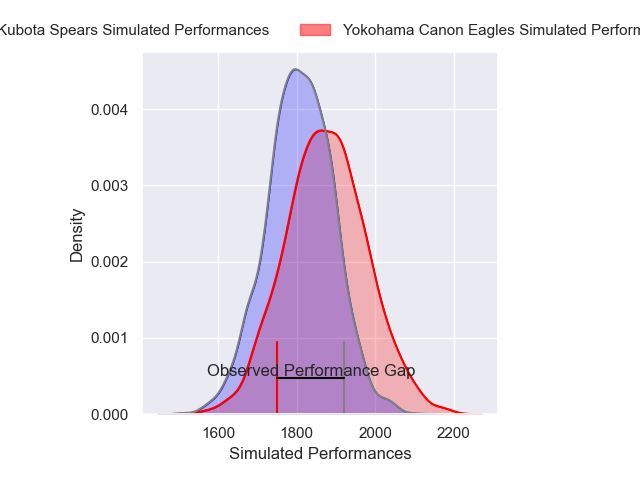
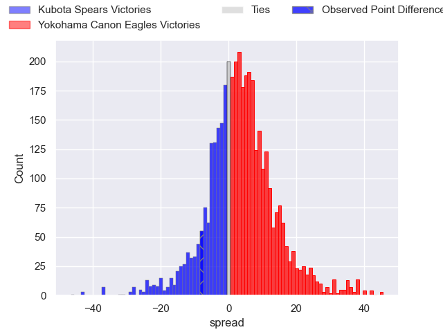
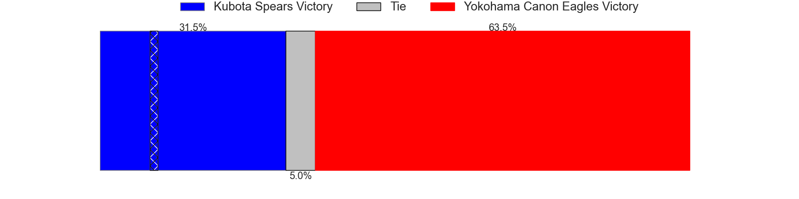
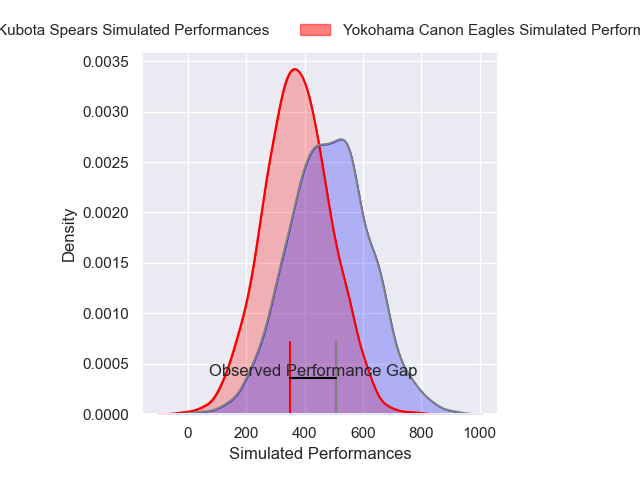
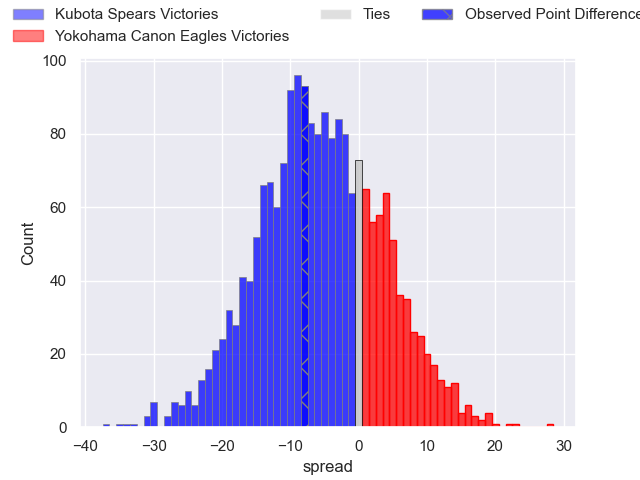
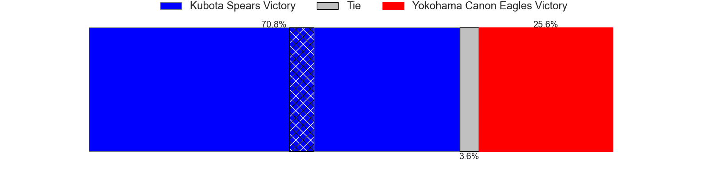

---  
layout: page  
title: Kubota Spears at Yokohama Canon Eagles; 30-22  
date: 2025-02-08 18:00:00 -0500  
categories: "Japan Rugby League One 24/25" match review  
---
# Kubota Spears at Yokohama Canon Eagles; 30-22

# Club Level Predictions

The first set of predictions treats a club as the smallest object, as the club develops its members, organizes a gameplan, and deploys its players as needed for each match. This club model has a prediction of 0.591, which translates to predicting Yokohama Canon Eagles to win by 3.3.

Our Over/Under is 55.5 - and combined with the spread above, we have a predicted scoreline of 26 to 29

Each club has a rating and a rating deviation (similar to a Glicko rating), and expected performances can be generated. This allows for simulated matches and spreads like the ones below.
## Projected Performances - Club Model

## Projected Spreads - Club Model

## Projected Results - Club Model

# Player Level Predictions

Treating teams instead as an entity made up of the currently active players, I have ratings for each player in an altogether different system. These can be combined to form team ratings once teamsheets are announced, weighting starters a bit higher than the reserves. After the match is played, players can be weighted by their minutes on the field, allowing for an accurate measure of the team's composition. With these compiled team ratings, we can make predictions, measure inaccuracy, and update the individual player ratings.
## Prediction without Player Minutes: Yokohama Canon Eagles by 4.9

Yokohama Canon Eagles by 0.6 on a neutral pitch

## Projected Performances - Player Model

## Projected Spreads - Player Model

## Projected Results - Player Model

|   Away Minutes | Away Player            |   Away Percentile |   Number |   Home Percentile | Home Player        |   Home Minutes |
|---------------:|:-----------------------|------------------:|---------:|------------------:|:-------------------|---------------:|
|             26 | Yota Kamimori          |             58.93 |        1 |             86.34 | Sioeli Vakalahi    |             80 |
|              9 | Hayate Era             |             73.47 |        2 |             74.17 | Yusuke Niwai       |             29 |
|             16 | Keijiro Tamefusa       |             75.97 |        3 |             71.19 | Ryosuke Iwaihara   |             80 |
|             26 | David Van Zeeland      |             60.02 |        4 |             10.65 | Liaki Moli         |             77 |
|             80 | David Bulbring         |             88.09 |        5 |             56.73 | Matt Philip        |             80 |
|             40 | Lappies Labuschagne    |             93.73 |        6 |             55.02 | Billy Harmon       |             54 |
|             80 | Takeo Suenaga          |             93.44 |        7 |             60.91 | Naoto Shimada      |             51 |
|             80 | Faulua Makisi          |             93.33 |        8 |             97.42 | Amanaki Mafi       |             26 |
|             23 | Shinobu Fujiwara       |             71.05 |        9 |             93.51 | Faf de Klerk       |              8 |
|             80 | Atsushi Oshikawa       |             66.24 |       10 |             90.17 | Yu Tamura          |             29 |
|             54 | Gerhard van den Heever |             96.43 |       11 |             69.66 | Masayoshi Takezawa |             13 |
|             80 | Yuya Hirose            |             65.23 |       12 |             97.47 | Yusuke Kajimura    |             71 |
|             80 | Rikus Pretorius        |             61.22 |       13 |             99.47 | Jesse Kriel        |             80 |
|             54 | Halatoa Vailea         |             87.44 |       14 |             44.06 | Kippei Ishida      |             67 |
|             80 | Shaun Stevenson        |             81.88 |       15 |             26.88 | Ryu Fukuhara       |             80 |
|              9 | Opeti Helu             |             83.54 |       16 |             95.64 | Takato Okabe       |             80 |
|             66 | Ruan Botha             |             99.52 |       17 |             55.95 | Cormac Daly        |             29 |
|             40 | Finau Tupa             |             86.49 |       18 |             72.88 | Masato Furukawa    |             64 |
|             51 | Kota Kaishi            |             88.72 |       19 |             31.72 | Ryo Tabata         |             29 |
|             80 | Malcolm Marx           |             99.83 |       20 |             93.54 | Shunta Nakamura    |             64 |
|             80 | Harumichi Tatekawa     |             87.18 |       21 |              2.39 | Tatsuro Sugimoto   |             48 |
|             80 | Bryn Hall              |             96.67 |       22 |             93.14 | Viliame Takayawa   |             29 |
|             80 | Hibiki Yamada          |            nan    |       23 |             74.74 | Toshiki Amano      |             14 |

