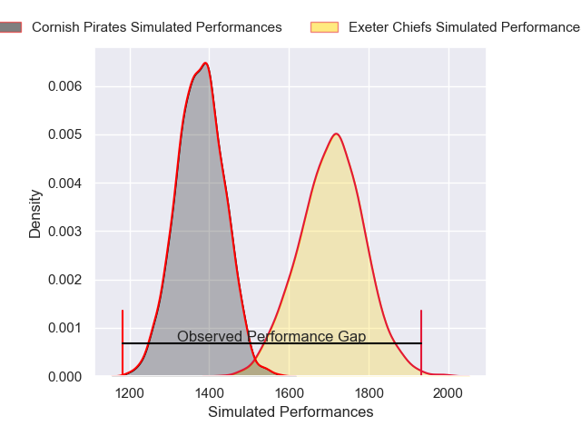
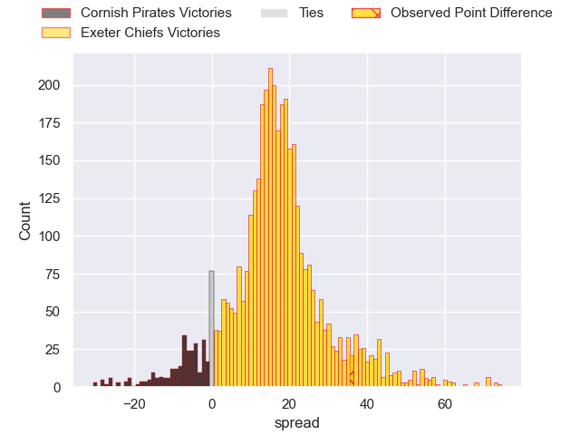
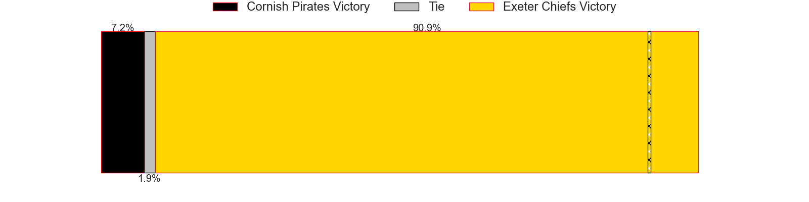
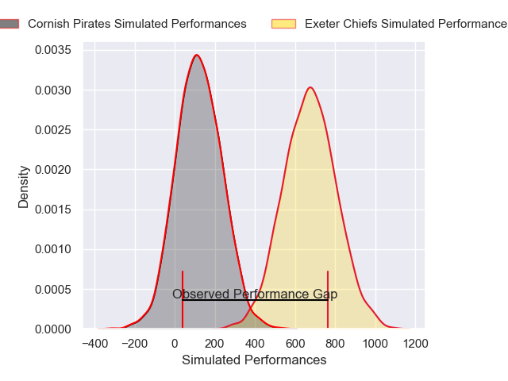
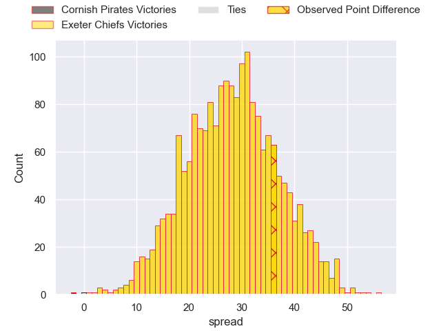
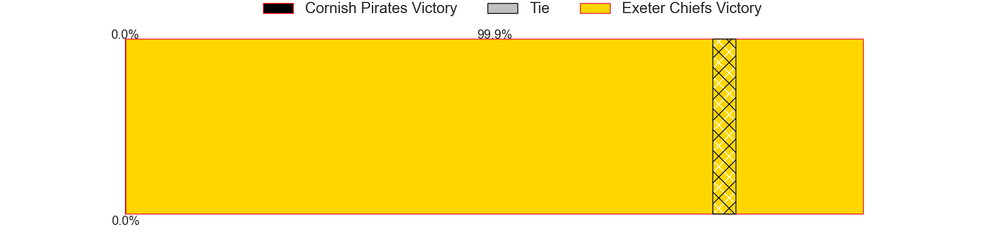

---  
layout: page  
title: Cornish Pirates at Exeter Chiefs; 7-43  
date: 2025-02-09 18:00:00 -0500  
categories: "Premiership Rugby Cup 24/25" match review  
---
# Cornish Pirates at Exeter Chiefs; 7-43

# Club Level Predictions

The first set of predictions treats a club as the smallest object, as the club develops its members, organizes a gameplan, and deploys its players as needed for each match. This club model has a prediction of 0.867, which translates to predicting Exeter Chiefs to win by 16.6.

Our Over/Under is 75.5 - and combined with the spread above, we have a predicted scoreline of 30 to 46

Each club has a rating and a rating deviation (similar to a Glicko rating), and expected performances can be generated. This allows for simulated matches and spreads like the ones below.
## Projected Performances - Club Model

## Projected Spreads - Club Model

## Projected Results - Club Model

# Player Level Predictions

Treating teams instead as an entity made up of the currently active players, I have ratings for each player in an altogether different system. These can be combined to form team ratings once teamsheets are announced, weighting starters a bit higher than the reserves. After the match is played, players can be weighted by their minutes on the field, allowing for an accurate measure of the team's composition. With these compiled team ratings, we can make predictions, measure inaccuracy, and update the individual player ratings.
## Prediction without Player Minutes: Exeter Chiefs by 23.1

Exeter Chiefs by 15.1 on a neutral pitch

## Projected Performances - Player Model

## Projected Spreads - Player Model

## Projected Results - Player Model

|   Away Minutes | Away Player       |   Away Percentile |   Number |   Home Percentile | Home Player               |   Home Minutes |
|---------------:|:------------------|------------------:|---------:|------------------:|:--------------------------|---------------:|
|             53 | Oisin Michel      |             66.97 |        1 |             52.37 | Kwenzokuhle Ndumiso Blose |             64 |
|             57 | Harry Hocking     |             75.84 |        2 |             97.47 | Jack Yeandle              |             80 |
|              0 | James French      |             51.95 |        3 |             94.85 | Ethan Roots               |             59 |
|             80 | Alfie Bell        |             42.4  |        4 |             44.52 | Rusiate Tuima             |             80 |
|             28 | Josh King         |             47.12 |        5 |             98.94 | Franco Molina             |             54 |
|             28 | Josh King         |             47.12 |        5 |             98.94 | Franco Molina             |             80 |
|             27 | Matt Cannon       |             34.43 |        6 |             94.85 | Ethan Roots               |             18 |
|             80 | Lucas Dorrell     |             36.76 |        7 |             15.62 | Richard Capstick          |             53 |
|             34 | Tomiwa Agbongbon  |             13.26 |        8 |             90.32 | Jacques Vermeulen         |             46 |
|             62 | Dan Hiscocks      |             25.31 |        9 |             89.56 | Tom Cairns                |             18 |
|             25 | Iwan Jenkins      |             13.35 |       10 |             55.72 | Will Haydon-Wood          |             80 |
|             55 | Will Trewin       |             91.33 |       11 |             66.16 | Paul Brown-Bampoe         |             25 |
|             80 | Harry Yates       |             40.86 |       12 |             63.85 | Tamati Tua                |             55 |
|             30 | Tom Georgiou      |             14.52 |       13 |             75.65 | Joe Hawkins               |             54 |
|             46 | Arthur Relton     |             76.06 |       14 |             76.44 | Ben Hammersley            |             19 |
|             46 | Bruce Houston     |             79.8  |       15 |             89.39 | Tom Wyatt                 |             45 |
|             25 | Billy Young       |             33.44 |       16 |             91.22 | Dan Frost                 |             59 |
|             16 | Sol Moody         |             64.02 |       17 |             30.29 | Marcus Street             |             24 |
|             32 | Tom Connolly      |            nan    |       18 |             43.24 | Billy Keast               |             20 |
|             55 | Fintan Coleman    |            nan    |       19 |             80.21 | Lewis Pearson             |             39 |
|             16 | Cam Jones         |             36.28 |       20 |             80.89 | Martin Moloney            |             80 |
|             80 | Joe Elderkin      |             76.07 |       21 |             89.73 | Stu Townsend              |             80 |
|             25 | Iwan Price-Thomas |             44.69 |       22 |             38.35 | Charlie McCaig            |             80 |
|             80 | Chris Mills       |            nan    |       23 |             70.41 | Dan John                  |             80 |

