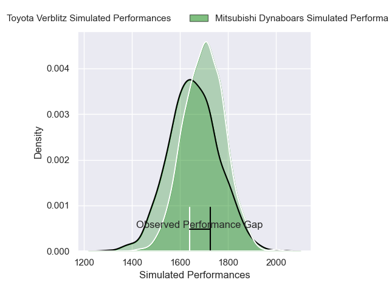
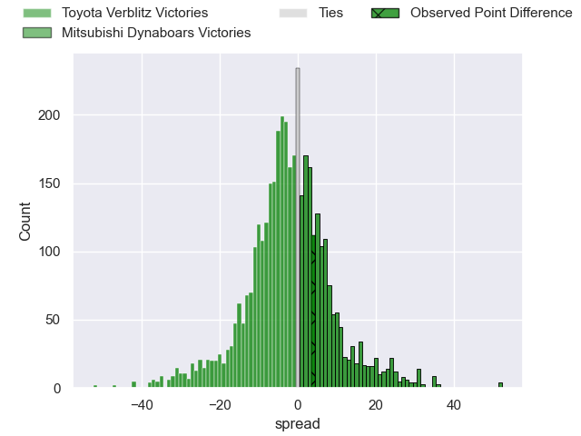
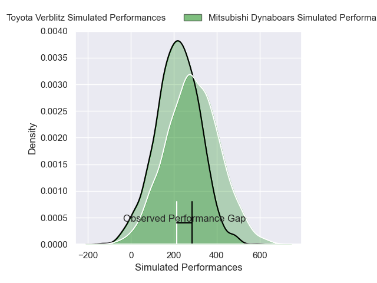
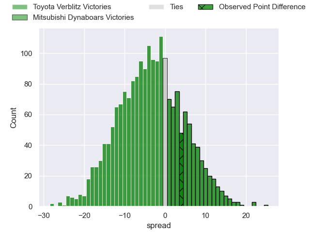

---  
layout: page  
title: Toyota Verblitz at Mitsubishi Dynaboars; 40-44  
date: 2025-02-09 18:00:00 -0500  
categories: "Japan Rugby League One 24/25" match review  
---
# Toyota Verblitz at Mitsubishi Dynaboars; 40-44

# Club Level Predictions

The first set of predictions treats a club as the smallest object, as the club develops its members, organizes a gameplan, and deploys its players as needed for each match. This club model has a prediction of 0.44, which translates to predicting Toyota Verblitz to win by 2.2.

Our Over/Under is 69.5 - and combined with the spread above, we have a predicted scoreline of 36 to 34

Each club has a rating and a rating deviation (similar to a Glicko rating), and expected performances can be generated. This allows for simulated matches and spreads like the ones below.
## Projected Performances - Club Model

## Projected Spreads - Club Model

## Projected Results - Club Model

# Player Level Predictions

Treating teams instead as an entity made up of the currently active players, I have ratings for each player in an altogether different system. These can be combined to form team ratings once teamsheets are announced, weighting starters a bit higher than the reserves. After the match is played, players can be weighted by their minutes on the field, allowing for an accurate measure of the team's composition. With these compiled team ratings, we can make predictions, measure inaccuracy, and update the individual player ratings.
## Prediction without Player Minutes: Toyota Verblitz by 5.0

Toyota Verblitz by 8.2 on a neutral pitch

## Projected Performances - Player Model

## Projected Spreads - Player Model

## Projected Results - Player Model

|   Away Minutes | Away Player         |   Away Percentile |   Number |   Home Percentile | Home Player         |   Home Minutes |
|---------------:|:--------------------|------------------:|---------:|------------------:|:--------------------|---------------:|
|              4 | Shogo Miura         |             88.38 |        1 |              6.8  | Hayato Hosoda       |             46 |
|             50 | Yoshikatsu Hikosaka |             92.06 |        2 |              6.42 | Lee Seung Hyok      |             34 |
|             65 | Genki Sudo          |             74.44 |        3 |             16.43 | Kanzo Schinckel     |             29 |
|             65 | Richie Gray         |             69.33 |        4 |             73.37 | Walt Steenkamp      |             29 |
|             80 | Daichi Akiyama      |             72.4  |        5 |              6.35 | Epineri Uluiviti    |             16 |
|             76 | Isaiah Mapusua      |             85.74 |        6 |             74.98 | Kyo Yoshida         |             49 |
|             76 | Akito Okui          |             31.13 |        7 |             93.21 | Masataka Tsuruya    |             15 |
|             18 | Will Tupou          |             25.89 |        8 |             57.05 | Jackson Hemopo      |              1 |
|             60 | Aaron Smith         |             97.17 |        9 |             74.69 | Kota Iwamura        |             22 |
|              4 | Rikiya Matsuda      |             97.03 |       10 |             55.51 | James Grayson       |             68 |
|             80 | Siosaia Fifita      |              0.38 |       11 |             73.89 | Honeti Taumoha'apai |             23 |
|             80 | Nicholas McCurran   |             80.46 |       12 |             93.94 | Charlie Lawrence    |             80 |
|             41 | Joseph Manu         |             17.66 |       13 |             29.36 | Matt Vaega          |             58 |
|             48 | Taichi Takahashi    |             88.31 |       14 |             38.64 | Ben Paltridge       |             80 |
|             76 | Tiaan Falcon        |             75.71 |       15 |             97.14 | Kurt-Lee Arendse    |             22 |
|             21 | Yuichiro Wada       |             79.64 |       16 |             64.32 | Chang Ho Ahn        |             80 |
|             62 | Josh Dickson        |             72.69 |       17 |             13.68 | Marino Mikaele-Tu'u |             15 |
|             22 | Shunsuke Asaoka     |            nan    |       18 |             72.97 | Yoshimitsu Yasue    |             80 |
|             80 | Ryusei Kato         |             80.07 |       19 |            nan    | Haniteli Vailea     |             12 |
|             52 | Kaito Shigeno       |             23.72 |       20 |             40.91 | Chinen Yu           |             23 |
|             12 | Toby McPherson      |             29.62 |       21 |             39.52 | Lewis Chessum       |             52 |
|             12 | Ryunosuke Momoji    |            nan    |       22 |             91.68 | Jack Stratton       |             68 |
|             23 | Matt McGahan        |             81.19 |       23 |             52.28 | Kohki Sato          |              1 |

