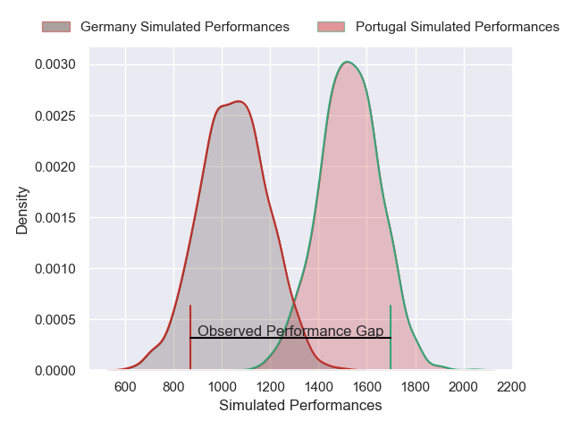
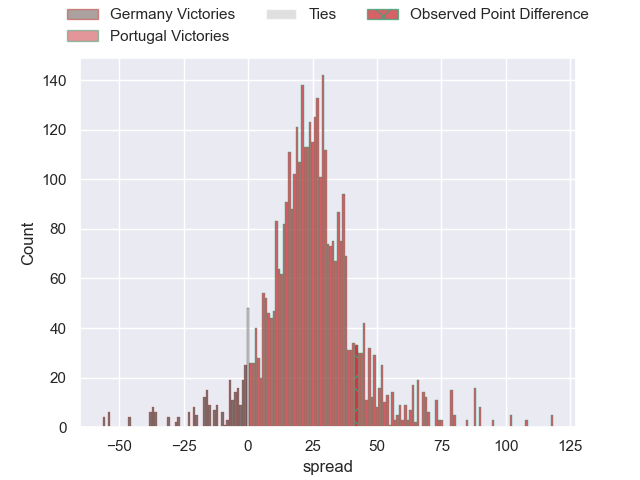
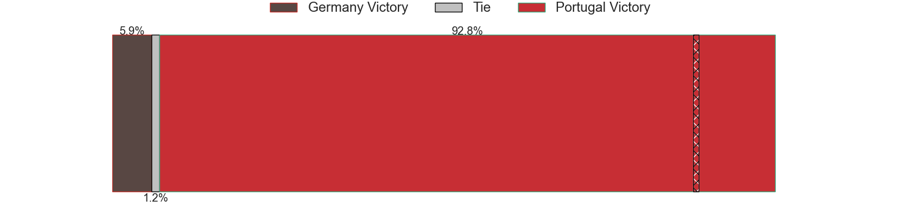
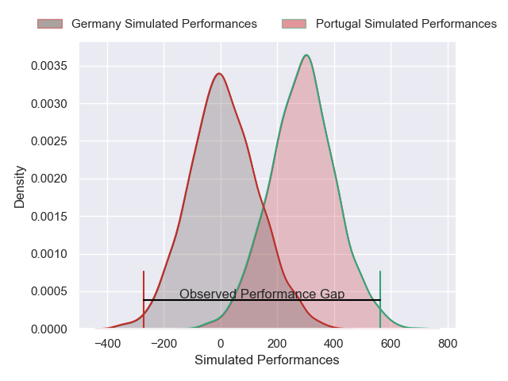
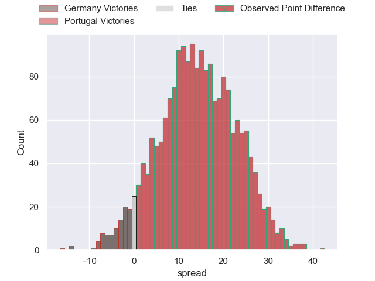

---  
layout: page  
title: Germany at Portugal; 14-56  
date: 2025-02-09 18:00:00 -0500  
categories: "Rugby Europe Championship 2025" match review  
---
# Germany at Portugal; 14-56

# Club Level Predictions

The first set of predictions treats a club as the smallest object, as the club develops its members, organizes a gameplan, and deploys its players as needed for each match. This club model has a prediction of 0.926, which translates to predicting Portugal to win by 23.9.

Our Over/Under is 59.5 - and combined with the spread above, we have a predicted scoreline of 18 to 42

Each club has a rating and a rating deviation (similar to a Glicko rating), and expected performances can be generated. This allows for simulated matches and spreads like the ones below.
## Projected Performances - Club Model

## Projected Spreads - Club Model

## Projected Results - Club Model

# Player Level Predictions

Treating teams instead as an entity made up of the currently active players, I have ratings for each player in an altogether different system. These can be combined to form team ratings once teamsheets are announced, weighting starters a bit higher than the reserves. After the match is played, players can be weighted by their minutes on the field, allowing for an accurate measure of the team's composition. With these compiled team ratings, we can make predictions, measure inaccuracy, and update the individual player ratings.
## Prediction without Player Minutes: Portugal by 16.4

Portugal by 12.7 on a neutral pitch

## Projected Performances - Player Model

## Projected Spreads - Player Model

## Projected Results - Player Model

|   Away Minutes | Away Player            |   Away Percentile |   Number |   Home Percentile | Home Player            |   Home Minutes |
|---------------:|:-----------------------|------------------:|---------:|------------------:|:-----------------------|---------------:|
|           80   | Jörn Schröder          |             10.7  |        1 |             41.96 | David Costa            |           80   |
|           80   | Andrew Reintges        |              7.74 |        2 |             40.07 | Luka Begic             |           80   |
|           19   | Markus Bachofer        |             13.35 |        3 |             40.8  | Anthony Alves          |           64   |
|           40   | Hassan Rayan           |             18.04 |        4 |             93.47 | Jose Madeira           |           80   |
|           31   | Michel Himmer          |             16.79 |        5 |             53.65 | José Rebelo De Andrade |           50   |
|           39   | Sione Havili Talitui   |             14.89 |        6 |             58.69 | Diego Pinheiro Ruiz    |           10   |
|           19.5 | Shawn Ingle            |             25.74 |        7 |             89.15 | Nicolas Martins        |           39   |
|           16   | Oliver Stein           |             39.87 |        8 |             88.19 | Joao Granate           |           21   |
|            0   | Jan Piosik             |             26.26 |        9 |             50.96 | Hugo Gomes Camacho     |           31   |
|           50   | Bader-Werner Pretorius |             34.26 |       10 |             86.81 | Joris De Moura         |           49   |
|           80   | Felix Lammers          |             13.69 |       11 |             94.96 | Rodrigo Marta          |           70   |
|           41   | Leo Wolf               |              8.64 |       12 |             85.54 | Tomas Appleton         |           59   |
|           59   | Robin PlüMpe           |             37.15 |       13 |             77.42 | Jose Lima              |           62   |
|           49   | Cameron Mcdonald       |             23.48 |       14 |             69.2  | Vincent Pinto          |           30   |
|           61   | Nikolai Klewinghaus    |             14.02 |       15 |             13.61 | Simao Bento            |           40   |
|           80   | Daniel Wolf            |             43.7  |       16 |             68.33 | Antonio Machado Santos |           50   |
|           49   | Marcel Becker          |            nan    |       17 |            nan    | Pedro Lucas            |           44   |
|           80   | Dustin Mizera          |            nan    |       18 |             10.03 | Diogo Hasse Ferreira   |           22   |
|           80   | Luis Ball              |             61.1  |       19 |             87.81 | Duarte Torgal          |           29.5 |
|           80   | Nico Windemuth         |            nan    |       20 |             43.04 | Vasco Baptista         |           29.5 |
|           31   | Mike Mcdonald          |             29.57 |       21 |            nan    | Francisco Magalhães    |           80   |
|           31   | Zinzan Hees            |             21.96 |       22 |            nan    | Manuel Vareiro         |           80   |
|           31   |                        |            nan    |       23 |             87.55 | Raffaele Storti        |           41   |

