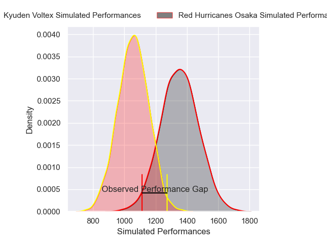
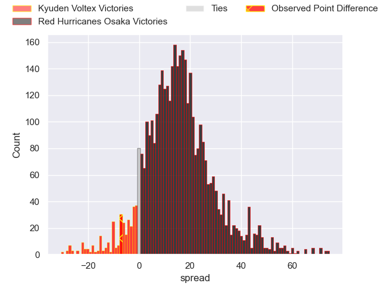
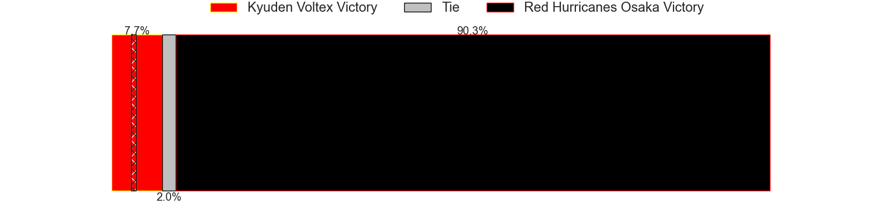
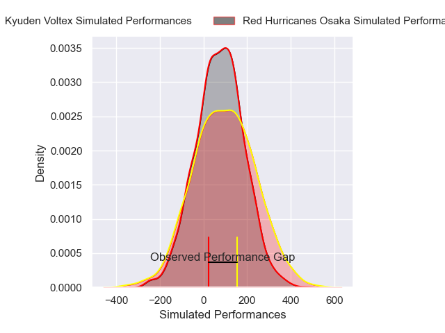
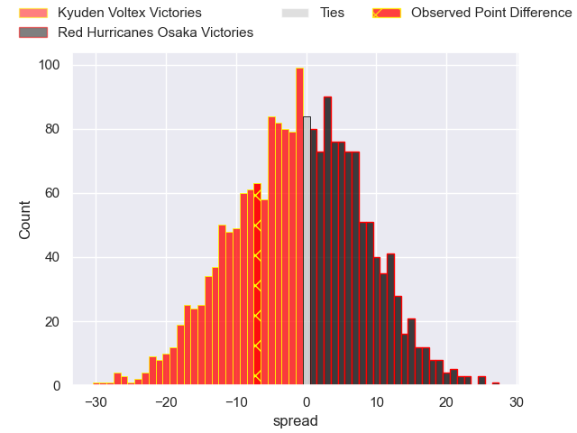
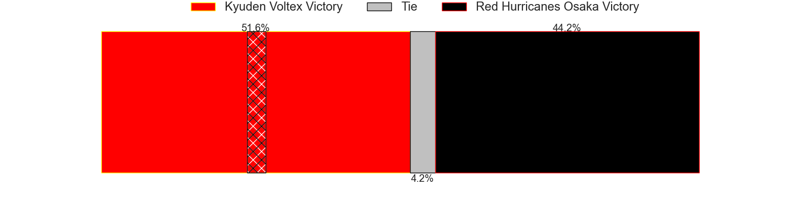

---  
layout: page  
title: Kyuden Voltex at Red Hurricanes Osaka; 27-20  
date: 2025-02-09 18:00:00 -0500  
categories: "Japan Rugby League One D2 24/25" match review  
---
# Kyuden Voltex at Red Hurricanes Osaka; 27-20

# Club Level Predictions

The first set of predictions treats a club as the smallest object, as the club develops its members, organizes a gameplan, and deploys its players as needed for each match. This club model has a prediction of 0.84, which translates to predicting Red Hurricanes Osaka to win by 15.1.

Our Over/Under is 60.5 - and combined with the spread above, we have a predicted scoreline of 23 to 38

Each club has a rating and a rating deviation (similar to a Glicko rating), and expected performances can be generated. This allows for simulated matches and spreads like the ones below.
## Projected Performances - Club Model

## Projected Spreads - Club Model

## Projected Results - Club Model

# Player Level Predictions

Treating teams instead as an entity made up of the currently active players, I have ratings for each player in an altogether different system. These can be combined to form team ratings once teamsheets are announced, weighting starters a bit higher than the reserves. After the match is played, players can be weighted by their minutes on the field, allowing for an accurate measure of the team's composition. With these compiled team ratings, we can make predictions, measure inaccuracy, and update the individual player ratings.
## Prediction without Player Minutes: Kyuden Voltex by 0.5

Kyuden Voltex by 4.3 on a neutral pitch

## Projected Performances - Player Model

## Projected Spreads - Player Model

## Projected Results - Player Model

|   Away Minutes | Away Player            |   Away Percentile |   Number |   Home Percentile | Home Player          |   Home Minutes |
|---------------:|:-----------------------|------------------:|---------:|------------------:|:---------------------|---------------:|
|             68 | Samuel Nozomu Faialaga |             36.38 |        1 |              5.1  | Hiromichi Sakamoto   |             22 |
|             80 | Kyungmun Wang          |              2.09 |        2 |             37.7  | Hisamitsu Shimada    |             59 |
|             80 | Taro Uesugi            |             68.97 |        3 |              3.7  | Hiroshi Kitajima     |             17 |
|             80 | Masahiro Eriguchi      |             64.09 |        4 |              7.94 | Michael Allardice    |             52 |
|             80 | Aaron Carroll          |             90.71 |        5 |             82.77 | Elliott Stooke       |             80 |
|             80 | Colby Fainga'a         |              7.72 |        6 |             54.54 | Taro Sato            |             15 |
|             62 | Keisuke Yamzoe         |             68.05 |        7 |             80.02 | Blake Gibson         |             28 |
|             20 | Alex Takuya Walker     |             56.99 |        8 |             26.02 | Tsukasa Yasuda       |             28 |
|             80 | Spencer Jeans          |             68.6  |        9 |             12.28 | Akira Inoue          |             18 |
|             60 | Tom Taylor             |             90.6  |       10 |             59.4  | Fumiya Dobashi       |             50 |
|             12 | Ren Hagiwara           |             28.6  |       11 |             12.75 | Kouki Shigeno        |              4 |
|             57 | Hayato Kojo            |             27.61 |       12 |              6.22 | Mifiposeti Paea      |             80 |
|             80 | Sione Likuata Teaupa   |             65.86 |       13 |             23.29 | Henry Taefu          |             12 |
|             31 | Goki Saito             |             82.22 |       14 |              0.58 | Taichi Yoshizawa     |             68 |
|             49 | Makoto Kato            |              3.75 |       15 |             41.46 | Taiki Yamaguchi      |             80 |
|             80 | Ray Tatafu             |             13.17 |       16 |             28.17 | Hiroki Hanada        |              4 |
|             61 | Hiroki Murakawa        |            nan    |       17 |            nan    | Shota Takai          |             40 |
|             80 | Ryosuke Kagoshima      |            nan    |       18 |            nan    | Yo Sato              |             80 |
|             80 | Shinpei Kamata         |            nan    |       19 |            nan    | Yuma Fujino          |             23 |
|              7 | Shunta Takenouchi      |            nan    |       20 |             24.04 | Toshihiro Yamamouchi |             80 |
|             80 | Charlie Worthington    |             41.67 |       21 |             15.65 | Kenta Komura         |             57 |
|             30 | Ken Nakashima          |             20.75 |       22 |              5.79 | Toru Sugishita       |             76 |
|             76 | Noriaki Nakazuru       |             15.81 |       23 |            nan    | Kaoru Tsuruta        |             80 |

