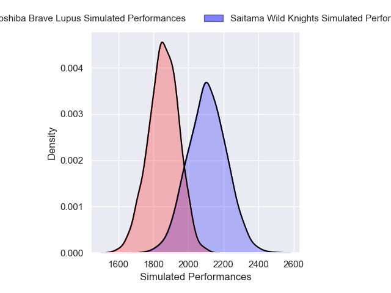
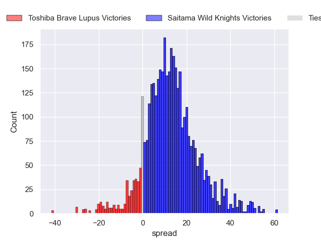
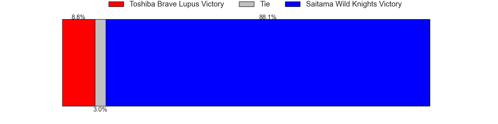
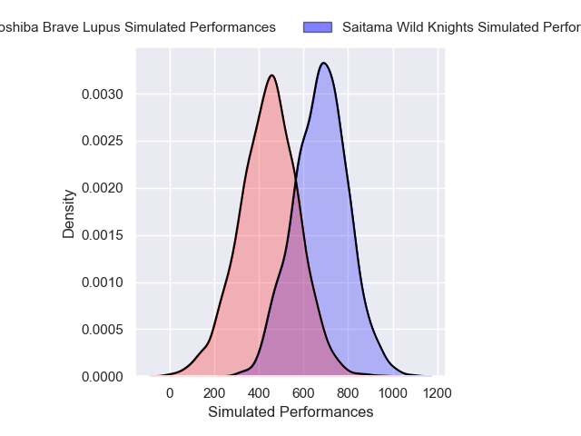
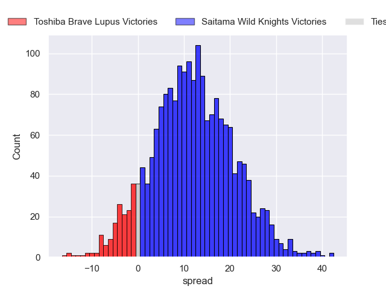
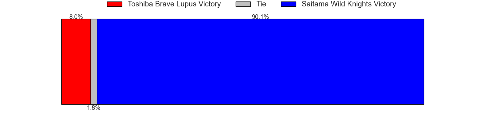

---  
layout: page  
title: Toshiba Brave Lupus at Saitama Wild Knights; 28-28  
date: 2025-02-09 18:00:00 -0500  
categories: "Japan Rugby League One 24/25" match review  
---
# Toshiba Brave Lupus at Saitama Wild Knights; 28-28

# Club Level Predictions

The first set of predictions treats a club as the smallest object, as the club develops its members, organizes a gameplan, and deploys its players as needed for each match. This club model has a prediction of 0.805, which translates to predicting Saitama Wild Knights to win by 12.7.

Our Over/Under is 44.5 - and combined with the spread above, we have a predicted scoreline of 16 to 28

Each club has a rating and a rating deviation (similar to a Glicko rating), and expected performances can be generated. This allows for simulated matches and spreads like the ones below.
## Projected Performances - Club Model

## Projected Spreads - Club Model

## Projected Results - Club Model

# Player Level Predictions

Treating teams instead as an entity made up of the currently active players, I have ratings for each player in an altogether different system. These can be combined to form team ratings once teamsheets are announced, weighting starters a bit higher than the reserves. After the match is played, players can be weighted by their minutes on the field, allowing for an accurate measure of the team's composition. With these compiled team ratings, we can make predictions, measure inaccuracy, and update the individual player ratings.
## Prediction without Player Minutes: Saitama Wild Knights by 14.9

Saitama Wild Knights by 10.2 on a neutral pitch

## Projected Performances - Player Model

## Projected Spreads - Player Model

## Projected Results - Player Model

|   Away Minutes | Away Player        |   Away Percentile |   Number |   Home Percentile | Home Player       |   Home Minutes |
|---------------:|:-------------------|------------------:|---------:|------------------:|:------------------|---------------:|
|             28 | Sena Kimura        |             90.54 |        1 |             96.02 | Keita Inagaki     |             50 |
|             80 | Mamoru Harada      |             93.75 |        2 |             84.29 | Atsushi Sakate    |             80 |
|             80 | Yuta Kokaji        |             94.69 |        3 |             87.55 | Taiki Fujii       |             46 |
|             57 | Shohei Ito         |             60.87 |        4 |             82.4  | Esei Ha'angana    |             80 |
|             45 | Jacob Pierce       |             99.04 |        5 |             96.92 | Lood de Jager     |             80 |
|             52 | Shannon Frizell    |             95.73 |        6 |             96.41 | Ben Gunter        |             76 |
|             28 | Takeshi Sasaki     |             90.2  |        7 |             98.93 | Lachlan Boshier   |             59 |
|             80 | Michael Leitch     |             97.05 |        8 |             97.26 | Jack Cornelsen    |             57 |
|             80 | Yuhei Sugiyama     |             87.96 |        9 |             94.69 | Taiki Koyama      |             76 |
|             80 | Richie Mo'unga     |            100    |       10 |             77.54 | Kyohei Yamasawa   |             80 |
|             12 | Yuto Mori          |             62.49 |       11 |             33.93 | Tomoki Osada      |             30 |
|             80 | Taichi Mano        |             86.73 |       12 |            100    | Damian de Allende |             28 |
|              4 | Seta Tamanivalu    |             96.66 |       13 |             98.12 | Dylan Riley       |             73 |
|              4 | Jone Naikabula     |             80.21 |       14 |             98.3  | Koki Takeyama     |             61 |
|              4 | Takuro Matsunaga   |             93.47 |       15 |             96.94 | Ryuji Noguchi     |             80 |
|             80 | Daigo Hashimoto    |             77.03 |       16 |             82.56 | Vince Aso         |             15 |
|             80 | Latu Taufa         |            nan    |       17 |             99.13 | Ryota Hasegawa    |              4 |
|             70 | Rob Thompson       |             37.41 |       18 |             52.7  | Craig Millar      |             68 |
|             40 | Yoshitaka Tokunaga |             26.96 |       19 |             98.67 | Asaeli Ai Valu    |             22 |
|             80 | Teruo Makabe       |             85.48 |       20 |             84.13 | Liam Mitchell     |             10 |
|             52 | Michael Collins    |             92.86 |       21 |             65.89 | Shota Fukui       |             80 |
|             68 | Kohei Takahashi    |             64.42 |       22 |            nan    | Yuta Takagi       |              7 |
|            nan | nan                |            nan    |       23 |            nan    | Kenji Sato        |             17 |

