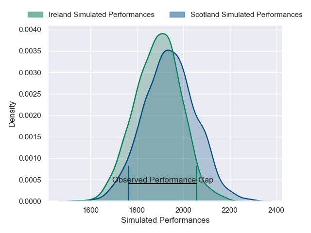
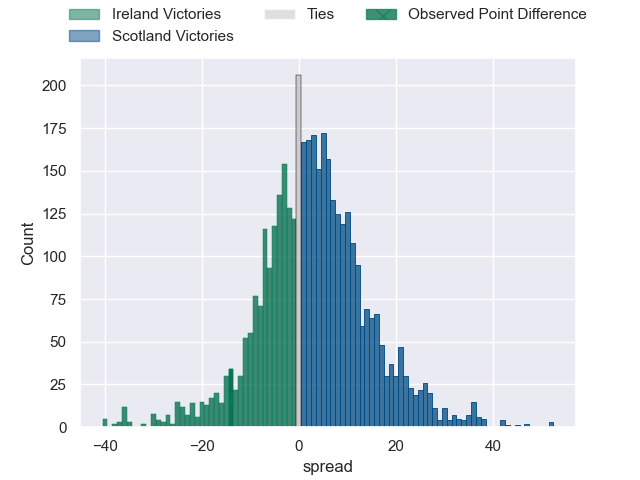
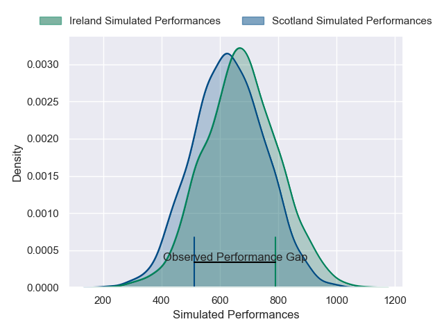
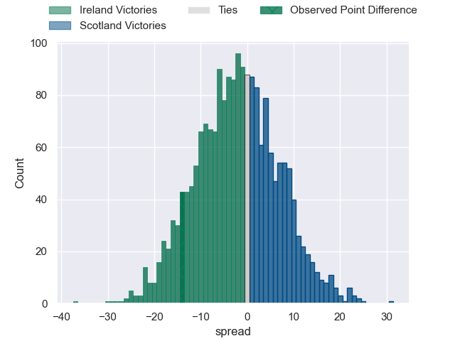

---  
layout: page  
title: Ireland at Scotland; 32-18  
date: 2025-02-09 18:00:00 -0500  
categories: "Six Nations Championship 2025" match review  
---
# Ireland at Scotland; 32-18

# Club Level Predictions

The first set of predictions treats a club as the smallest object, as the club develops its members, organizes a gameplan, and deploys its players as needed for each match. This club model has a prediction of 0.564, which translates to predicting Scotland to win by 2.4.

Our Over/Under is 45.5 - and combined with the spread above, we have a predicted scoreline of 21 to 24

Each club has a rating and a rating deviation (similar to a Glicko rating), and expected performances can be generated. This allows for simulated matches and spreads like the ones below.
## Projected Performances - Club Model

## Projected Spreads - Club Model

## Projected Results - Club Model

# Player Level Predictions

Treating teams instead as an entity made up of the currently active players, I have ratings for each player in an altogether different system. These can be combined to form team ratings once teamsheets are announced, weighting starters a bit higher than the reserves. After the match is played, players can be weighted by their minutes on the field, allowing for an accurate measure of the team's composition. With these compiled team ratings, we can make predictions, measure inaccuracy, and update the individual player ratings.
## Prediction without Player Minutes: Ireland by 3.1

Ireland by 9.1 on a neutral pitch

## Projected Performances - Player Model

## Projected Spreads - Player Model

## Projected Results - Player Model

|   Away Minutes | Away Player         |   Away Percentile |   Number |   Home Percentile | Home Player         |   Home Minutes |
|---------------:|:--------------------|------------------:|---------:|------------------:|:--------------------|---------------:|
|             80 | Andrew Porter       |             89.55 |        1 |             26.09 | Rory Sutherland     |             80 |
|             68 | Ronan Kelleher      |             94.94 |        2 |             69.46 | Dave Cherry         |             71 |
|             22 | Finlay Bealham      |             96.3  |        3 |             99.67 | Zander Fagerson     |             18 |
|             69 | James Ryan          |             95.35 |        4 |             91.29 | Jonny Gray          |             61 |
|             80 | Tadhg Beirne        |             99.61 |        5 |             96.9  | Grant Gilchrist     |             48 |
|             58 | Peter O'Mahony      |             98.65 |        6 |             96.43 | Matt Fagerson       |             65 |
|             11 | Josh van der Flier  |             98.55 |        7 |             89.77 | Rory Darge          |             80 |
|             33 | Caelan Doris        |             95.91 |        8 |             67.1  | Jack Dempsey        |             58 |
|             19 | Jamison Gibson-Park |             96.14 |        9 |             94.39 | Ben White           |             80 |
|             80 | Sam Prendergast     |             24.36 |       10 |             99.57 | Finn Russell        |             25 |
|             10 | James Lowe          |            100    |       11 |             85.89 | Duhan van der Merwe |             52 |
|             22 | Bundee Aki          |             99.58 |       12 |             46.58 | Tom Jordan          |             16 |
|             19 | Robbie Henshaw      |             93.05 |       13 |             79.03 | Huw Jones           |             32 |
|             80 | Calvin Nash         |             94.78 |       14 |             34.88 | Darcy Graham        |             27 |
|             28 | Hugo Keenan         |             98.96 |       15 |            100    | Blair Kinghorn      |             16 |
|             22 | Dan Sheehan         |             61.61 |       16 |             71.55 | Ewan Ashman         |             39 |
|             80 | Cian Healy          |             91.69 |       17 |             72.43 | Pierre Schoeman     |             80 |
|             58 | Thomas Clarkson     |             82.96 |       18 |             48.81 | Will Hurd           |             65 |
|             80 | Ryan Baird          |             78.19 |       19 |             93.42 | Sam Skinner         |             80 |
|             80 | Jack Conan          |             98.28 |       20 |             69.7  | Gregor Brown        |             70 |
|             62 | Conor Murray        |             99.47 |       21 |             99.81 | Jamie Ritchie       |             80 |
|             41 | Jack Crowley        |             38.68 |       22 |             83.51 | Jamie Dobie         |             80 |
|             80 | Garry Ringrose      |             98.84 |       23 |             90.62 | Stafford McDowall   |             62 |

