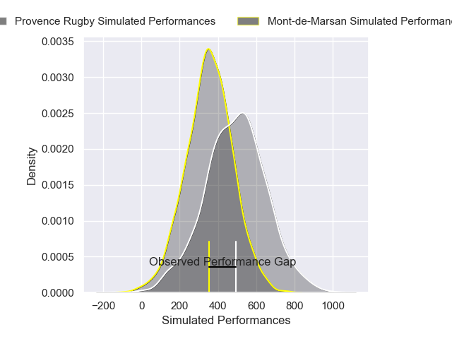
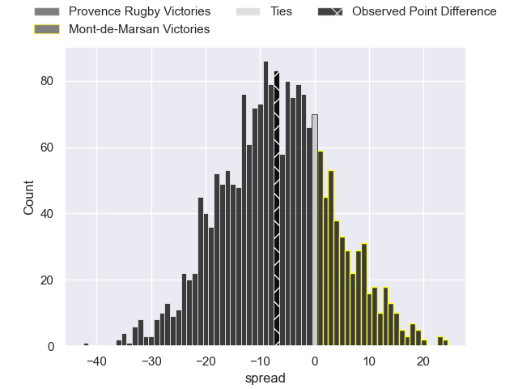

---  
layout: page  
title: Provence Rugby at Mont-de-Marsan; 44-37  
date: 2025-02-13 18:00:00 -0500  
categories: "Pro D2 24/25" match review  
---
# Provence Rugby at Mont-de-Marsan; 44-37

# Club Level Predictions

The first set of predictions treats a club as the smallest object, as the club develops its members, organizes a gameplan, and deploys its players as needed for each match. This club model has a prediction of 0.599, which translates to predicting Mont-de-Marsan to win by 3.5.

Our Over/Under is 51.5 - and combined with the spread above, we have a predicted scoreline of 24 to 28

Each club has a rating and a rating deviation (similar to a Glicko rating), and expected performances can be generated. This allows for simulated matches and spreads like the ones below.
## Projected Performances - Club Model

## Projected Spreads - Club Model

## Projected Results - Club Model

# Player Level Predictions

Treating teams instead as an entity made up of the currently active players, I have ratings for each player in an altogether different system. These can be combined to form team ratings once teamsheets are announced, weighting starters a bit higher than the reserves. After the match is played, players can be weighted by their minutes on the field, allowing for an accurate measure of the team's composition. With these compiled team ratings, we can make predictions, measure inaccuracy, and update the individual player ratings.
## Prediction without Player Minutes: Mont-de-Marsan by 3.6

Provence Rugby by 9.3 on a neutral pitch

## Projected Performances - Player Model

## Projected Spreads - Player Model

## Projected Results - Player Model

|   Away Minutes | Away Player              |   Away Percentile |   Number |   Home Percentile | Home Player           |   Home Minutes |
|---------------:|:-------------------------|------------------:|---------:|------------------:|:----------------------|---------------:|
|             19 | Hayden Thompson-Stringer |             97.86 |        1 |             76.38 | Ali-Amjad Osman-Bosch |             80 |
|             18 | Hayden Thompson-Stringer |             97.86 |        1 |             76.38 | Ali-Amjad Osman-Bosch |             80 |
|             81 | Hayden Thompson-Stringer |             97.86 |        1 |             76.38 | Ali-Amjad Osman-Bosch |             80 |
|             80 | Kapeli Pifeleti          |              8.03 |        2 |             75.22 | Samuel Lagrange       |             80 |
|             67 | Eliott Yemsi             |             41.98 |        3 |             66.09 | Mattéo Lalanne        |             80 |
|             62 | Andres Zafra Tarazona    |              2.03 |        4 |             59.05 | Albert Mataele        |             80 |
|             77 | Josh Tyrell              |             75.12 |        5 |             13.65 | Aston Fortuin         |             80 |
|             80 | Teimana Harrison         |             80.5  |        6 |             66.99 | Aurélien Laforgue     |             80 |
|             63 | Ned Hanigan              |             37.26 |        7 |             12.84 | Nicolas Garrault      |             20 |
|              9 | Malohi Suta              |             52.9  |        8 |             85.81 | Raphaël Robic         |             80 |
|             80 | Kevin Viallard           |             33.33 |        9 |             32.98 | Christophe Loustalot  |             80 |
|             57 | Jules Soulan             |             77.56 |       10 |             81.62 | Willie du Plessis     |             80 |
|             58 | Nadir Bouhedjeur         |             91.4  |       11 |             88.12 | Mosese Dawai          |             80 |
|             80 | Jimmy Gopperth           |             93.89 |       12 |             71.87 | Nacani Wakaya         |              5 |
|             80 | Atila Septar             |             59.85 |       13 |             51.84 | Gatien Masse          |             72 |
|             80 | Adrien Lapegue-Lafaye    |             26.96 |       14 |             93.91 | Pierre Sayerse        |             80 |
|             80 | Léo Drouet               |             74.79 |       15 |             28.54 | Yoann Laousse Azpiazu |             80 |

