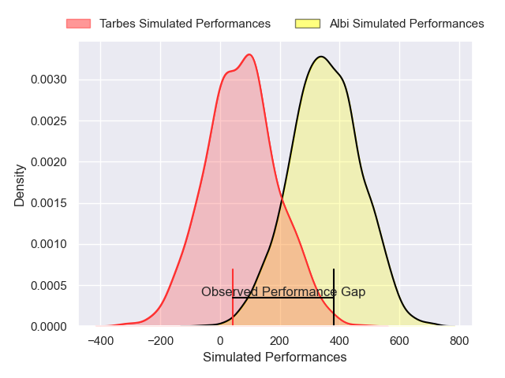
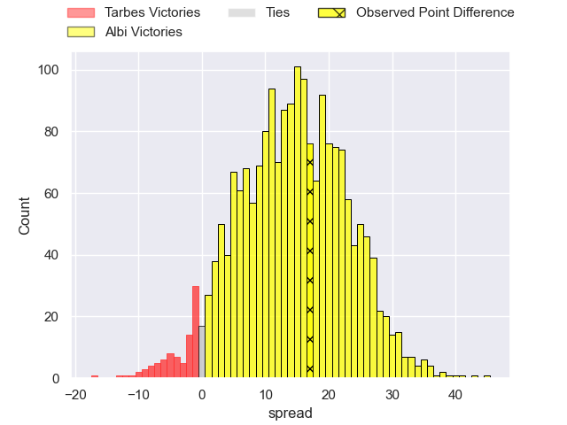
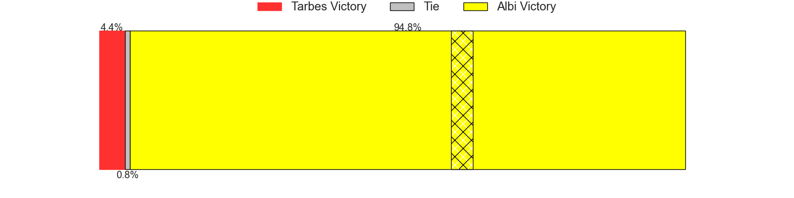

---  
layout: page  
title: Tarbes at Albi; 25-42  
date: 2025-02-14 18:00:00 -0500  
categories: "Nationale 24/25" match review  
---
# Tarbes at Albi; 25-42

# Club Level Predictions

The first set of predictions treats a club as the smallest object, as the club develops its members, organizes a gameplan, and deploys its players as needed for each match. This club model has a prediction of 0.748, which translates to predicting Albi to win by 9.6.

Our Over/Under is 45.5 - and combined with the spread above, we have a predicted scoreline of 18 to 27

Each club has a rating and a rating deviation (similar to a Glicko rating), and expected performances can be generated. This allows for simulated matches and spreads like the ones below.
## Projected Performances - Club Model

## Projected Spreads - Club Model

## Projected Results - Club Model

# Player Level Predictions

Treating teams instead as an entity made up of the currently active players, I have ratings for each player in an altogether different system. These can be combined to form team ratings once teamsheets are announced, weighting starters a bit higher than the reserves. After the match is played, players can be weighted by their minutes on the field, allowing for an accurate measure of the team's composition. With these compiled team ratings, we can make predictions, measure inaccuracy, and update the individual player ratings.
## Prediction without Player Minutes: Albi by 13.9

Albi by 2.3 on a neutral pitch

## Projected Performances - Player Model

## Projected Spreads - Player Model

## Projected Results - Player Model

|   Away Minutes | Away Player         |   Away Percentile |   Number |   Home Percentile | Home Player            |   Home Minutes |
|---------------:|:--------------------|------------------:|---------:|------------------:|:-----------------------|---------------:|
|             80 | Enzo Baggiani       |             38.23 |        1 |             36.14 | Antoine Soave          |             80 |
|             41 | Florian Lamothe     |             14.8  |        2 |             15.14 | Reinach Venter         |             48 |
|             80 | Luka Vea            |             38.07 |        3 |             89    | Maks van Dyk           |             30 |
|             41 | Baptiste Peytavi    |             31.54 |        4 |             54.61 | Jonathan Kpoku         |             80 |
|             80 | Mathieu Soufflet    |             61.77 |        5 |             14.31 | Dion Evrard Oulai      |             34 |
|             27 | Alexis Armary       |             93.91 |        6 |             61.76 | Robin Dione            |             80 |
|             80 | Léo Saint-Guilhem   |             43.96 |        7 |             12.18 | Mattéo Coustalat       |             51 |
|             20 | Filipe Manu         |              1.25 |        8 |             38.2  | Guillem Calmon         |             24 |
|             28 | Thomas Millet       |             11.17 |        9 |             22.51 | Titouan Pouzoullic     |             34 |
|             39 | Joris Pialot        |             15.21 |       10 |             21.88 | Victor Pisano          |             32 |
|             59 | Clement Latorre     |             26.53 |       11 |             80.43 | Paul Clergue           |             50 |
|             24 | Savenaca Rawaca     |             11.64 |       12 |             12.26 | Leo Treilles           |             56 |
|             56 | Osea Waqaninavatu   |             47.91 |       13 |             73.95 | Baptiste Couchinave    |             80 |
|             56 | Amona Artaud        |             34.04 |       14 |             67.63 | Simon Hartmann         |             80 |
|             34 | Hugo Cellier        |             39.8  |       15 |             40.4  | Téo Dospital           |             46 |
|             29 | Irakli Mirtskhulava |             80    |       16 |             20.64 | Lucas Pindor           |             64 |
|             29 | Vincent Dolier      |             61.22 |       17 |             38.39 | Thomas Cretu           |             80 |
|             51 | Ximun Bessonart     |              8.11 |       18 |            nan    | Dimitri Chauvet        |             14 |
|             29 | Nolhan Bizien       |            nan    |       19 |             72.79 | Vincent Mutel          |             23 |
|             29 | Jean Guicherd       |             72.73 |       20 |             79.66 | Ianis Ponsole          |             23 |
|             80 | Mickael Thébault    |             77.32 |       21 |             46.39 | Ruben Courties         |             80 |
|             80 | Alexandre Perez     |             19.17 |       22 |             66.67 | Thibault Olender       |             80 |
|             80 | Jonathan Duffau     |             11.04 |       23 |             91.52 | Nasoni Naqiri Kunavore |             80 |

