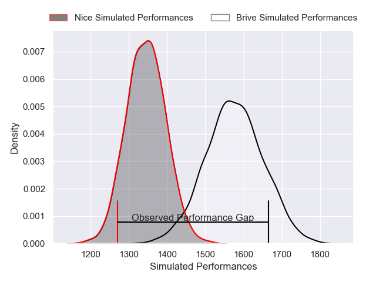
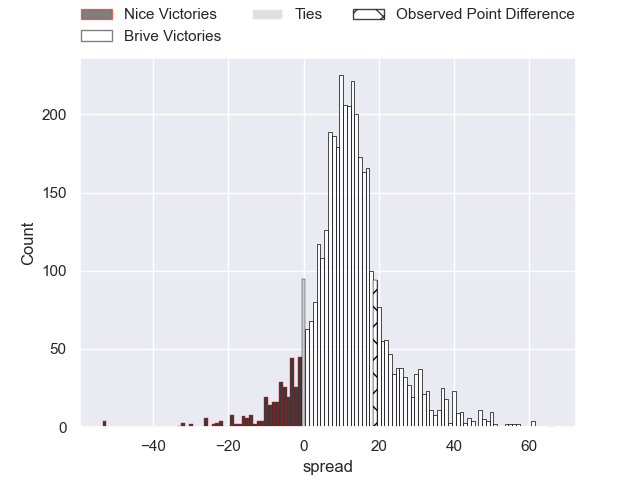
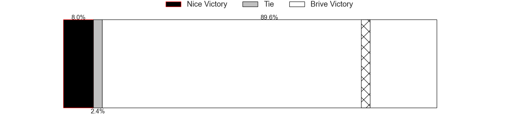
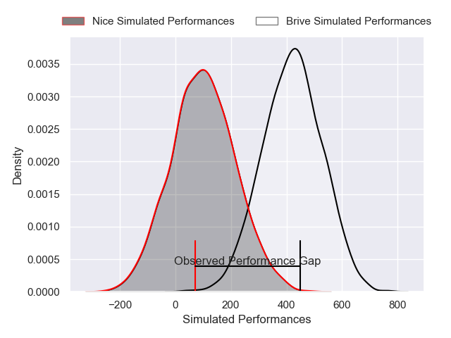
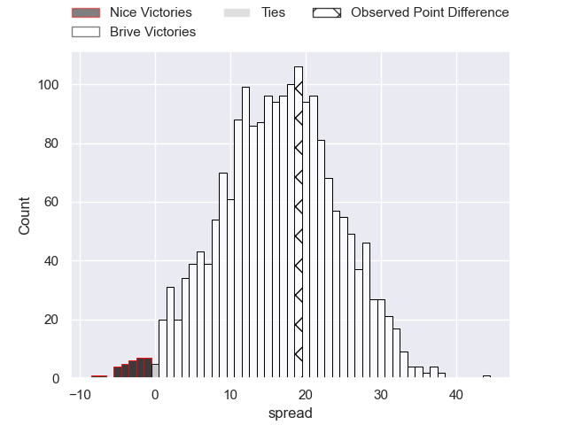

---  
layout: page  
title: Nice at Brive; 10-29  
date: 2025-02-14 18:00:00 -0500  
categories: "Pro D2 24/25" match review  
---
# Nice at Brive; 10-29

# Club Level Predictions

The first set of predictions treats a club as the smallest object, as the club develops its members, organizes a gameplan, and deploys its players as needed for each match. This club model has a prediction of 0.789, which translates to predicting Brive to win by 11.6.

Our Over/Under is 57.5 - and combined with the spread above, we have a predicted scoreline of 23 to 34

Each club has a rating and a rating deviation (similar to a Glicko rating), and expected performances can be generated. This allows for simulated matches and spreads like the ones below.
## Projected Performances - Club Model

## Projected Spreads - Club Model

## Projected Results - Club Model

# Player Level Predictions

Treating teams instead as an entity made up of the currently active players, I have ratings for each player in an altogether different system. These can be combined to form team ratings once teamsheets are announced, weighting starters a bit higher than the reserves. After the match is played, players can be weighted by their minutes on the field, allowing for an accurate measure of the team's composition. With these compiled team ratings, we can make predictions, measure inaccuracy, and update the individual player ratings.
## Prediction without Player Minutes: Brive by 14.7

Brive by 1.8 on a neutral pitch

## Projected Performances - Player Model

## Projected Spreads - Player Model

## Projected Results - Player Model

|   Away Minutes | Away Player              |   Away Percentile |   Number |   Home Percentile | Home Player               |   Home Minutes |
|---------------:|:-------------------------|------------------:|---------:|------------------:|:--------------------------|---------------:|
|             80 | Facundo Gigena           |              6.03 |        1 |              7.98 | Simon-Pierre Chauvac      |             17 |
|              9 | Sacha Idoumi             |             18.18 |        2 |             75.99 | Issam Hamel               |             30 |
|             41 | Tom Ross                 |              3.09 |        3 |             34.93 | Henzo Kiteau              |             41 |
|             57 | Louis Suaud              |             90.15 |        4 |             65.62 | Renger van Eerten         |             28 |
|             46 | Clément Chartier         |             20.36 |        5 |             88.64 | Sitaleki Timani           |             80 |
|             57 | Jordan Taufua            |             85.13 |        6 |             20.11 | Sasha Gue                 |             21 |
|             80 | Hugo Sarrasin            |             10.3  |        7 |             59.2  | Samuel Maximin            |             59 |
|             54 | Ramiha Tarrel Tia Smiler |             26.01 |        8 |             42    | Loan Lavergne             |             13 |
|             64 | Jules Solinas            |             33.45 |        9 |             53.66 | Mathis Ferté              |             57 |
|             29 | Jules Gimbert            |              5.23 |       10 |             30.13 | Tom Raffy                 |             80 |
|             80 | Andrzej Charlat          |             76.68 |       11 |             90.95 | Erwan Dridi               |             80 |
|             80 | Tom Daly                 |             38.8  |       12 |             21.06 | Paul Pimienta             |             80 |
|             63 | Baptiste Lafond          |              8.2  |       13 |             94.5  | Matias Moroni             |             28 |
|             16 | David Odiete             |             91.98 |       14 |             12.22 | Tevita Railevu            |             80 |
|             50 | Flavio Asquini           |             41.54 |       15 |              5.22 | Thomas Zenon              |             26 |
|             63 | Luca Cutayar             |             25.62 |       16 |            nan    | Nathan Fraissenon         |             28 |
|             23 | Bastien Berenguel        |              0.67 |       17 |             44.77 | Benjamin Boudou           |             34 |
|             25 | Mathis Viard             |             79.5  |       18 |             57.08 | Francisco Coria Marchetti |             34 |
|             28 | Kylian Laurans           |             34.12 |       19 |             89.39 | Asier Usarraga            |             80 |
|             32 | Adrien Vigne             |            nan    |       20 |             76.64 | Matthieu Voisin           |             34 |
|             39 | Pierre Strippoli         |             39.62 |       21 |             79.4  | Omar Odishvili            |             39 |
|             39 | Nicolas Ciancio          |             66.04 |       22 |            nan    | Maximus Lestro            |             71 |
|             39 | Sunia Vola               |             68.32 |       23 |             71.6  | Maxime Sidobre            |             52 |

