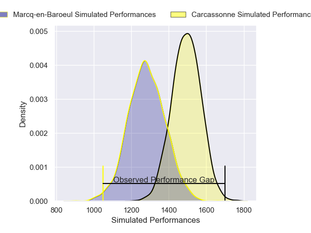
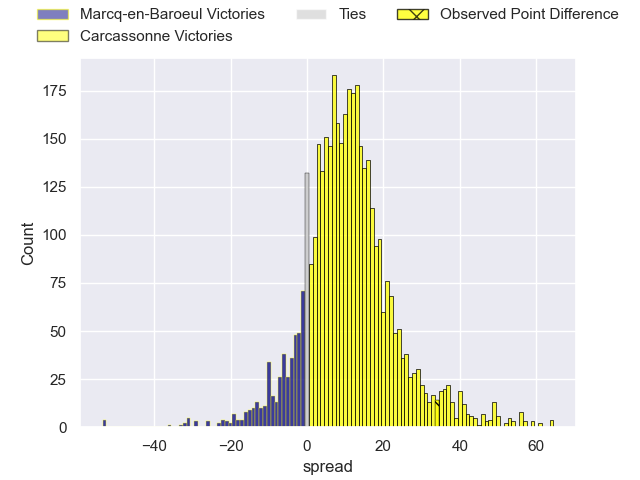
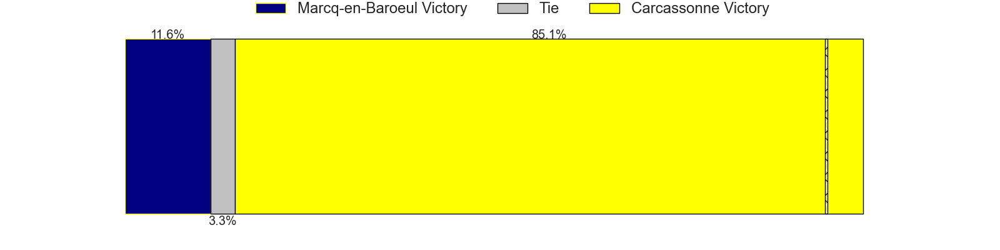
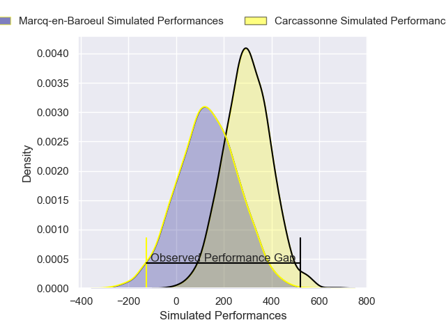
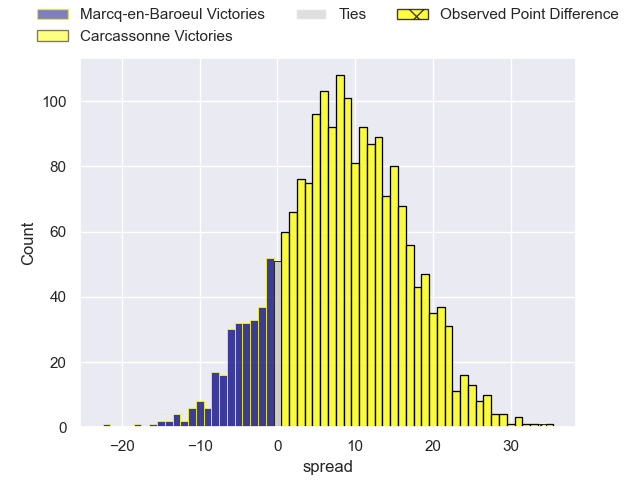
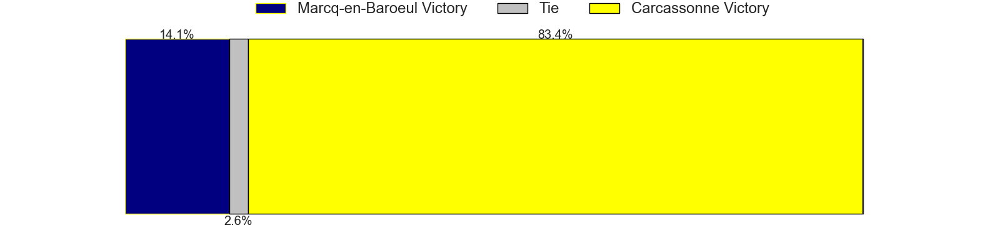

---  
layout: page  
title: Marcq-en-Baroeul at Carcassonne; 6-40  
date: 2025-02-14 18:00:00 -0500  
categories: "Nationale 24/25" match review  
---
# Marcq-en-Baroeul at Carcassonne; 6-40

# Club Level Predictions

The first set of predictions treats a club as the smallest object, as the club develops its members, organizes a gameplan, and deploys its players as needed for each match. This club model has a prediction of 0.763, which translates to predicting Carcassonne to win by 10.6.

Our Over/Under is 34.5 - and combined with the spread above, we have a predicted scoreline of 12 to 22

Each club has a rating and a rating deviation (similar to a Glicko rating), and expected performances can be generated. This allows for simulated matches and spreads like the ones below.
## Projected Performances - Club Model

## Projected Spreads - Club Model

## Projected Results - Club Model

# Player Level Predictions

Treating teams instead as an entity made up of the currently active players, I have ratings for each player in an altogether different system. These can be combined to form team ratings once teamsheets are announced, weighting starters a bit higher than the reserves. After the match is played, players can be weighted by their minutes on the field, allowing for an accurate measure of the team's composition. With these compiled team ratings, we can make predictions, measure inaccuracy, and update the individual player ratings.
## Prediction without Player Minutes: Carcassonne by 12.5

Carcassonne by 3.3 on a neutral pitch

## Projected Performances - Player Model

## Projected Spreads - Player Model

## Projected Results - Player Model

|   Away Minutes | Away Player              |   Away Percentile |   Number |   Home Percentile | Home Player         |   Home Minutes |
|---------------:|:-------------------------|------------------:|---------:|------------------:|:--------------------|---------------:|
|             19 | Lewys Jones              |             59.44 |        1 |             77.59 | Yan Arnold          |             28 |
|             39 | Joseph Reynaud           |             42.01 |        2 |             55.61 | Raphael Carbou      |             39 |
|             56 | Sive Mazosiwe            |             80.96 |        3 |             78.23 | Siua Halanukonuka   |             80 |
|             39 | Antoine Delaporte        |             65.73 |        4 |             23.73 | Romain Manchia      |             35 |
|             39 | Jean-Baptiste Rende      |             58.85 |        5 |             62.52 | Clément Fontaine    |             80 |
|             53 | Cedric Yonkeu            |             52.2  |        6 |             79.1  | Gary Graham         |             25 |
|             80 | Lucio Anconetani         |             33.93 |        7 |             90.25 | Etienne Herjean     |             40 |
|             17 | Otilo Kafotamaki         |              8.77 |        8 |             58.46 | Ferdinand Dreno     |             29 |
|             80 | Dylan Nocete             |             68.38 |        9 |             19.76 | Gaetan Pichon       |             29 |
|             46 | Serafin Bordoli          |             12.71 |       10 |             63.96 | Johnny McPhillips   |             35 |
|             80 | Jeannick Ouassiero       |             32.93 |       11 |             92.02 | Clement Egiziano    |             40 |
|             39 | Mark Erasmus             |             45.97 |       12 |             19.92 | Jordan Puletua      |             40 |
|             80 | Louis Decavel            |             55.36 |       13 |             77.53 | Lukas Doyhenard     |             23 |
|             56 | Dany Antunes             |              7.79 |       14 |             40.63 | Lilian Pichon       |             34 |
|             80 | Patrick Fleming Dewhirst |             40.81 |       15 |             86.87 | Maxime Gianet       |             59 |
|             80 | Walid Abou               |             50.28 |       16 |             53.01 | Thomas Agati        |             34 |
|             59 | Santiago Iglesias Valdez |             30.78 |       17 |              1.85 | Vakhtangi Akhobadze |             34 |
|             12 | Marius Pollet            |            nan    |       18 |             72.96 | Gabin Villerouge    |             24 |
|             21 | Thomas Simonet           |             34.4  |       19 |             77.78 | Romain Guyot        |             19 |
|             80 | Joachim Beaumont         |             54.55 |       20 |             33.55 | Noe Bedou           |             80 |
|             40 | Arthur Bruges            |             70.38 |       21 |             31.3  | Corentin Bousquet   |             80 |
|             80 | Antoine Soubirou         |             51.03 |       22 |             37.37 | Nils Chalies        |             80 |
|             56 | Mathias Ortiz            |             69.02 |       23 |             39.24 | Paul Gadea          |             16 |

