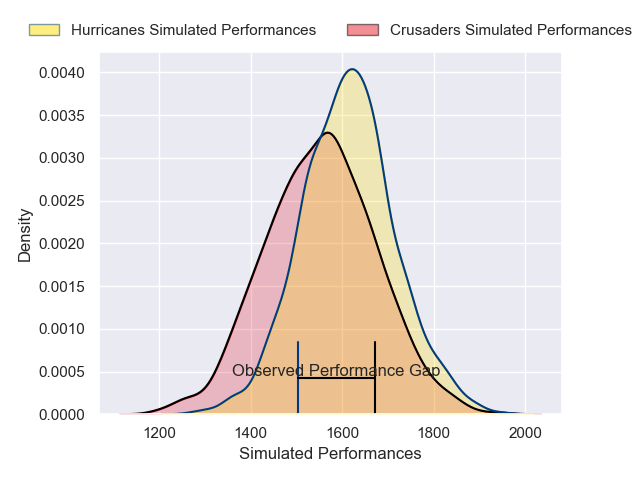
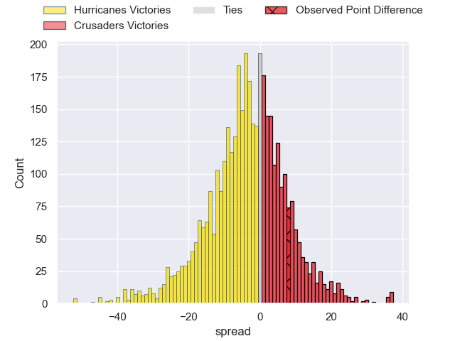
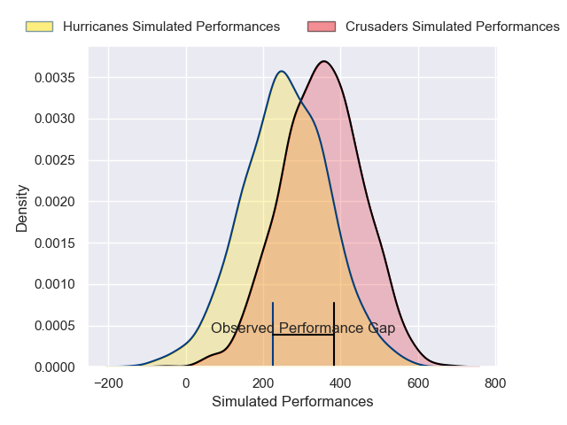
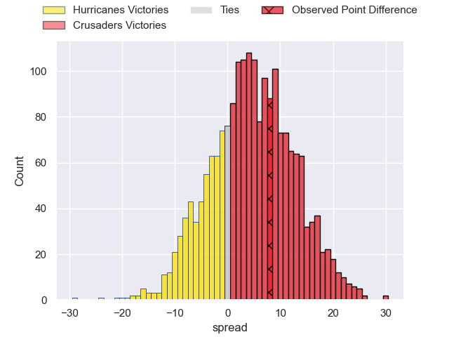

---  
layout: page  
title: Hurricanes at Crusaders; 25-33  
date: 2025-02-14 18:00:00 -0500  
categories: "Super Rugby Pacific 2025" match review  
---
# Hurricanes at Crusaders; 25-33

# Club Level Predictions

The first set of predictions treats a club as the smallest object, as the club develops its members, organizes a gameplan, and deploys its players as needed for each match. This club model has a prediction of 0.417, which translates to predicting Hurricanes to win by 3.1.

Our Over/Under is 51.5 - and combined with the spread above, we have a predicted scoreline of 27 to 24

Each club has a rating and a rating deviation (similar to a Glicko rating), and expected performances can be generated. This allows for simulated matches and spreads like the ones below.
## Projected Performances - Club Model

## Projected Spreads - Club Model

## Projected Results - Club Model

# Player Level Predictions

Treating teams instead as an entity made up of the currently active players, I have ratings for each player in an altogether different system. These can be combined to form team ratings once teamsheets are announced, weighting starters a bit higher than the reserves. After the match is played, players can be weighted by their minutes on the field, allowing for an accurate measure of the team's composition. With these compiled team ratings, we can make predictions, measure inaccuracy, and update the individual player ratings.
## Prediction without Player Minutes: Crusaders by 7.9

Crusaders by 0.4 on a neutral pitch

## Projected Performances - Player Model

## Projected Spreads - Player Model

## Projected Results - Player Model

|   Away Minutes | Away Player          |   Away Percentile |   Number |   Home Percentile | Home Player          |   Home Minutes |
|---------------:|:---------------------|------------------:|---------:|------------------:|:---------------------|---------------:|
|             20 | Xavier Numia         |             98.39 |        1 |             91.89 | Tamaiti Williams     |             72 |
|             77 | Jacob Devery         |             88.95 |        2 |             44.05 | Ioane Moananu        |             32 |
|             24 | Tevita Mafile'o      |             45.22 |        3 |              0.56 | Fletcher Newell      |             57 |
|             81 | Caleb Delany         |             70.34 |        4 |             94.16 | Scott Barrett        |             49 |
|             81 | Isaia Walker-Leawere |             95.86 |        5 |             32.86 | Antonio Shalfoon     |              8 |
|             63 | Brad Shields         |             85    |        6 |             79.76 | Cullen Grace         |             58 |
|             20 | Du'Plessis Kirifi    |             94    |        7 |             97.38 | Ethan Blackadder     |             40 |
|             18 | Brayden Iose         |              1.46 |        8 |             74.74 | Christian Lio-Willie |             24 |
|             76 | Cam Roigard          |             70.96 |        9 |             79.21 | Noah Hotham          |             81 |
|              5 | Harry Godfrey        |              7.29 |       10 |              9.79 | Taha Kemara          |             32 |
|             20 | Kini Naholo          |             97.68 |       11 |             82.93 | Sevu Reece           |             15 |
|             19 | Peter Umaga-Jensen   |             56.79 |       12 |             93.46 | David Havili         |             13 |
|             62 | Bailyn Sullivan      |             34.93 |       13 |             81.92 | Levi Aumua           |             81 |
|              4 | Fehi Fineanganofo    |             55.19 |       14 |              7.98 | Chay Fihaki          |             23 |
|             23 | Callum Harkin        |             24.24 |       15 |             95.76 | Will Jordan          |             81 |
|             23 | Raymond Tuputupu     |             20.75 |       16 |            nan    | Manumaua Letiu       |             14 |
|             61 | Pouri Rakete-Stones  |             90.2  |       17 |              6.51 | George Bower         |             81 |
|             40 | Pasilio Tosi         |             76.31 |       18 |             70.6  | Sam Matenga          |             81 |
|             66 | Hugo Plummer         |             78.44 |       19 |             19.59 | Tahlor Cahill        |              9 |
|             58 | Peter Lakai          |             94.66 |       20 |             37.49 | Corey Kellow         |             41 |
|             20 | Ere Enari            |              6.7  |       21 |             14.95 | Kyle Preston         |             10 |
|             81 | Riley Hohepa         |             12.16 |       22 |            nan    | James O'Connor       |             13 |
|             61 | Ngatungane Punivai   |             72.63 |       23 |             41.68 | Dallas McLeod        |             76 |

