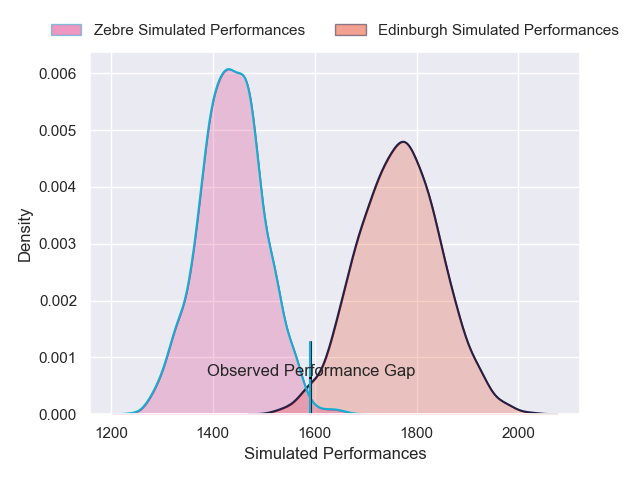
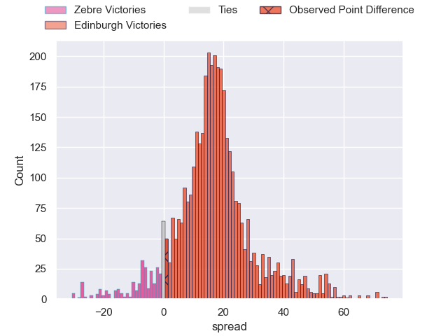
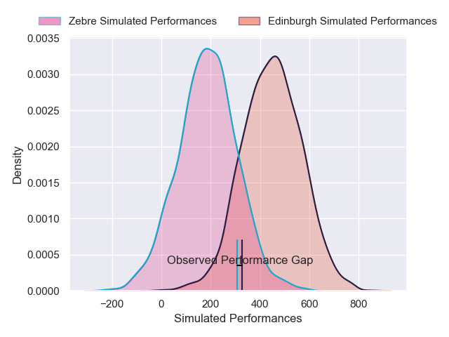
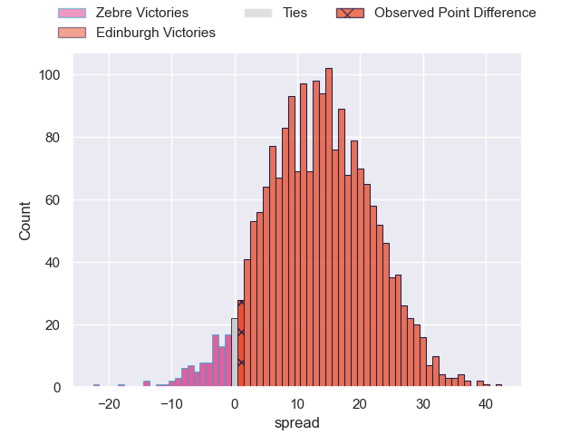
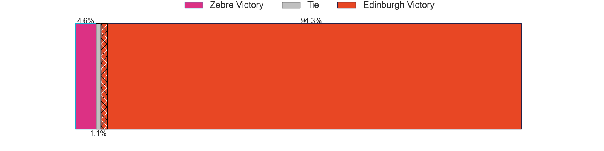

---  
layout: page  
title: Zebre at Edinburgh; 27-28  
date: 2025-02-14 18:00:00 -0500  
categories: "United Rugby Championship 24/25" match review  
---
# Zebre at Edinburgh; 27-28

# Club Level Predictions

The first set of predictions treats a club as the smallest object, as the club develops its members, organizes a gameplan, and deploys its players as needed for each match. This club model has a prediction of 0.865, which translates to predicting Edinburgh to win by 16.4.

Our Over/Under is 54.5 - and combined with the spread above, we have a predicted scoreline of 19 to 36

Each club has a rating and a rating deviation (similar to a Glicko rating), and expected performances can be generated. This allows for simulated matches and spreads like the ones below.
## Projected Performances - Club Model

## Projected Spreads - Club Model

## Projected Results - Club Model

# Player Level Predictions

Treating teams instead as an entity made up of the currently active players, I have ratings for each player in an altogether different system. These can be combined to form team ratings once teamsheets are announced, weighting starters a bit higher than the reserves. After the match is played, players can be weighted by their minutes on the field, allowing for an accurate measure of the team's composition. With these compiled team ratings, we can make predictions, measure inaccuracy, and update the individual player ratings.
## Prediction without Player Minutes: Edinburgh by 18.1

Edinburgh by 7.5 on a neutral pitch

## Projected Performances - Player Model

## Projected Spreads - Player Model

## Projected Results - Player Model

|   Away Minutes | Away Player            |   Away Percentile |   Number |   Home Percentile | Home Player       |   Home Minutes |
|---------------:|:-----------------------|------------------:|---------:|------------------:|:------------------|---------------:|
|             22 | Paolo Buonfiglio       |             61.92 |        1 |             64.2  | Boan Venter       |             58 |
|             80 | Luca Bigi              |             84.52 |        2 |             11.22 | Patrick Harrison  |             80 |
|             19 | Muhamed Hasa           |             22.86 |        3 |             20.59 | D'Arcy Rae        |             72 |
|             57 | Matteo Canali          |             90.39 |        4 |             49.67 | Marshall Sykes    |             32 |
|             19 | Leonard Krumov         |              5.94 |        5 |              2.83 | Glen Young        |             39 |
|             24 | Luca Andreani          |              4.78 |        6 |             86.15 | Luke Crosbie      |             80 |
|             61 | Bautista Stavile       |             34.48 |        7 |             69.63 | Hamish Watson     |             80 |
|             22 | Giovanni Licata        |             16.08 |        8 |             31.75 | Tom Currie        |             55 |
|             27 | Gonzalo Garcia         |              2.07 |        9 |             88.97 | Ali Price         |             80 |
|             27 | Giacomo Da Re          |             65.26 |       10 |             74.53 | Ross Thompson     |             80 |
|             80 | Scott Gregory          |             85.7  |       11 |              9.63 | Ross McCann       |             43 |
|             61 | Damiano Mazza          |             64.1  |       12 |             21.03 | Mosese Tuipulotu  |             80 |
|             53 | Fetuli Paea            |             13.64 |       13 |             79.18 | Matt Currie       |             61 |
|             19 | Jacopo Trulla          |             15.89 |       14 |             82.43 | Emiliano Boffelli |             80 |
|             80 | Geronimo Prisciantelli |             91.91 |       15 |             84.65 | Wes Goosen        |             41 |
|             80 | Tommaso Di Bartolomeo  |             52.55 |       16 |            nan    | Harri Morris      |             58 |
|             68 | Luca Rizzoli           |             64.36 |       17 |            nan    | Robin Hislop      |             11 |
|             80 | Juan Pitinari          |             53.54 |       18 |             99.51 | Paul Hill         |             19 |
|             80 | Guido Volpi            |             86.06 |       19 |             93.59 | Sam Skinner       |             22 |
|             80 | Giacomo Ferrari        |             53.2  |       20 |            nan    | Liam McConnell    |             25 |
|             28 | Alessandro Fusco       |              6.43 |       21 |             48.79 | Ben Vellacott     |             48 |
|              8 | Giovanni Montemauri    |              2.32 |       22 |             78.74 | Ben Healy         |             44 |
|             53 | Luca Morisi            |             90.87 |       23 |             73.95 | James Lang        |             80 |

