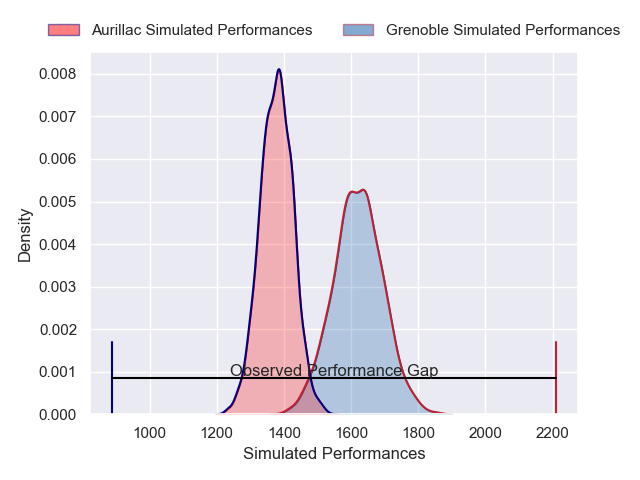
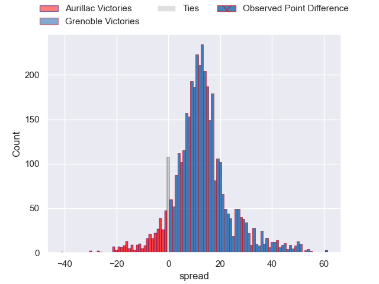
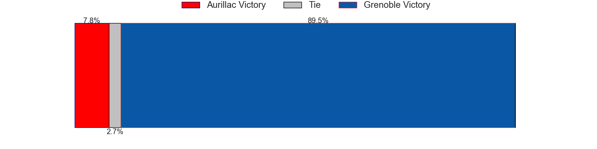
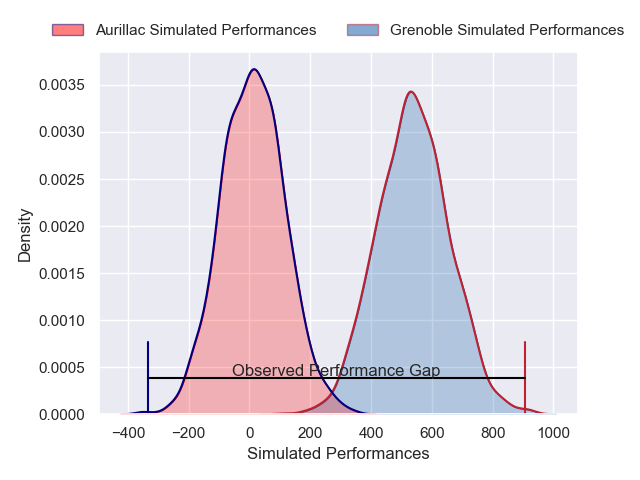
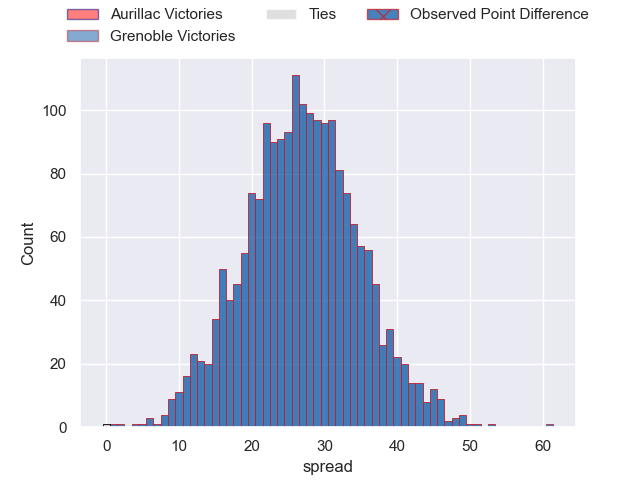
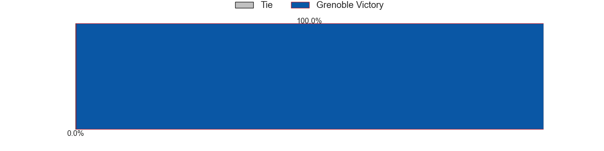

---  
layout: page  
title: Aurillac at Grenoble; 14-75  
date: 2025-02-14 18:00:00 -0500  
categories: "Pro D2 24/25" match review  
---
# Aurillac at Grenoble; 14-75

# Club Level Predictions

The first set of predictions treats a club as the smallest object, as the club develops its members, organizes a gameplan, and deploys its players as needed for each match. This club model has a prediction of 0.8, which translates to predicting Grenoble to win by 12.2.

Our Over/Under is 55.5 - and combined with the spread above, we have a predicted scoreline of 21 to 34

Each club has a rating and a rating deviation (similar to a Glicko rating), and expected performances can be generated. This allows for simulated matches and spreads like the ones below.
## Projected Performances - Club Model

## Projected Spreads - Club Model

## Projected Results - Club Model

# Player Level Predictions

Treating teams instead as an entity made up of the currently active players, I have ratings for each player in an altogether different system. These can be combined to form team ratings once teamsheets are announced, weighting starters a bit higher than the reserves. After the match is played, players can be weighted by their minutes on the field, allowing for an accurate measure of the team's composition. With these compiled team ratings, we can make predictions, measure inaccuracy, and update the individual player ratings.
## Prediction without Player Minutes: Grenoble by 27.8

Grenoble by 14.8 on a neutral pitch

## Projected Performances - Player Model

## Projected Spreads - Player Model

## Projected Results - Player Model

|   Away Minutes | Away Player               |   Away Percentile |   Number |   Home Percentile | Home Player        |   Home Minutes |
|---------------:|:--------------------------|------------------:|---------:|------------------:|:-------------------|---------------:|
|             39 | Robert Rodgers            |             10.5  |        1 |             88.45 | Zack Gauthier      |             80 |
|             80 | Ronan Loughnane           |             10.2  |        2 |             68.03 | Mathis Sarragallet |             41 |
|             57 | Dominic Robertson-McCoy   |             77.71 |        3 |             38    | Johannes Jonker    |             34 |
|             28 | Abongile Nonkontwana      |              0.28 |        4 |             60.13 | Thomas Lainault    |             30 |
|             57 | Mosa'ati Moala            |             27.99 |        5 |             63.05 | Pio Muarua         |             50 |
|             28 | Aleksandre Burduli        |             40.4  |        6 |             77.08 | Ryno Pieterse      |             80 |
|             25 | Théo Cambon               |             27.7  |        7 |             81.18 | Victor Guillaumond |             46 |
|             60 | Louis-Antonin Agostini    |             61.44 |        8 |             89.07 | Hanru Sirgel       |             80 |
|             23 | Leo Salvan                |             68.45 |        9 |             65.34 | Barnabe Couilloud  |             63 |
|             26 | Jean-Luc Alewyn Cilliers  |             33.68 |       10 |             91.37 | Sam Davies         |             63 |
|             28 | Jordon Janse Van Rensburg |             30.37 |       11 |             77.66 | Gerswin Mouton     |             41 |
|             61 | Karsen Talalua            |             20.21 |       12 |             76.62 | Romain Trouilloud  |             80 |
|             80 | Ofa Manuofetoa            |             41.74 |       13 |             82.77 | Julien Heriteau    |             80 |
|             59 | Simeli Yabaki             |              4.3  |       14 |             85.33 | Wilfried Hulleu    |             80 |
|             39 | Axel Bevia                |             26.14 |       15 |             61.2  | Hugo Trouilloud    |             17 |
|             63 | Basa Khonelidze           |             64.63 |       16 |             89.59 | Antonin Berruyer   |             16 |
|             39 | Mael Perrin               |             29.88 |       17 |            nan    | Théo Lavoine       |             80 |
|             51 | Valentin Welsch           |             66.4  |       18 |             59.01 | Bastien Soury      |             57 |
|             41 | Irakli Mtchedlidze        |             22.46 |       19 |             77.89 | Max Clement        |             57 |
|             51 | Hugo Bastard              |             54.77 |       20 |             88.12 | Tommy Raynaud      |             46 |
|             39 | Hugo Huurman              |             46.23 |       21 |             77.95 | Thomas Ployet      |             29 |
|             23 | Léopold Dupas             |             73.1  |       22 |            nan    | Cameron Holt       |             29 |
|             23 | Heath Backhouse           |             71.44 |       23 |             67.28 | Romain Fusier      |             80 |

