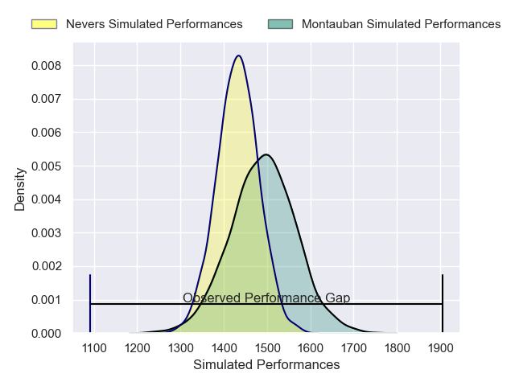
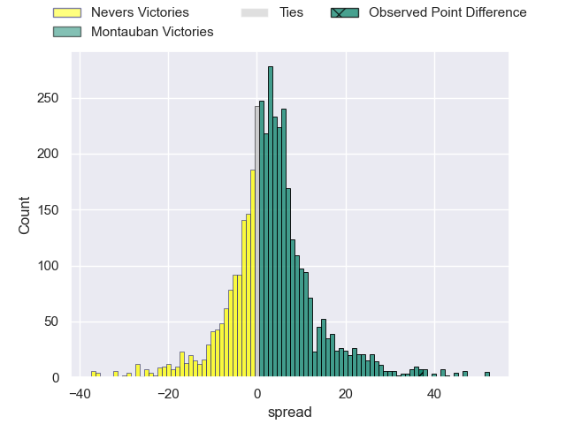
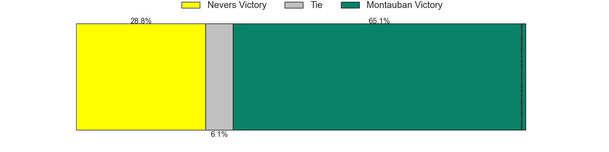
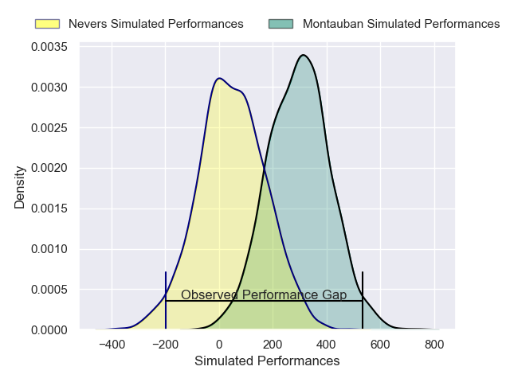
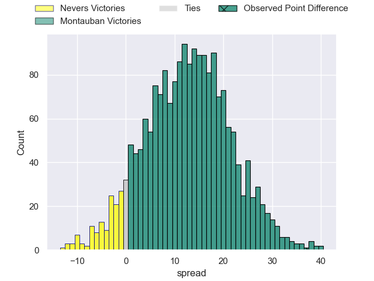
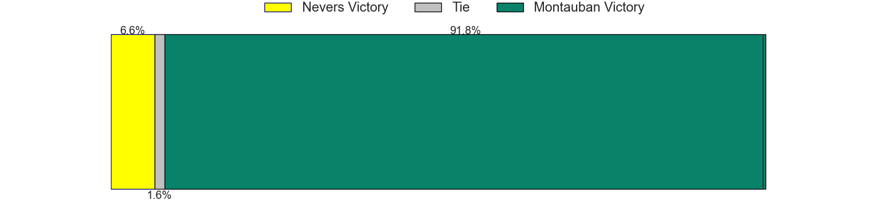

---  
layout: page  
title: Nevers at Montauban; 23-60  
date: 2025-02-14 18:00:00 -0500  
categories: "Pro D2 24/25" match review  
---
# Nevers at Montauban; 23-60

# Club Level Predictions

The first set of predictions treats a club as the smallest object, as the club develops its members, organizes a gameplan, and deploys its players as needed for each match. This club model has a prediction of 0.583, which translates to predicting Montauban to win by 2.9.

Our Over/Under is 51.5 - and combined with the spread above, we have a predicted scoreline of 24 to 27

Each club has a rating and a rating deviation (similar to a Glicko rating), and expected performances can be generated. This allows for simulated matches and spreads like the ones below.
## Projected Performances - Club Model

## Projected Spreads - Club Model

## Projected Results - Club Model

# Player Level Predictions

Treating teams instead as an entity made up of the currently active players, I have ratings for each player in an altogether different system. These can be combined to form team ratings once teamsheets are announced, weighting starters a bit higher than the reserves. After the match is played, players can be weighted by their minutes on the field, allowing for an accurate measure of the team's composition. With these compiled team ratings, we can make predictions, measure inaccuracy, and update the individual player ratings.
## Prediction without Player Minutes: Montauban by 13.4

Montauban by 2.6 on a neutral pitch

## Projected Performances - Player Model

## Projected Spreads - Player Model

## Projected Results - Player Model

|   Away Minutes | Away Player                 |   Away Percentile |   Number |   Home Percentile | Home Player           |   Home Minutes |
|---------------:|:----------------------------|------------------:|---------:|------------------:|:----------------------|---------------:|
|             80 | Louis Chanet                |             34.58 |        1 |             45.65 | Leo Aouf              |             40 |
|             55 | Jean-Maxence Jules-Rosette  |             12.24 |        2 |              7.48 | Kevin Firmin          |             40 |
|             45 | Lasha Pkhakadze             |             22.95 |        3 |             54.19 | Facundo Pomponio      |             80 |
|             80 | Ugo Vignolles               |             32.61 |        4 |             87.28 | Frank Bradshaw        |             63 |
|             80 | Chris Gabriel               |             12.25 |        5 |             24.98 | Lewis Bean            |             62 |
|             80 | Luka Plataret               |             72.11 |        6 |             20.15 | Karl Wilkins          |             80 |
|             68 | Kevin Noah                  |              9.26 |        7 |              3.72 | Tjuee Uanivi          |             24 |
|             59 | Steven David                |             32.78 |        8 |             17.32 | Tyrone Viiga          |             63 |
|             29 | Hugo Bouyssou               |              1.55 |        9 |             74.48 | Joe Powell            |             24 |
|             80 | Shaun Reynolds              |              5.05 |       10 |             78.53 | Jérôme Bosviel        |             40 |
|             18 | Arthur Mathiron             |              9.44 |       11 |             69.63 | Yvan Reilhac          |             80 |
|             80 | Alifereti Loaloa            |             54.46 |       12 |             72.62 | Simon Renda           |             41 |
|             12 | Atunaisa Taulanga Vaka Manu |             26.97 |       13 |             37.44 | JT Jackson            |             17 |
|             14 | Johan Georg Wasserman       |             47.48 |       14 |             95.98 | Stephane Ahmed        |             58 |
|             68 | Perry Mayo                  |             24.27 |       15 |              1.87 | Segundo Tuculet       |             21 |
|             80 | Rati Zazadze                |             50.81 |       16 |             69.25 | Kyllian Ringuet       |             80 |
|             63 | Julien Kazubek              |             74.5  |       17 |             18.23 | Thomas Bue            |             80 |
|             40 | Mahamadou Coulibaly         |            nan    |       18 |            nan    | Vakhtang Jintcharadze |             80 |
|             21 | Cleopas Kundiona            |              8.06 |       19 |              1.72 | Frédéric Quercy       |             12 |
|             16 | Kamaliele Tufele            |             63.3  |       20 |             53.63 | Noa Kanika            |             80 |
|             63 | Simon Tarel                 |             15    |       21 |              3.91 | Lucas Seyrolle        |             17 |
|             56 | Luka Ungiadze               |             66.72 |       22 |             32.24 | Hugo Zabalza          |             80 |
|             29 | Nicolas Ragoevi             |             31.59 |       23 |             31.79 | Thomas Fortunel       |             25 |

