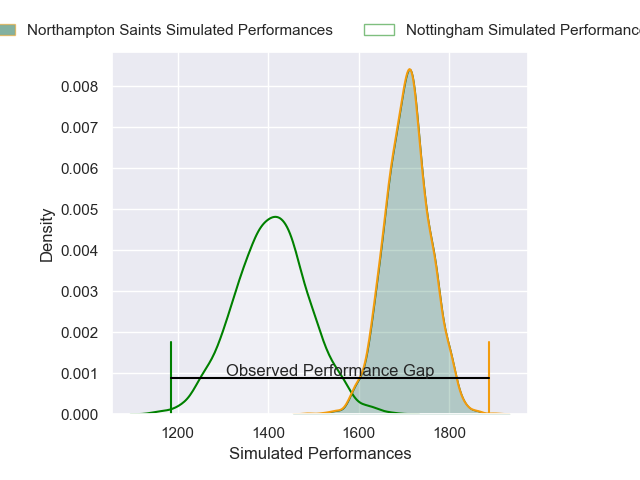
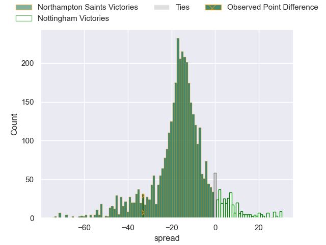
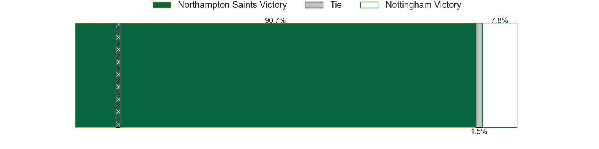
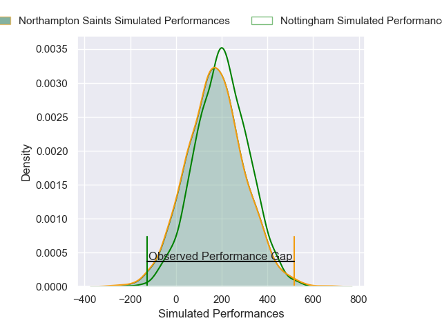
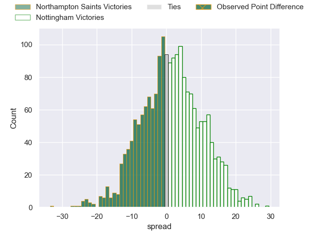

---  
layout: page  
title: Northampton Saints at Nottingham; 66-33  
date: 2025-02-14 18:00:00 -0500  
categories: "Premiership Rugby Cup 24/25" match review  
---
# Northampton Saints at Nottingham; 66-33

# Club Level Predictions

The first set of predictions treats a club as the smallest object, as the club develops its members, organizes a gameplan, and deploys its players as needed for each match. This club model has a prediction of 0.155, which translates to predicting Northampton Saints to win by 14.9.

Our Over/Under is 52.5 - and combined with the spread above, we have a predicted scoreline of 34 to 19

Each club has a rating and a rating deviation (similar to a Glicko rating), and expected performances can be generated. This allows for simulated matches and spreads like the ones below.
## Projected Performances - Club Model

## Projected Spreads - Club Model

## Projected Results - Club Model

# Player Level Predictions

Treating teams instead as an entity made up of the currently active players, I have ratings for each player in an altogether different system. These can be combined to form team ratings once teamsheets are announced, weighting starters a bit higher than the reserves. After the match is played, players can be weighted by their minutes on the field, allowing for an accurate measure of the team's composition. With these compiled team ratings, we can make predictions, measure inaccuracy, and update the individual player ratings.
## Prediction without Player Minutes: Nottingham by 3.2

Northampton Saints by 1.4 on a neutral pitch

## Projected Performances - Player Model

## Projected Spreads - Player Model

## Projected Results - Player Model

|   Away Minutes | Away Player             |   Away Percentile |   Number |   Home Percentile | Home Player        |   Home Minutes |
|---------------:|:------------------------|------------------:|---------:|------------------:|:-------------------|---------------:|
|             29 | Emmanuel Iyogun         |             71.42 |        1 |             61.97 | Kai Owen           |             67 |
|             39 | Craig Wright            |             89.88 |        2 |             71.36 | Harry Clayton      |             34 |
|             24 | Elliot Millar Mills     |             86.32 |        3 |             80.29 | Dan Richardson     |             29 |
|             24 | Ed Prowse               |             65.91 |        4 |             37.69 | Jack Shine         |             29 |
|             17 | Alex Coles              |             16    |        5 |              4.07 | Sebastien Ferreira |             29 |
|             17 | Archie Benson           |             26.79 |        6 |             56.34 | Sam Green          |             51 |
|             56 | Angus Scott-Young       |             70.73 |        7 |             28.69 | Nathan Tweedy      |             29 |
|             16 | Iakopo Petelo Mapu      |             47.76 |        8 |             61.83 | James Cherry       |             24 |
|             80 | Tom James               |             64.63 |        9 |             30.84 | Will Yarnell       |             17 |
|             49 | George Makepeace-Cubitt |             81.8  |       10 |             61.72 | Matthew Arden      |             51 |
|             41 | Tom Seabrook            |              4.38 |       11 |             68.94 | Harry Graham       |             63 |
|             80 | Charlie Savala          |             70.95 |       12 |              5.19 | Javiah Pohe        |             80 |
|             80 | Tom Litchfield          |             79.98 |       13 |              0.93 | Jack Stapley       |             80 |
|             60 | Rafe Witheat            |             54.38 |       14 |              9.98 | David Williams     |             80 |
|             56 | George Hendy            |             89.14 |       15 |             75.16 | Ryan Olowofela     |             63 |
|             80 | Tom West                |             51.95 |       16 |             38.49 | Tom Threlfall      |             63 |
|             55 | Henry Walker            |             40.82 |       17 |             56.26 | Antonio TJ Harris  |             64 |
|             76 | William Glister         |             18.1  |       18 |             48.05 | Aniseko Sio        |             80 |
|             80 | Beltus Nonleh           |              9.2  |       19 |             34.85 | Jay Ecclesfield    |             80 |
|             80 | Tom Pearson             |             97.52 |       20 |             64.06 | Kody Vereti        |             80 |
|             80 | Fyn Brown               |             15.06 |       21 |             65.16 | Toby Venner        |             56 |
|             31 | Jonny Weimann           |            nan    |       22 |             47.76 | Sam Mercer         |             56 |
|             80 | Billy Pasco             |             35.17 |       23 |            nan    | nan                |            nan |

