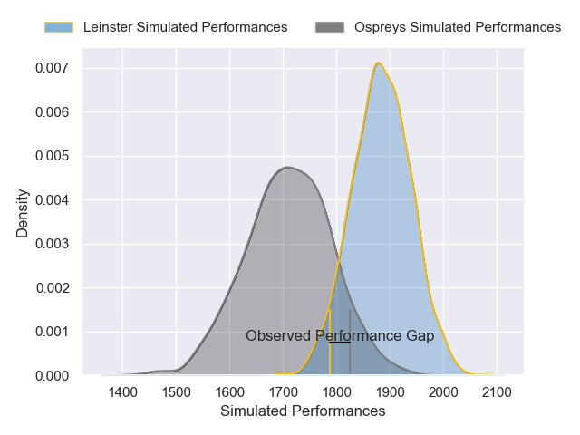
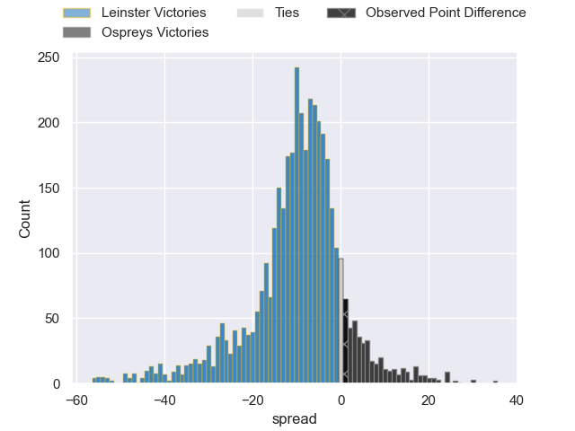
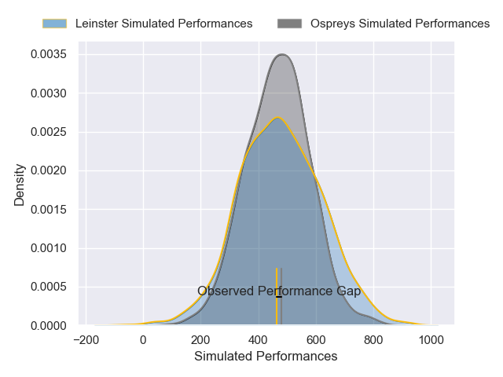
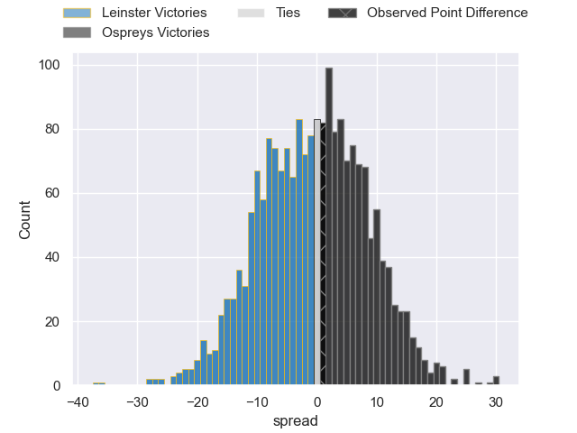

---  
layout: page  
title: Leinster at Ospreys; 27-28  
date: 2025-02-14 18:00:00 -0500  
categories: "United Rugby Championship 24/25" match review  
---
# Leinster at Ospreys; 27-28

# Club Level Predictions

The first set of predictions treats a club as the smallest object, as the club develops its members, organizes a gameplan, and deploys its players as needed for each match. This club model has a prediction of 0.274, which translates to predicting Leinster to win by 8.6.

Our Over/Under is 54.5 - and combined with the spread above, we have a predicted scoreline of 32 to 23

Each club has a rating and a rating deviation (similar to a Glicko rating), and expected performances can be generated. This allows for simulated matches and spreads like the ones below.
## Projected Performances - Club Model

## Projected Spreads - Club Model

## Projected Results - Club Model

# Player Level Predictions

Treating teams instead as an entity made up of the currently active players, I have ratings for each player in an altogether different system. These can be combined to form team ratings once teamsheets are announced, weighting starters a bit higher than the reserves. After the match is played, players can be weighted by their minutes on the field, allowing for an accurate measure of the team's composition. With these compiled team ratings, we can make predictions, measure inaccuracy, and update the individual player ratings.
## Prediction without Player Minutes: Ospreys by 8.2

Leinster by 1.3 on a neutral pitch

## Projected Performances - Player Model

## Projected Spreads - Player Model

## Projected Results - Player Model

|   Away Minutes | Away Player     |   Away Percentile |   Number |   Home Percentile | Home Player            |   Home Minutes |
|---------------:|:----------------|------------------:|---------:|------------------:|:-----------------------|---------------:|
|             37 | Jack Boyle      |             55.33 |        1 |             80.63 | Garyn Phillips         |             81 |
|             81 | Gus McCarthy    |             57.31 |        2 |              8.16 | Ethan Lewis            |             66 |
|             57 | Gus McCarthy    |             57.31 |        2 |              8.16 | Ethan Lewis            |             66 |
|             27 | Rabah Slimani   |             82.42 |        3 |             84.3  | Tom Botha              |             15 |
|             49 | Diarmuid Mangan |             42.32 |        4 |             82.28 | James Ratti            |             15 |
|             80 | Brian Deeny     |             67.11 |        5 |             87.18 | James Fender           |             32 |
|             80 | Max Deegan      |             93.6  |        6 |             92.07 | Harri Deaves           |             15 |
|             19 | Scott Penny     |             89.97 |        7 |             99.14 | Justin Tipuric         |             81 |
|             15 | James Culhane   |             31.13 |        8 |             12.78 | Morgan Morris          |             81 |
|             64 | Luke McGrath    |             98.79 |        9 |             89.14 | Reuben Morgan-Williams |             44 |
|             37 | Luke McGrath    |             98.79 |        9 |             89.14 | Reuben Morgan-Williams |             44 |
|             81 | Ciaran Frawley  |             46.32 |       10 |             94.53 | Owen Williams          |             44 |
|             81 | Jimmy O'Brien   |             94.49 |       11 |             51.5  | Keelan Giles           |             62 |
|             81 | Charlie Tector  |             39.59 |       12 |             90.15 | Keiran Williams        |             81 |
|             53 | Hugh Cooney     |             44.92 |       13 |             13.74 | Evardi Boshoff         |             66 |
|             58 | Tommy O'Brien   |             66.64 |       14 |             97.94 | Daniel Kasende         |             34 |
|             32 | Jamie Osborne   |             86.93 |       15 |             84.85 | Jack Walsh             |             24 |
|             17 | John McKee      |             74.32 |       16 |            nan    | Wills Austin           |             81 |
|             61 | Paddy McCarthy  |            nan    |       17 |            nan    | Cameron Jones          |              0 |
|             80 | Rory McGuire    |            nan    |       18 |             79.33 | Ben Warren             |             12 |
|             37 | RG Snyman       |             99.81 |       19 |             70.5  | Will Spencer           |             69 |
|             80 | Alex Soroka     |             47.37 |       20 |             55.05 | Morgan Morse           |             44 |
|             19 | Fintan Gunne    |            nan    |       21 |             78.79 | Kieran Hardy           |             49 |
|             24 | Ross Byrne      |             95.37 |       22 |             74.43 | Tom Florence           |             81 |
|             80 | Andrew Osborne  |             54.67 |       23 |             75.52 | Iestyn Hopkins         |             69 |

