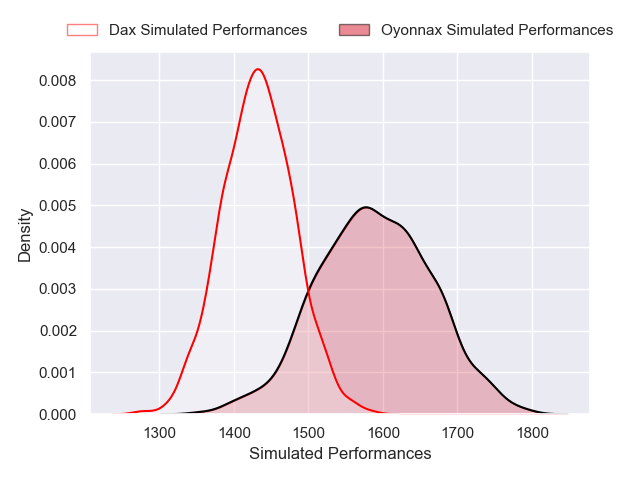
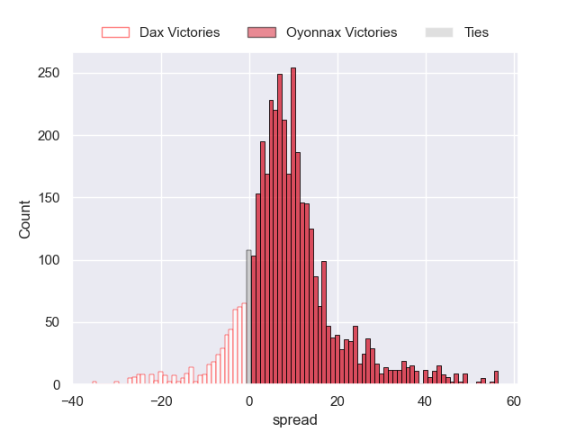
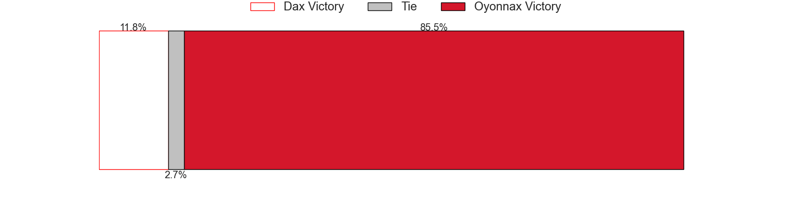
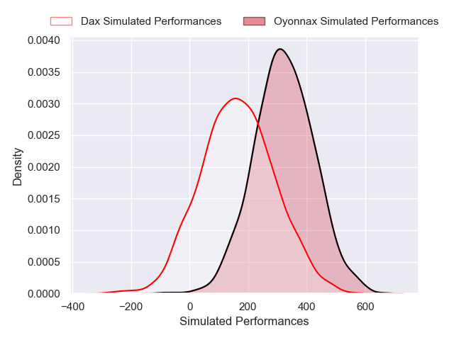
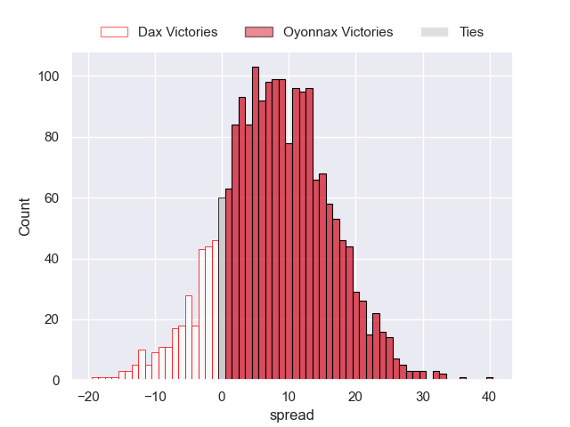
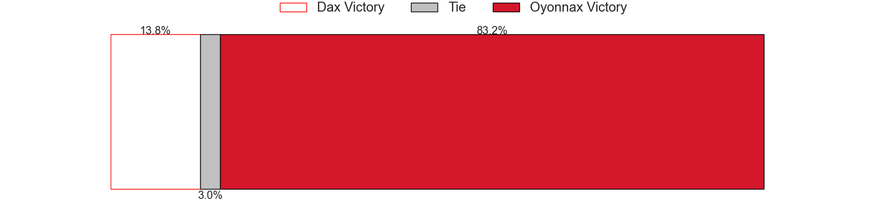

---  
layout: page  
title: Dax at Oyonnax; 23-23  
date: 2025-02-14 18:00:00 -0500  
categories: "Pro D2 24/25" match review  
---
# Dax at Oyonnax; 23-23

# Club Level Predictions

The first set of predictions treats a club as the smallest object, as the club develops its members, organizes a gameplan, and deploys its players as needed for each match. This club model has a prediction of 0.715, which translates to predicting Oyonnax to win by 8.1.

Our Over/Under is 45.5 - and combined with the spread above, we have a predicted scoreline of 19 to 27

Each club has a rating and a rating deviation (similar to a Glicko rating), and expected performances can be generated. This allows for simulated matches and spreads like the ones below.
## Projected Performances - Club Model

## Projected Spreads - Club Model

## Projected Results - Club Model

# Player Level Predictions

Treating teams instead as an entity made up of the currently active players, I have ratings for each player in an altogether different system. These can be combined to form team ratings once teamsheets are announced, weighting starters a bit higher than the reserves. After the match is played, players can be weighted by their minutes on the field, allowing for an accurate measure of the team's composition. With these compiled team ratings, we can make predictions, measure inaccuracy, and update the individual player ratings.
## Prediction without Player Minutes: Oyonnax by 10.8

Dax by 2.1 on a neutral pitch

## Projected Performances - Player Model

## Projected Spreads - Player Model

## Projected Results - Player Model

|   Away Minutes | Away Player          |   Away Percentile |   Number |   Home Percentile | Home Player        |   Home Minutes |
|---------------:|:---------------------|------------------:|---------:|------------------:|:-------------------|---------------:|
|             80 | Dino Casadei         |             67.29 |        1 |              7.24 | Adrien Bordenave   |             39 |
|             80 | Paul Laperne         |             61.56 |        2 |              2.21 | Teddy Durand       |             39 |
|             53 | Thibaud Dréan        |             37.35 |        3 |             29.13 | Ali Oz             |             39 |
|             59 | Étienne Loiret       |             47.69 |        4 |             91.61 | Phoenix Battye     |             60 |
|             24 | Jean-Baptiste Singer |              7.63 |        5 |             50.24 | Ewan Johnson       |             52 |
|             30 | Jean Despiau         |             19.96 |        6 |             15.57 | Kevin Lebreton     |             80 |
|             48 | Malo Hannoyer        |             54.92 |        7 |              9.65 | Hugo Hermet        |             16 |
|             80 | Genesis Mamea Lemalu |             65.98 |        8 |              2.27 | Loic Godener       |             80 |
|             56 | Sylvère Reteau       |             69.14 |        9 |             91.72 | Jonathan Ruru      |             41 |
|             52 | Hugo Cerisier        |             65.47 |       10 |             84.42 | Zack Holmes        |             41 |
|             28 | Diego Miranda        |             46.07 |       11 |             47.1  | Karim Qadiri       |             80 |
|             48 | Benjamin Puntous     |             10.56 |       12 |              9.33 | Lucas Mensa        |             41 |
|             80 | Hugo Fourquet        |             89.33 |       13 |             59.59 | Afusipa Taumoepeau |             41 |
|             60 | Viliame Tutuvili     |             49.72 |       14 |             67.76 | Daniel Ikpefan     |             29 |
|             40 | Guillaume Bouche     |             74.27 |       15 |             22.41 | Martin Bogado      |             20 |
|             40 | Romuald Séguy        |             30.32 |       16 |             63.47 | Paulo Tafili       |             20 |
|             80 | Kito Falatea         |            nan    |       17 |              1.51 | Manuel Leindekar   |             59 |
|             80 | Raphaël Laboille     |            nan    |       18 |             92.86 | Peniami Narisia    |             80 |
|             34 | David Lolohea        |             44.26 |       19 |             37.7  | Kevin Kornath      |             80 |
|             34 | Paul Ravier          |             82.59 |       20 |            nan    | nan                |            nan |
|             80 | Paul Arnaud Ausset   |             75.07 |       21 |            nan    | nan                |            nan |
|             21 | Alexandre Manukula   |             19.89 |       22 |            nan    | nan                |            nan |
|             80 | Bastien Daguerre     |             53.85 |       23 |            nan    | nan                |            nan |

