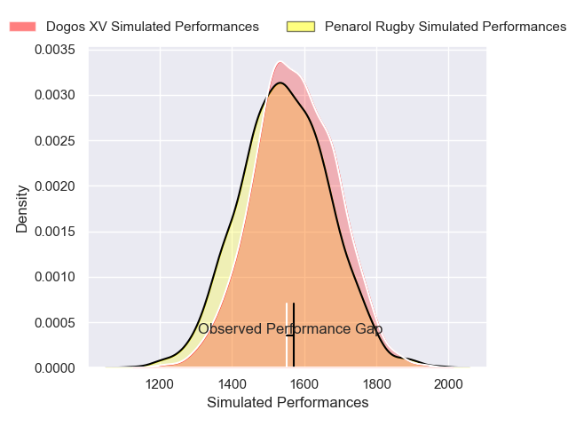
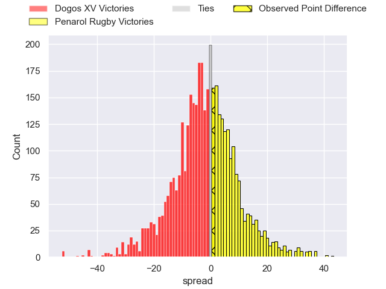
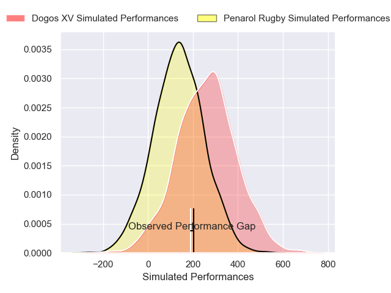
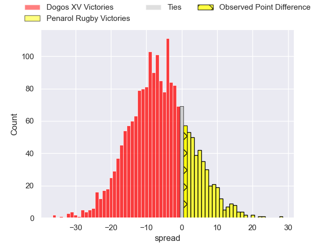

---  
layout: page  
title: Dogos XV at Penarol Rugby; 28-29  
date: 2025-02-14 18:00:00 -0500  
categories: "Super Rugby Americas 2025" match review  
---
# Dogos XV at Penarol Rugby; 28-29

# Club Level Predictions

The first set of predictions treats a club as the smallest object, as the club develops its members, organizes a gameplan, and deploys its players as needed for each match. This club model has a prediction of 0.46, which translates to predicting Dogos XV to win by 1.5.

Our Over/Under is 49.5 - and combined with the spread above, we have a predicted scoreline of 25 to 24

Each club has a rating and a rating deviation (similar to a Glicko rating), and expected performances can be generated. This allows for simulated matches and spreads like the ones below.
## Projected Performances - Club Model

## Projected Spreads - Club Model

## Projected Results - Club Model

# Player Level Predictions

Treating teams instead as an entity made up of the currently active players, I have ratings for each player in an altogether different system. These can be combined to form team ratings once teamsheets are announced, weighting starters a bit higher than the reserves. After the match is played, players can be weighted by their minutes on the field, allowing for an accurate measure of the team's composition. With these compiled team ratings, we can make predictions, measure inaccuracy, and update the individual player ratings.
## Prediction without Player Minutes: Dogos XV by 5.7

Dogos XV by 8.5 on a neutral pitch

## Projected Performances - Player Model

## Projected Spreads - Player Model

## Projected Results - Player Model

|   Away Minutes | Away Player              |   Away Percentile |   Number |   Home Percentile | Home Player                |   Home Minutes |
|---------------:|:-------------------------|------------------:|---------:|------------------:|:---------------------------|---------------:|
|             80 | Boris Wenger             |             85.46 |        1 |              3.53 | Mateo Sanguinetti          |              7 |
|             80 | Leonel Oviedo            |             76.53 |        2 |             87.76 | Guillermo Pujadas          |             61 |
|             61 | Pedro Delgado            |             63.13 |        3 |             68.43 | Bautista Vidal             |             14 |
|             61 | Lautaro Simes            |             82.49 |        4 |             64.78 | Juan Manuel Rodriguez      |             24 |
|             61 | Federico Albrisi         |             51.98 |        5 |             63.09 | Felipe Aliaga              |             18 |
|             75 | Aitor Bildosola          |             63.92 |        6 |             30.18 | Santiago Civetta           |             14 |
|             80 | Valentin Cabral          |             76.19 |        7 |             68.23 | Lucas Bianchi              |             12 |
|             20 | Juan Cruz Caballero      |             40.08 |        8 |              6.68 | Manuel Diana               |             80 |
|             56 | Agustin Moyano           |             85.4  |        9 |             67.7  | Santiago Alvarez           |             80 |
|             80 | Julian Ignacio Hernandez |             75.62 |       10 |             38.12 | Felipe Etcheverry          |             49 |
|             56 | Lautaro Cipriani         |             59    |       11 |             60.67 | Ignacio Facciolo           |             66 |
|             80 | Felipe Mallia            |             71.4  |       12 |             65.99 | Bautista Farisé            |             31 |
|             24 | Mateo Soler              |             79.06 |       13 |             59.96 | Felipe Arcos Perez         |             80 |
|             14 | Ernesto Giudice          |             80.06 |       14 |             25.14 | Bautista Basso             |             80 |
|             80 | Bautista Lescano         |             34.14 |       15 |             37.78 | Baltazar Amaya             |             66 |
|             56 | Juan Baronio             |            nan    |       16 |             19.67 | Manuel Cardoso Pinto       |             24 |
|              5 | Mateo Sanchez            |            nan    |       17 |            nan    | Mateo Perillo              |             80 |
|             56 | Ignacio Jose Gandini     |            nan    |       18 |            nan    | Joaquin Myszka             |             60 |
|             68 | Lorenzo Colidio          |             69.45 |       19 |            nan    | Bautista Bottino           |             80 |
|             80 | Nicolas Revol            |             64.02 |       20 |             72.16 | Carlos Deus                |             33 |
|             12 | Octavio Filippa          |             85.38 |       21 |            nan    | Alfonso Perillo Albarracin |             13 |
|            nan | nan                      |            nan    |       22 |             73.2  | Tomas Di Biase             |              9 |
|            nan | nan                      |            nan    |       23 |            nan    | Franco Marini              |             60 |

