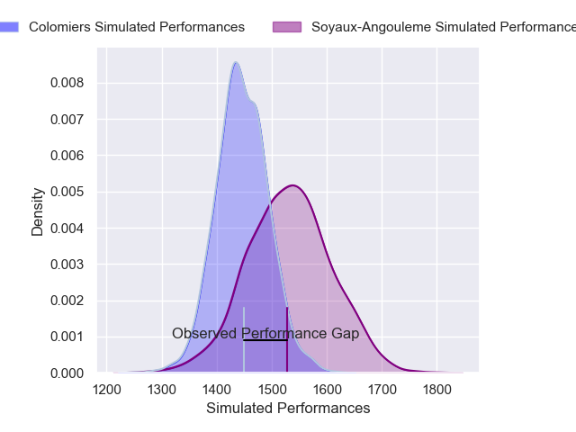
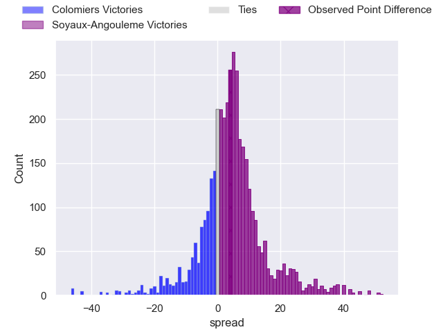
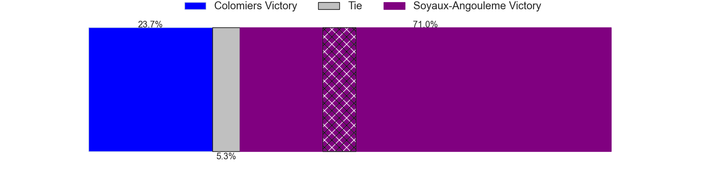
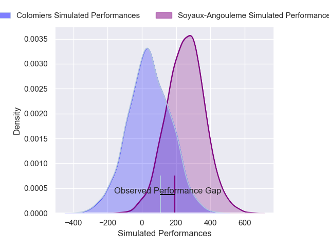
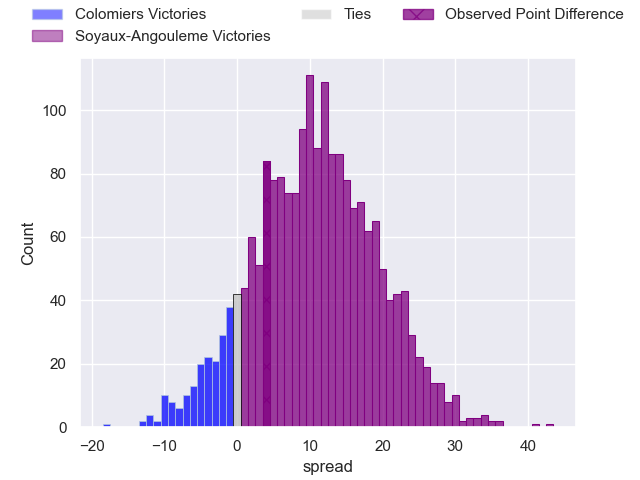
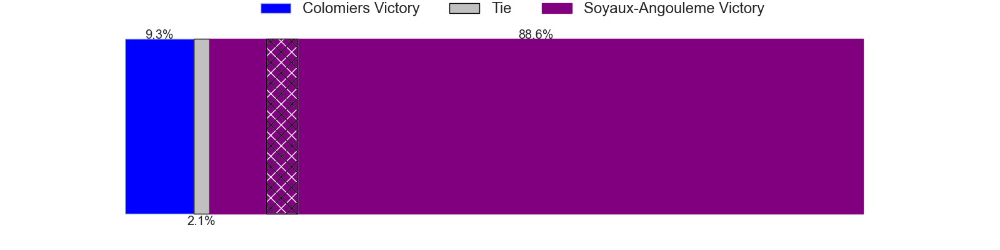

---  
layout: page  
title: Colomiers at Soyaux-Angouleme; 37-41  
date: 2025-02-14 18:00:00 -0500  
categories: "Pro D2 24/25" match review  
---
# Colomiers at Soyaux-Angouleme; 37-41

# Club Level Predictions

The first set of predictions treats a club as the smallest object, as the club develops its members, organizes a gameplan, and deploys its players as needed for each match. This club model has a prediction of 0.623, which translates to predicting Soyaux-Angouleme to win by 4.4.

Our Over/Under is 53.5 - and combined with the spread above, we have a predicted scoreline of 25 to 29

Each club has a rating and a rating deviation (similar to a Glicko rating), and expected performances can be generated. This allows for simulated matches and spreads like the ones below.
## Projected Performances - Club Model

## Projected Spreads - Club Model

## Projected Results - Club Model

# Player Level Predictions

Treating teams instead as an entity made up of the currently active players, I have ratings for each player in an altogether different system. These can be combined to form team ratings once teamsheets are announced, weighting starters a bit higher than the reserves. After the match is played, players can be weighted by their minutes on the field, allowing for an accurate measure of the team's composition. With these compiled team ratings, we can make predictions, measure inaccuracy, and update the individual player ratings.
## Prediction without Player Minutes: Soyaux-Angouleme by 15.9

Soyaux-Angouleme by 10.3 on a neutral pitch

## Projected Performances - Player Model

## Projected Spreads - Player Model

## Projected Results - Player Model

|   Away Minutes | Away Player               |   Away Percentile |   Number |   Home Percentile | Home Player        |   Home Minutes |
|---------------:|:--------------------------|------------------:|---------:|------------------:|:-------------------|---------------:|
|             80 | Guillaume Tartas          |             73.64 |        1 |             97.8  | Sami Zouhair       |             19 |
|             80 | Theo Lachaud              |              4.42 |        2 |              4.25 | Motu Matu'u        |             19 |
|             51 | Robin Bellemand           |             50.77 |        3 |             13.75 | Yassine Boutemane  |             80 |
|             80 | Jean Thomas               |             54.19 |        4 |             16.4  | Matt Beukeboom     |             67 |
|             28 | Janse Roux                |             27.33 |        5 |             91.33 | Sikeli Nabou       |             27 |
|             53 | Anthony Coletta           |              7.55 |        6 |             43.65 | Hubert Texier      |             23 |
|             51 | Gregoire Bazin            |             19.29 |        7 |             86.53 | Germain Burgaud    |             57 |
|             53 | Aldric Lescure            |             59.18 |        8 |             35.26 | Alexander Masibaka |             34 |
|             28 | Mathis Galthié            |             33.45 |        9 |             73.97 | Manu Saubusse      |             34 |
|             32 | Joaquin de la Vega Mendia |             15.58 |       10 |             93.26 | Ben Botica         |             17 |
|             80 | Anzelo Tuitavuki          |             17.29 |       11 |             37.76 | Nathan Farissier   |             51 |
|             80 | Baptiste Serrano          |             26.15 |       12 |             61.03 | Mathis Lafon       |             57 |
|             21 | Martin Dulon              |              5.23 |       13 |              5.13 | Arthur Proult      |             80 |
|             80 | Martin Alonso Munoz       |              6.92 |       14 |             84.58 | Matthys Gratien    |             52 |
|             41 | Vincent Pinto             |             71.58 |       15 |             67.22 | Jules Dubecq       |             17 |
|             41 | Enzo Salles               |             58.77 |       16 |             94.15 | George Tilsley     |             59 |
|             28 | Ugo Pacome                |             32.37 |       17 |             68.43 | Maxence Lemardelet |             24 |
|             80 | Pierre-Samuel Pacheco     |            nan    |       18 |             66.48 | Paul Tailhades     |             17 |
|             61 | Pablo Dimcheff            |             45.58 |       19 |             86.56 | Rayne Barka        |             80 |
|             51 | Michael Simutoga          |             32.22 |       20 |             30.68 | Seydou Diakité     |             51 |
|             13 | Louis Descoux             |            nan    |       21 |              4.31 | Adrien Bau         |             80 |
|             40 | Sadek Deghmache           |             14.66 |       22 |             57.68 | Corentin Glenat    |             80 |
|             40 | Elliott Maurel            |            nan    |       23 |              7.64 | Gautier Gibouin    |             80 |

