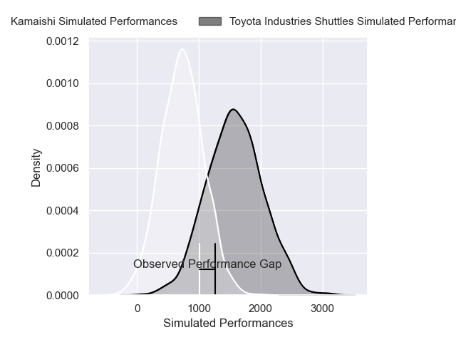
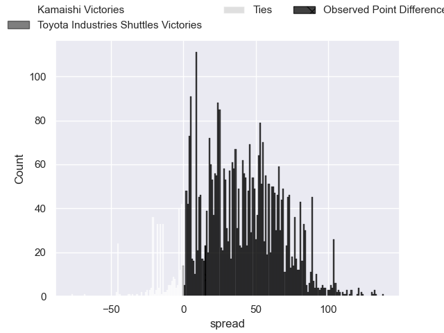
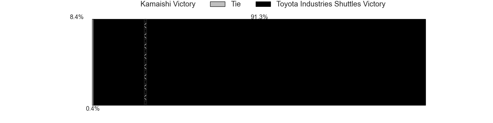
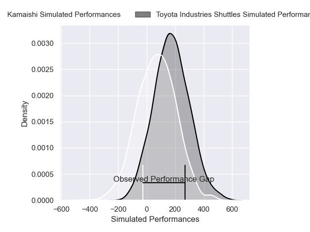
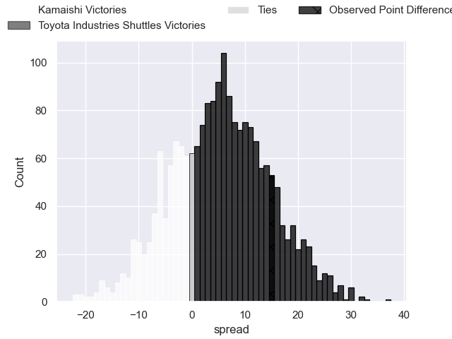
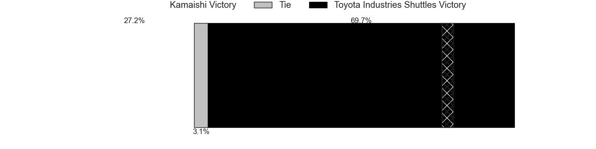

---  
layout: page  
title: Kamaishi at Toyota Industries Shuttles; 14-29  
date: 2025-02-14 18:00:00 -0500  
categories: "Japan Rugby League One - Division 2 2025" match review  
---
# Kamaishi at Toyota Industries Shuttles; 14-29

# Club Level Predictions

The first set of predictions treats a club as the smallest object, as the club develops its members, organizes a gameplan, and deploys its players as needed for each match. This club model has a prediction of 0.969, which translates to predicting Toyota Industries Shuttles to win by 43.9.

Our Over/Under is 40.5 - and combined with the spread above, we have a predicted scoreline of -2 to 42

Each club has a rating and a rating deviation (similar to a Glicko rating), and expected performances can be generated. This allows for simulated matches and spreads like the ones below.
## Projected Performances - Club Model

## Projected Spreads - Club Model

## Projected Results - Club Model

# Player Level Predictions

Treating teams instead as an entity made up of the currently active players, I have ratings for each player in an altogether different system. These can be combined to form team ratings once teamsheets are announced, weighting starters a bit higher than the reserves. After the match is played, players can be weighted by their minutes on the field, allowing for an accurate measure of the team's composition. With these compiled team ratings, we can make predictions, measure inaccuracy, and update the individual player ratings.
## Prediction without Player Minutes: Toyota Industries Shuttles by 5.9

Toyota Industries Shuttles by 3.7 on a neutral pitch

## Projected Performances - Player Model

## Projected Spreads - Player Model

## Projected Results - Player Model

|   Away Minutes | Away Player         |   Away Percentile |   Number |   Home Percentile | Home Player        |   Home Minutes |
|---------------:|:--------------------|------------------:|---------:|------------------:|:-------------------|---------------:|
|            8.5 | Yusuke Yamada       |             35.39 |        1 |             50.37 | Tomoki Yamaguchi   |           17   |
|           47   | Taiki Ito           |             30.44 |        2 |             45.75 | Takuma Oyama       |           10   |
|           60   | Taiki Noguchi       |             31.33 |        3 |             55.82 | Nobuhisa Takahashi |           53   |
|           63   | Satoshi Hatazawa    |             31.48 |        4 |             55.8  | Taishi Nakamura    |           55   |
|            4   | Hamish Dalzell      |             28.46 |        5 |             56.74 | James Gaskell      |           60   |
|           76   | Ben Nee Nee         |              5.83 |        6 |             55.11 | Tama Kapene        |           53   |
|            4   | Ryota Kono          |             34.57 |        7 |             54.15 | Cheng Chao Yi      |           46   |
|           63   | Sam Henwood         |             26.6  |        8 |             92.99 | Taleni Seu         |           76   |
|           80   | Yohei Murakami      |             28.1  |        9 |             56.21 | Atsushi Yumoto     |           72   |
|           80   | Mitch Hunt          |             18.32 |       10 |             43.16 | Freddie Burns      |            4   |
|           80   | Jamie Henry         |             34.39 |       11 |             50.19 | Chance Peni        |           20   |
|           76   | Gerdus Van Der Walt |             31.69 |       12 |             46.67 | James Mollentze    |           20   |
|           80   | Katsuto Hatanaka    |             26.05 |       13 |             55.49 | Keita Ichikawa     |           80   |
|           72   | Gosuke Kawakami     |             32.52 |       14 |             58.79 | Hiroaki Saito      |           80   |
|           76   | Kazushi Ochi        |             29.05 |       15 |             56.64 | Josua Kerevi       |           80   |
|           80   | Hayato Nishibayashi |            nan    |       16 |            nan    | Akito Fujinami     |           80   |
|           80   | Suguru Aoyaki       |            nan    |       17 |            nan    | Takuya Tsushida    |           63   |
|           80   | Satoshi Ueda        |             34.01 |       18 |            nan    | Ryota Fukamura     |            8.5 |
|            4   | Kohei Ishigaki      |            nan    |       19 |            nan    | Seta Naivaluwaqa   |           60   |
|            4   | Angus Fletcher      |            nan    |       20 |            nan    | Isi Manu           |           80   |
|           17   | Atsushi Minami      |            nan    |       21 |            nan    | Keita Fujiwara     |           63   |
|            8   | Sho Kataoka         |            nan    |       22 |            nan    | Daigo Doi          |           63   |
|           80   | Mosese Tonga        |            nan    |       23 |            nan    | Yamato Matsuoka    |           80   |

