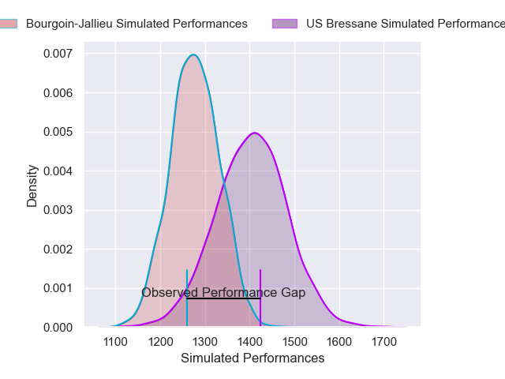
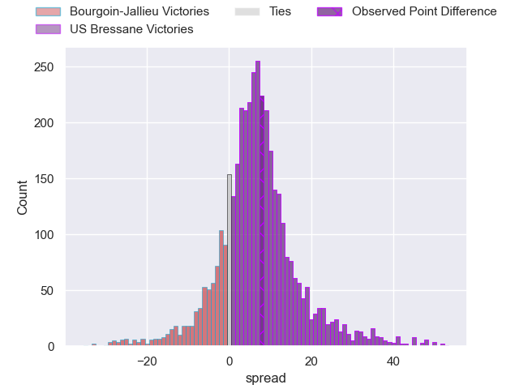
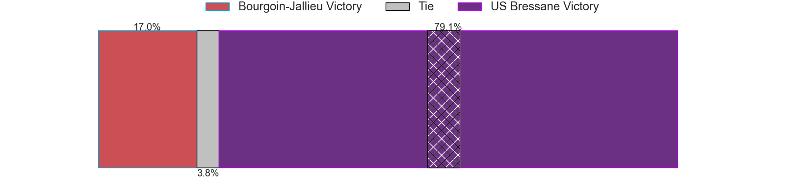
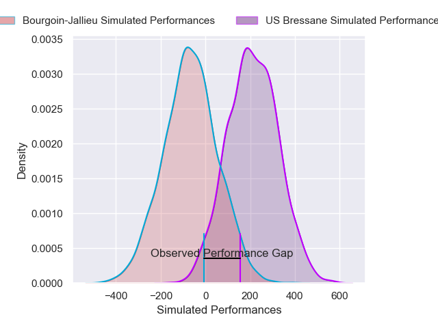
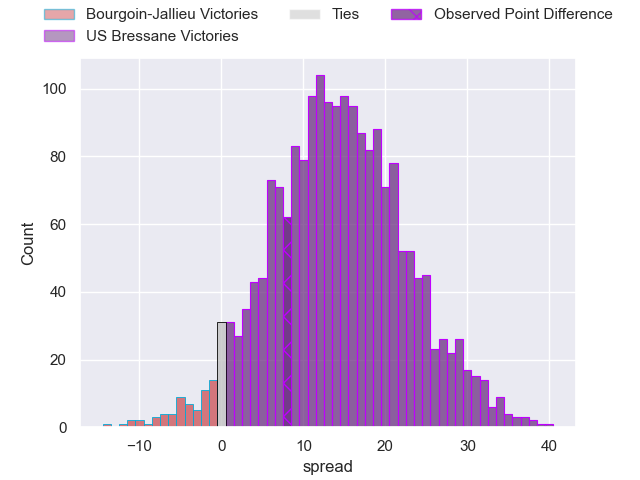
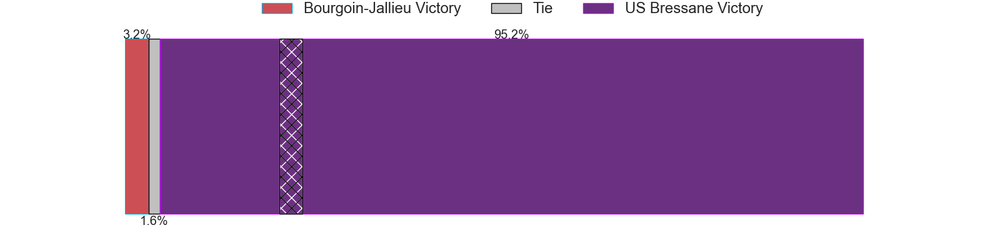

---  
layout: page  
title: Bourgoin-Jallieu at US Bressane; 17-25  
date: 2025-02-14 18:00:00 -0500  
categories: "Nationale 24/25" match review  
---
# Bourgoin-Jallieu at US Bressane; 17-25

# Club Level Predictions

The first set of predictions treats a club as the smallest object, as the club develops its members, organizes a gameplan, and deploys its players as needed for each match. This club model has a prediction of 0.676, which translates to predicting US Bressane to win by 6.5.

Our Over/Under is 42.5 - and combined with the spread above, we have a predicted scoreline of 18 to 25

Each club has a rating and a rating deviation (similar to a Glicko rating), and expected performances can be generated. This allows for simulated matches and spreads like the ones below.
## Projected Performances - Club Model

## Projected Spreads - Club Model

## Projected Results - Club Model

# Player Level Predictions

Treating teams instead as an entity made up of the currently active players, I have ratings for each player in an altogether different system. These can be combined to form team ratings once teamsheets are announced, weighting starters a bit higher than the reserves. After the match is played, players can be weighted by their minutes on the field, allowing for an accurate measure of the team's composition. With these compiled team ratings, we can make predictions, measure inaccuracy, and update the individual player ratings.
## Prediction without Player Minutes: US Bressane by 11.3

US Bressane by 5.9 on a neutral pitch

## Projected Performances - Player Model

## Projected Spreads - Player Model

## Projected Results - Player Model

|   Away Minutes | Away Player      |   Away Percentile |   Number |   Home Percentile | Home Player          |   Home Minutes |
|---------------:|:-----------------|------------------:|---------:|------------------:|:---------------------|---------------:|
|             80 | Lucas Dycke      |              1.47 |        1 |             31.19 | Teo Bordenave        |             17 |
|             80 | Maxime Castant   |             36.36 |        2 |             21.78 | Louis Dasalmartini   |             18 |
|             64 | Oktay Yilmaz     |             51.3  |        3 |             30.86 | Vazha Kapanadze      |             19 |
|             24 | Theophile Cotte  |             23.48 |        4 |              5.21 | Josh Peters          |             23 |
|             29 | Thomas Adélaïde  |             34.19 |        5 |              3.41 | Victor Fromenteze    |             23 |
|             17 | Kamil Bouregba   |             35.27 |        6 |             34.99 | Nicolas Tachat       |             23 |
|             28 | Matteo Broeders  |             14.01 |        7 |             69.88 | Pierre Reynaud       |             27 |
|             80 | Sam Daly         |              6.82 |        8 |             88.49 | Loic Baradel         |             80 |
|             51 | Yoan Cottin      |             70.73 |        9 |             73.87 | Jeremy Valencot      |             64 |
|             53 | Nicolas Cachet   |             11.92 |       10 |             29.08 | Nathan Azais         |             29 |
|             80 | Pierre Mignot    |             17.26 |       11 |             22.48 | Élie De Fleurian     |             56 |
|             80 | Isaiah Leota     |             69.61 |       12 |             33.82 | Aaron Stafford       |             80 |
|             34 | Tom Danovaro     |             18.67 |       13 |             33.4  | Joe Margetts         |             19 |
|             23 | Paul-Hugo Champ  |             10.45 |       14 |             47.11 | Jules Margarit       |             80 |
|             17 | Remi Bouet       |              3.34 |       15 |             78.29 | Florent Massip       |             80 |
|             23 | Julien Ratajczak |             11.84 |       16 |              8.52 | Quentin Witt         |             24 |
|             23 | Keynan Knox      |              8.55 |       17 |             59.2  | Erich de Jager       |             80 |
|             14 | Adrien Mallet    |             28.91 |       18 |             31.44 | Thomas Déliance      |             57 |
|             17 | Kevin Rivoire    |             54.62 |       19 |             89.71 | Clement Jullien      |             68 |
|             80 | Louis Giamarchi  |             36.59 |       20 |             31.95 | Benjamin Doy         |             80 |
|             80 | Tala Gray        |             44.56 |       21 |             17.63 | Alexandre Badet      |             80 |
|             48 | Aviata Silago    |              1.97 |       22 |            nan    | Mathis Charvet       |             57 |
|             80 | Morgan Eames     |              0.85 |       23 |             10.91 | Atonio Ulutuipalelei |             63 |

