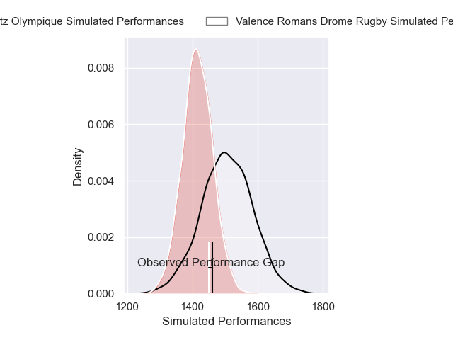
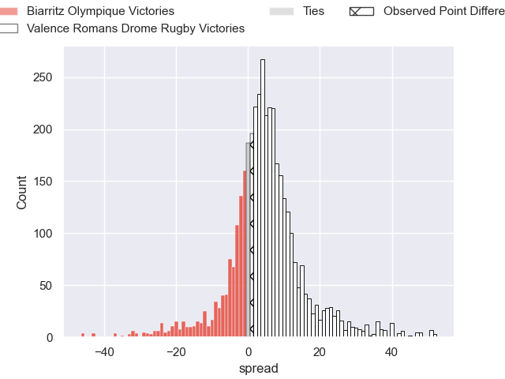
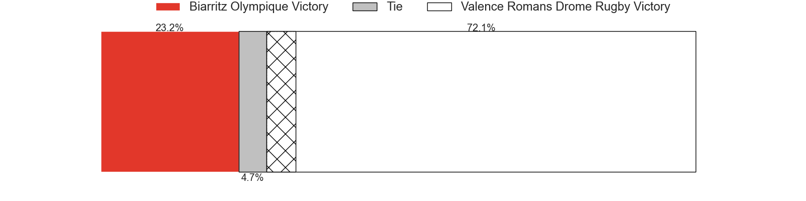
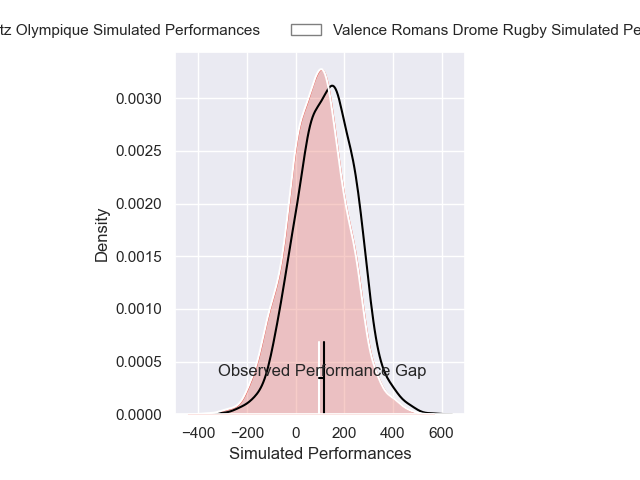
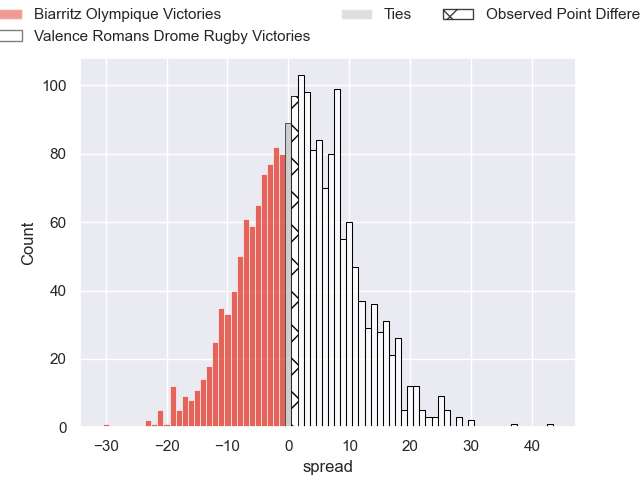
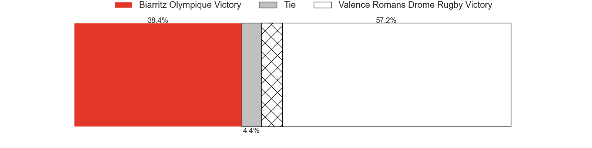

---  
layout: page  
title: Biarritz Olympique at Valence Romans Drome Rugby; 27-28  
date: 2025-02-14 18:00:00 -0500  
categories: "Pro D2 24/25" match review  
---
# Biarritz Olympique at Valence Romans Drome Rugby; 27-28

# Club Level Predictions

The first set of predictions treats a club as the smallest object, as the club develops its members, organizes a gameplan, and deploys its players as needed for each match. This club model has a prediction of 0.622, which translates to predicting Valence Romans Drome Rugby to win by 4.4.

Our Over/Under is 56.5 - and combined with the spread above, we have a predicted scoreline of 26 to 30

Each club has a rating and a rating deviation (similar to a Glicko rating), and expected performances can be generated. This allows for simulated matches and spreads like the ones below.
## Projected Performances - Club Model

## Projected Spreads - Club Model

## Projected Results - Club Model

# Player Level Predictions

Treating teams instead as an entity made up of the currently active players, I have ratings for each player in an altogether different system. These can be combined to form team ratings once teamsheets are announced, weighting starters a bit higher than the reserves. After the match is played, players can be weighted by their minutes on the field, allowing for an accurate measure of the team's composition. With these compiled team ratings, we can make predictions, measure inaccuracy, and update the individual player ratings.
## Prediction without Player Minutes: Valence Romans Drome Rugby by 4.8

Valence Romans Drome Rugby by 1.2 on a neutral pitch

## Projected Performances - Player Model

## Projected Spreads - Player Model

## Projected Results - Player Model

|   Away Minutes | Away Player         |   Away Percentile |   Number |   Home Percentile | Home Player         |   Home Minutes |
|---------------:|:--------------------|------------------:|---------:|------------------:|:--------------------|---------------:|
|             80 | Zakaria El Fakir    |              3.34 |        1 |             64.5  | Andrea Pontanier    |             41 |
|             80 | Yohan Beheregaray   |             20.75 |        2 |              0.86 | Cyril Deligny       |             80 |
|             61 | Nikoloz Narmania    |             78.5  |        3 |             14.5  | Gareth Milasinovich |             80 |
|             53 | Aitor Hourcade      |              2.84 |        4 |             31.91 | Ryan McCauley       |             52 |
|             80 | Piula Faasalele     |             60.13 |        5 |             59.94 | Florian Goumat      |             22 |
|             58 | Thomas Hebert       |             32.79 |        6 |             39.94 | Axel Bruchet        |             27 |
|             11 | Jessy Jegerlehner   |              2.86 |        7 |             51.86 | Loan Real           |             43 |
|             80 | Nafi Ma'afu         |             55.65 |        8 |             78.89 | Mathieu Vachon      |             52 |
|             22 | Imanol Biscay       |             31.18 |        9 |             74.74 | Thomas Lhusero      |             80 |
|             25 | Thomas Dolhagaray   |             56.9  |       10 |             26.78 | Lucas Meret         |             37 |
|             41 | Mathieu Acebes      |             96.27 |       11 |             86.66 | Mosese Mawalu       |             72 |
|             59 | Carlo Mignot        |             66.49 |       12 |             87.45 | Louis Marrou        |              8 |
|             53 | Tyler Morgan        |             39.52 |       13 |             81.22 | Anatole Pauvert     |             19 |
|             19 | Zach Kibirige       |              3.92 |       14 |              0.75 | Owen Lane           |             80 |
|             19 | Kylian Jaminet      |             85.59 |       15 |             19    | Thomas Roziere      |             41 |
|             61 | Giorgi Dzmanashvili |             62.54 |       16 |             26.66 | Mattéo Rodor        |             80 |
|             55 | Luteru Tolai        |             54.03 |       17 |             68.27 | Dorian Marco Pena   |             80 |
|             80 | Eliande Sanderson   |            nan    |       18 |             48.05 | Adrien Roux         |             59 |
|             61 | Ekain Imaz Agirre   |             24.21 |       19 |             35.7  | George Worth        |             80 |
|             27 | François Mur        |            nan    |       20 |             73.59 | Thembelani Bholi    |             48 |
|             69 | Yann David          |             63.59 |       21 |             44.22 | Anthony Aléo        |             80 |
|             80 | Yohan Tapie         |             63.99 |       22 |             56.27 | Vincent Vial        |             39 |
|            nan | nan                 |            nan    |       23 |              4.98 | Mathieu Guillomot   |             58 |

