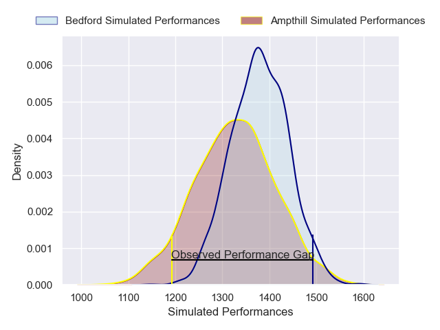
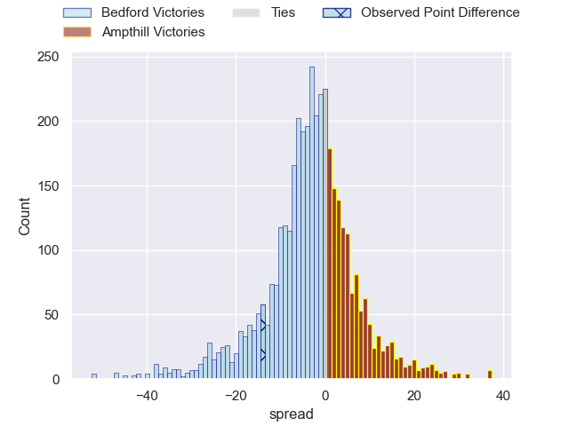
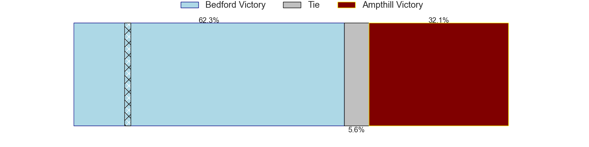
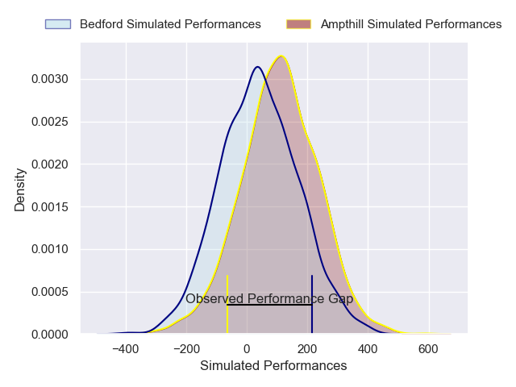
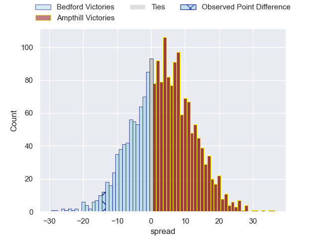

---  
layout: page  
title: Bedford at Ampthill; 21-7  
date: 2025-02-15 18:00:00 -0500  
categories: "Premiership Rugby Cup 24/25" match review  
---
# Bedford at Ampthill; 21-7

# Club Level Predictions

The first set of predictions treats a club as the smallest object, as the club develops its members, organizes a gameplan, and deploys its players as needed for each match. This club model has a prediction of 0.422, which translates to predicting Bedford to win by 2.8.

Our Over/Under is 51.5 - and combined with the spread above, we have a predicted scoreline of 27 to 25

Each club has a rating and a rating deviation (similar to a Glicko rating), and expected performances can be generated. This allows for simulated matches and spreads like the ones below.
## Projected Performances - Club Model

## Projected Spreads - Club Model

## Projected Results - Club Model

# Player Level Predictions

Treating teams instead as an entity made up of the currently active players, I have ratings for each player in an altogether different system. These can be combined to form team ratings once teamsheets are announced, weighting starters a bit higher than the reserves. After the match is played, players can be weighted by their minutes on the field, allowing for an accurate measure of the team's composition. With these compiled team ratings, we can make predictions, measure inaccuracy, and update the individual player ratings.
## Prediction without Player Minutes: Ampthill by 1.9

Bedford by 1.4 on a neutral pitch

## Projected Performances - Player Model

## Projected Spreads - Player Model

## Projected Results - Player Model

|   Away Minutes | Away Player          |   Away Percentile |   Number |   Home Percentile | Home Player                 |   Home Minutes |
|---------------:|:---------------------|------------------:|---------:|------------------:|:----------------------------|---------------:|
|             18 | Joey Conway          |             72.21 |        1 |             53.25 | Harrison Courtney           |              2 |
|             24 | Tommy Herman         |             70.41 |        2 |             41.84 | Luke Thompson               |             14 |
|             49 | Oisin Heffernan      |             82.89 |        3 |              2.57 | Callum Norrie               |             27 |
|             66 | Luke Frost           |              9.98 |        4 |             11.39 | Jake Parkinson              |             27 |
|             80 | Alex Woolford        |             88.7  |        5 |             23.92 | Aidan King                  |             21 |
|             63 | Joe Howard           |             13.78 |        6 |             13.4  | Arthur Thomas               |             67 |
|             53 | Jac Arthur           |             81.26 |        7 |              6.47 | Charles Rylands             |             82 |
|             80 | Freddie Tuilagi      |             28.81 |        8 |              5.64 | Tino Mapapalangi            |             80 |
|             35 | Alex Day             |             83.16 |        9 |              7.9  | Rory Morgan                 |             82 |
|             82 | William Maisey       |             85    |       10 |              7.5  | Josh Barton                 |             68 |
|             80 | Matt Worley          |             83.67 |       11 |              5.01 | Oran McNulty                |             80 |
|             27 | Josh Matavesi        |             35.24 |       12 |             64.56 | Fraser James Kevin Strachan |             80 |
|             80 | Lucas Titherington   |             57.71 |       13 |             12.77 | Byron Sharwood              |             80 |
|             80 | Alfie Garside        |             73.1  |       14 |             23.47 | Tom Barton                  |             80 |
|             80 | Louis James          |             29.49 |       15 |              6.87 | Evan Mitchell               |             80 |
|             62 | Jamie Jack           |              9.32 |       16 |              4.02 | James Flynn                 |             80 |
|             61 | Curtis Langdon       |             35.03 |       17 |             63.53 | Richard Barrington          |             80 |
|             59 | Austin Hay           |            nan    |       18 |             59.98 | Sid Blackmore               |             70 |
|             49 | Cameron King         |             15.87 |       19 |             19.83 | Lekima Ravuvu               |             62 |
|             80 | Rory Ward            |             32.77 |       20 |             41.33 | Barnaby Merrett             |             80 |
|             10 | Michael Le Bourgeois |             48.42 |       21 |            nan    | Charlie West                |             80 |

