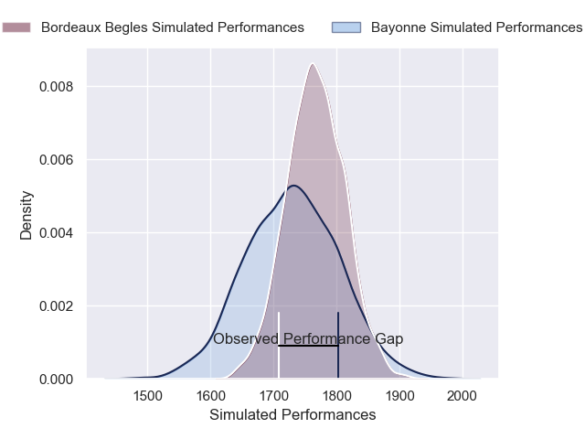
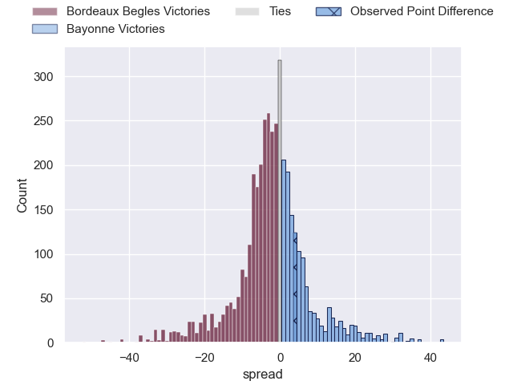
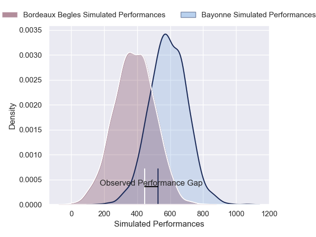
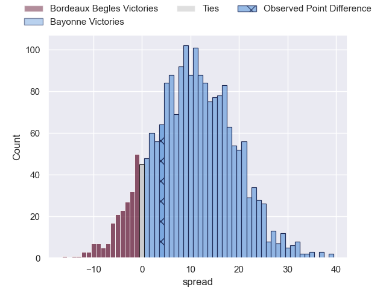
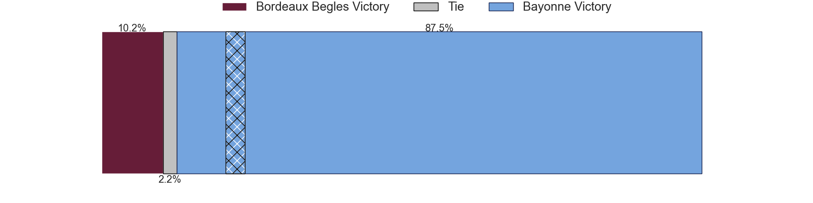

---  
layout: page  
title: Bordeaux Begles at Bayonne; 32-36  
date: 2025-02-15 18:00:00 -0500  
categories: "Top 14 Orange 24/25" match review  
---
# Bordeaux Begles at Bayonne; 32-36

# Club Level Predictions

The first set of predictions treats a club as the smallest object, as the club develops its members, organizes a gameplan, and deploys its players as needed for each match. This club model has a prediction of 0.451, which translates to predicting Bordeaux Begles to win by 1.7.

Our Over/Under is 39.5 - and combined with the spread above, we have a predicted scoreline of 21 to 19

Each club has a rating and a rating deviation (similar to a Glicko rating), and expected performances can be generated. This allows for simulated matches and spreads like the ones below.
## Projected Performances - Club Model

## Projected Spreads - Club Model

## Projected Results - Club Model

# Player Level Predictions

Treating teams instead as an entity made up of the currently active players, I have ratings for each player in an altogether different system. These can be combined to form team ratings once teamsheets are announced, weighting starters a bit higher than the reserves. After the match is played, players can be weighted by their minutes on the field, allowing for an accurate measure of the team's composition. With these compiled team ratings, we can make predictions, measure inaccuracy, and update the individual player ratings.
## Prediction without Player Minutes: Bayonne by 11.5

Bordeaux Begles by 2.0 on a neutral pitch

## Projected Performances - Player Model

## Projected Spreads - Player Model

## Projected Results - Player Model

|   Away Minutes | Away Player              |   Away Percentile |   Number |   Home Percentile | Home Player             |   Home Minutes |
|---------------:|:-------------------------|------------------:|---------:|------------------:|:------------------------|---------------:|
|             81 | Ugo Boniface             |             86.1  |        1 |             61.61 | Swan Cormenier          |             59 |
|             12 | Maxime Lamothe           |             62.07 |        2 |             89.97 | Facundo Bosch           |             32 |
|             81 | Ben Tameifuna            |             97.43 |        3 |             56.14 | Luke Tagi               |             23 |
|             55 | Guido Petti              |             81.17 |        4 |             96.52 | Alex Moon               |             56 |
|             50 | Cyril Cazeaux            |             96.23 |        5 |             10.64 | Lucas Paulos            |             26 |
|             13 | Lachlan Swinton          |              5.15 |        6 |             99.72 | Rodrigo Bruni           |             78 |
|             37 | Temo Matiu               |             13.31 |        7 |             81.82 | Baptiste Chouzenoux     |             35 |
|             19 | Marko Gazzotti           |             59.92 |        8 |             86.01 | Giovanni Habel-Kueffner |             63 |
|             44 | Maxime Lucu              |             99.31 |        9 |             10.31 | Guillaume Rouet         |             82 |
|             30 | Joey Carbery             |             77.71 |       10 |             87.08 | Camille Lopez           |             23 |
|             81 | Pete Samu                |             94.53 |       11 |             27.64 | Mateo Carreras          |             47 |
|             26 | Ben Tapuai               |             20.74 |       12 |             97.24 | Manu Tuilagi            |             82 |
|             48 | Nicolas Depoortere       |             80.69 |       13 |             16.04 | Guillaume Martocq       |             59 |
|             81 | Arthur Retiere           |             97.59 |       14 |             29.5  | Arnaud Erbinartegaray   |             47 |
|             32 | Jon Echegaray            |             46.67 |       15 |             10.91 | Cheikh Tiberghien       |             47 |
|              9 | Connor Sa                |             59.69 |       16 |             94.73 | Lucas Martin            |             56 |
|             82 | Jefferson Poirot         |             82.73 |       17 |             90.6  | Andy Bordelai           |             35 |
|             50 | Jonny Gray               |             90.58 |       18 |             35.88 | Arthur Iturria          |             82 |
|             82 | Mahamadou Diaby          |             77.6  |       19 |             36.12 | Uzair Cassiem           |             82 |
|             82 | Yann Lesgourgues         |              8.42 |       20 |             95.19 | Maxime Machenaud        |             82 |
|             56 | Rohan Janse van Rensburg |             85.09 |       21 |             72.71 | Joris Segonds           |             45 |
|             26 | Enzo Reybier             |             79.68 |       22 |             17.29 | Tom Spring              |             82 |
|             82 | Sipili Falatea           |             86.99 |       23 |              2.25 | Pieter Scholtz          |             35 |

