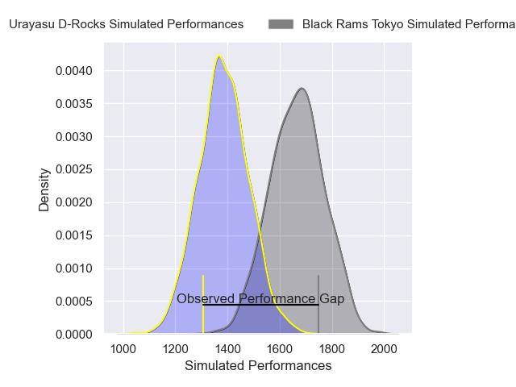
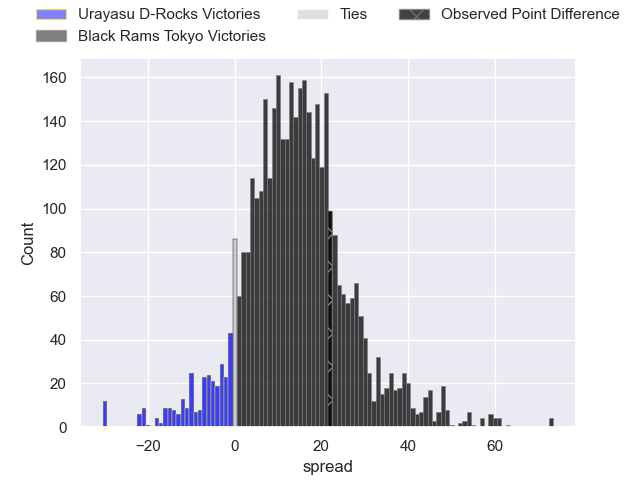
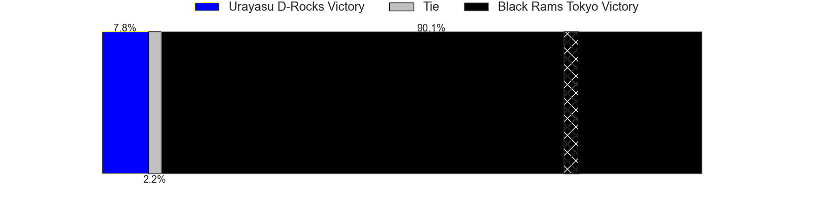
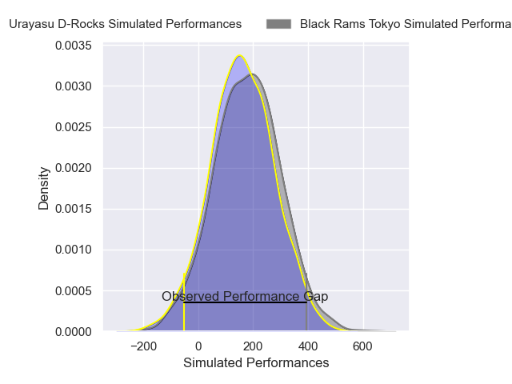
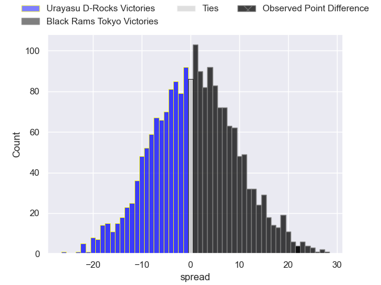
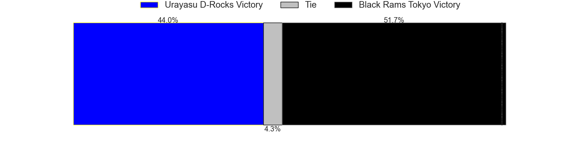

---  
layout: page  
title: Urayasu D-Rocks at Black Rams Tokyo; 22-44  
date: 2025-02-15 18:00:00 -0500  
categories: "Japan Rugby League One 24/25" match review  
---
# Urayasu D-Rocks at Black Rams Tokyo; 22-44

# Club Level Predictions

The first set of predictions treats a club as the smallest object, as the club develops its members, organizes a gameplan, and deploys its players as needed for each match. This club model has a prediction of 0.823, which translates to predicting Black Rams Tokyo to win by 14.0.

Our Over/Under is 56.5 - and combined with the spread above, we have a predicted scoreline of 21 to 35

Each club has a rating and a rating deviation (similar to a Glicko rating), and expected performances can be generated. This allows for simulated matches and spreads like the ones below.
## Projected Performances - Club Model

## Projected Spreads - Club Model

## Projected Results - Club Model

# Player Level Predictions

Treating teams instead as an entity made up of the currently active players, I have ratings for each player in an altogether different system. These can be combined to form team ratings once teamsheets are announced, weighting starters a bit higher than the reserves. After the match is played, players can be weighted by their minutes on the field, allowing for an accurate measure of the team's composition. With these compiled team ratings, we can make predictions, measure inaccuracy, and update the individual player ratings.
## Prediction without Player Minutes: Black Rams Tokyo by 0.9

Urayasu D-Rocks by 3.3 on a neutral pitch

## Projected Performances - Player Model

## Projected Spreads - Player Model

## Projected Results - Player Model

|   Away Minutes | Away Player         |   Away Percentile |   Number |   Home Percentile | Home Player       |   Home Minutes |
|---------------:|:--------------------|------------------:|---------:|------------------:|:------------------|---------------:|
|             16 | Hidetomo Nabeshima  |              6.59 |        1 |             51.73 | Taishi Tsumura    |             80 |
|             80 | Ryuji Fujimura      |              6.46 |        2 |             75.17 | Shin Ouchi        |             59 |
|             80 | Ryom Kim            |             22.09 |        3 |             28.35 | Shohei Oyama      |             80 |
|             80 | Uwe Helu            |             59.32 |        4 |             59.98 | Reijiro Yamamoto  |             80 |
|              8 | Lourens Erasmus     |             74.58 |        5 |             56.03 | Harrison Fox      |             72 |
|             26 | Zephania Tuinona    |             20.06 |        6 |              3.09 | Mike Stolberg     |             72 |
|             79 | Daishi Kojima       |             23.06 |        7 |             84.07 | Liam Gill         |             40 |
|             80 | Jasper Wiese        |             67.64 |        8 |             15.45 | Amato Fakatava    |             80 |
|             71 | Ren Iinuma          |             60.31 |        9 |             96.91 | TJ Perenara       |             60 |
|              9 | Yu Tamura           |             86.88 |       10 |             41.67 | Ichigo Nakakusu   |              3 |
|              3 | Caleb Cavubati      |             19.76 |       11 |             32.19 | Semisi Tupou      |              3 |
|             51 | Samu Kerevi         |             91.62 |       12 |             58.43 | Yuki Ikeda        |              7 |
|             80 | Shane Gates         |             11.24 |       13 |             46.99 | Larzlow Sword     |              8 |
|             80 | Takuhei Yasuda      |             84.88 |       14 |             55.57 | Taira Main        |             26 |
|             27 | Otere Black         |             52.53 |       15 |             49.29 | Kotaro Ito        |             33 |
|             80 | Hendrik Tui         |             27.46 |       16 |             45.3  | Kazuma Nishi      |             78 |
|             51 | Wimpie van der Walt |            nan    |       17 |             71.6  | Shuhei Matsuhashi |             82 |
|             40 | Sekonaia Pole       |            nan    |       18 |            nan    | Daigo Sasagawa    |             82 |
|              8 | Shin Takeuchi       |             66.73 |       19 |              9.09 | Viliami Lolohea   |             66 |
|             10 | Kianu Kereru-Symes  |             80.78 |       20 |            nan    | Lulu Paea         |             82 |
|             18 | Shunya Hamano       |            nan    |       21 |             84.65 | Pohiva Lotoahea   |              0 |
|             51 | Junya Matsumoto     |             29.68 |       22 |             62.89 | Toshiya Takahashi |             73 |
|             18 | Tone Tukufuka       |             93.97 |       23 |            nan    | nan               |            nan |

